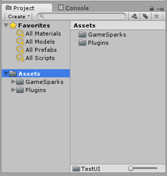
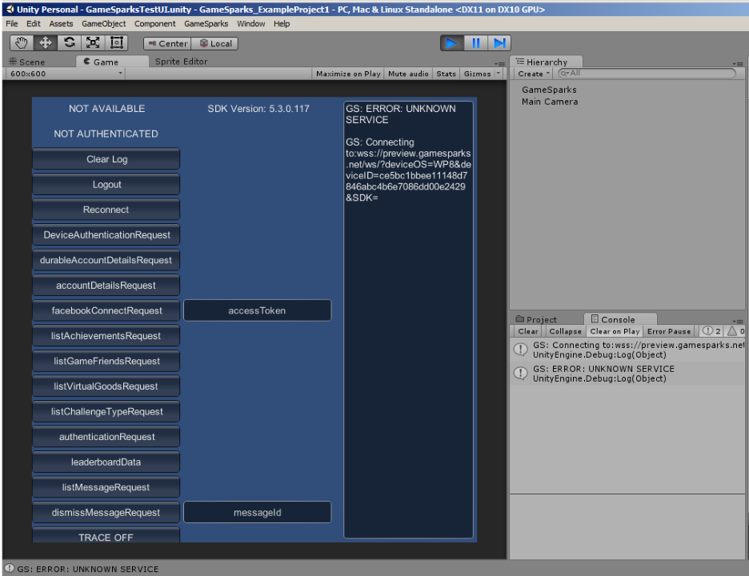
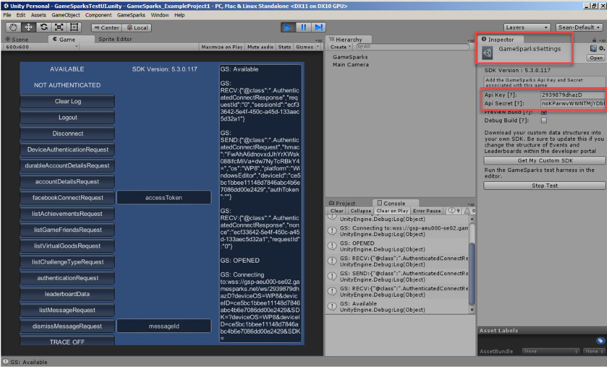
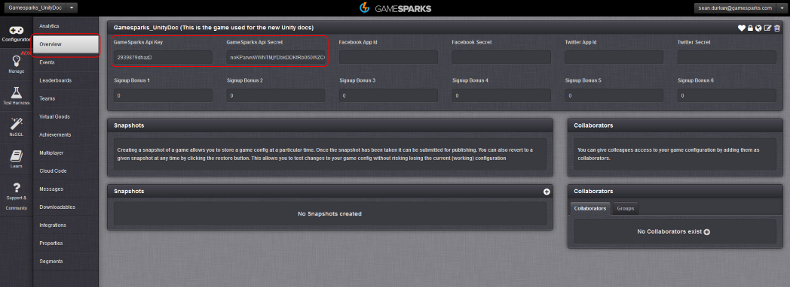

# Unity Setup

## Introduction

This tutorial will have you set up and using GameSparks in no time, even with only basic knowledge of the Unity game engine.

First, you'll need to download the GameSparks SDK. This is a Unity-package file, and so importing the SDK into Unity is very simple. You can also download our Unity example below:

 
**Example Unity Setup** code can be downloaded [here](http://repo.gamesparks.net/docs/tutorial-assets/UnitySetup_Tutorial.zip)

## Setting Up the GameSparks SDK

To set up the SDK, follow these steps:
* Once you have a Unity project set up and ready, select the *Assets* tab from the top menu-bar.
* From the drop-down menu, select *Import Package* and then *Custom Package* from the menu that appears.
* This causes an explorer window to appear. From here you can navigate to where your SDK-package was downloaded. When Unity prompts you to import the package file, make sure all files are selected and click *Import*.

If the package was successfully added to project, you will see that two new folders will have been added to your project called *GameSparks* and *Plugins*:

 

## Configuring the GameSparks SDK

Now you have to link your Unity project with your GameSparks game.

If you need instructions on how to create a new GameSparks game through the Portal check out the tutorial [here](./README.md).

In the GameSparks folder that has just appeared in your project, navigate to the *Test UI* folder, and open the *GameSparksTestUI* scene.  Go ahead and play this scene and see what happens.  You will likely see something like this:

There's a couple of important things to note:
* You can see a dialog box and some buttons indicating different requests on the left.
* You can see that you get an error here *GS: ERROR: UNKNOWN SERVICE*.

### Understanding Errors - Unknown Service Error

At this stage, the GameSparks SDK still hasn't been configured or provided with any information on what it should connect to.  The error above is telling us that the SDK couldn't connect to the service. When this error occurs, check that your GameSparks details are correct.

## Entering API Key and Secret

You now need to provide the SDK details about the game you want to connect to. For the sake of this tutorial, we are connecting to a demo game created on the GameSparks portal.

*1.* Notice that there is a new tab on the top menu-bar for *GameSparks*. Select this and click on the *Edit Settings* option. You will see *GameSparks Settings* appear in the inspector window:

You'll update *API Key* and *API Secret* with the key and secret from your game. You can get these from the *Overview* page of the GameSparks portal:

*2.* Copy both the *GameSparks Api Key* and *GameSparks Api Secret* into the respective fields on the Unity *Inspector* window. Hit the *Test Configuration* button and you should see a whole load of info pop up in the dialog box, eventually including a log stating that GameSparks is available.

Congratulations, you are now connected to your GameSparks game!

### Still Getting Unknown Service Error?

If you're still seeing the *GS: ERROR UNKNOWN SERVICE* message:
* Double-check that there are no trailing or preceding spaces in the *API Key* and *API Secret* fields.
* Please check that the code you entered in the GameSparks Settings did not contain space characters.

## Other SDK Settings

You can see that there are a few other settings available for the Unity SDK. For the initial setup you don’t need to worry about them, so feel free to skip this part if you are keen to get started.

  * *Preview Build Option* - This allows you to connect the SDK to preview builds of your game.
  * *Debug Build Option* - With this option on, your game will receive extra web-sockets information.
  * *Custom SDK* - This will check your GameSparks game for custom Events, Leaderboards, and so on, and create a C# file with custom functions.

You are now set up and connected to GameSparks. The next section will show you how to register and authenticate players on your GameSparks game, through the Unity game engine.
