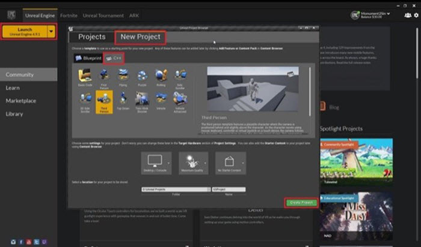
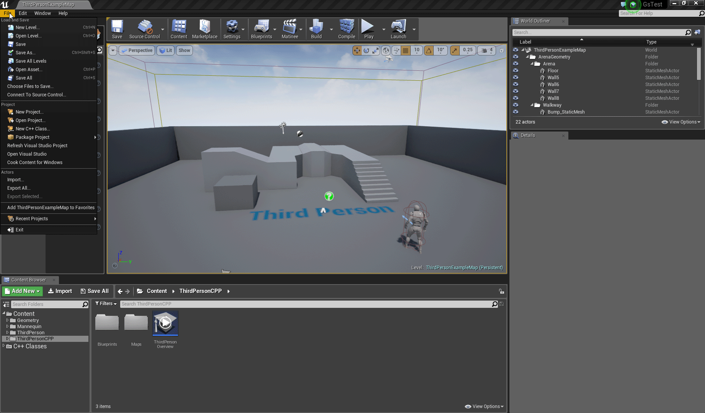
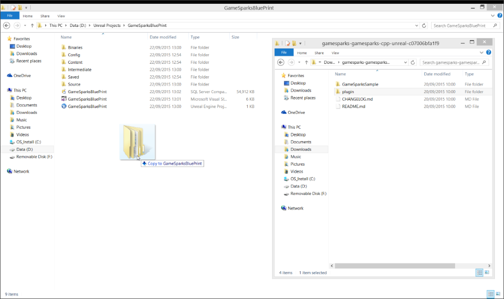
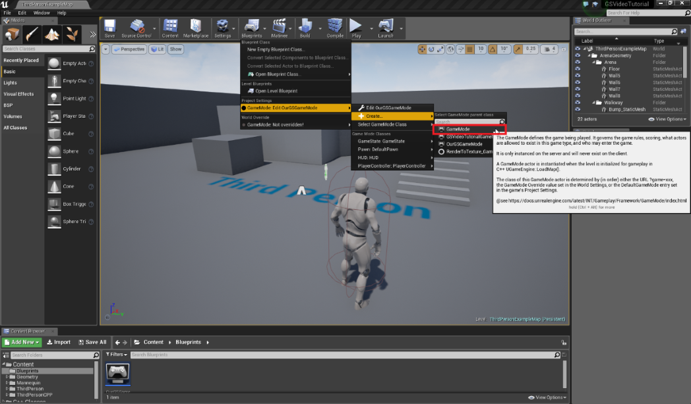
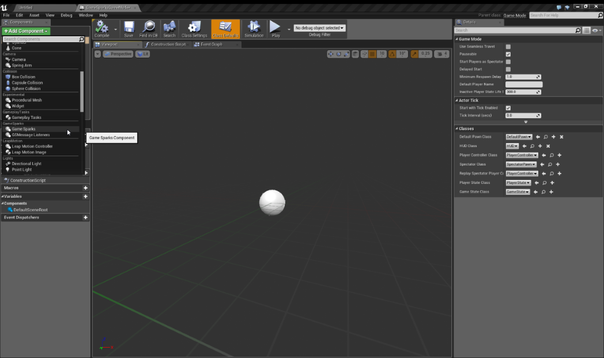
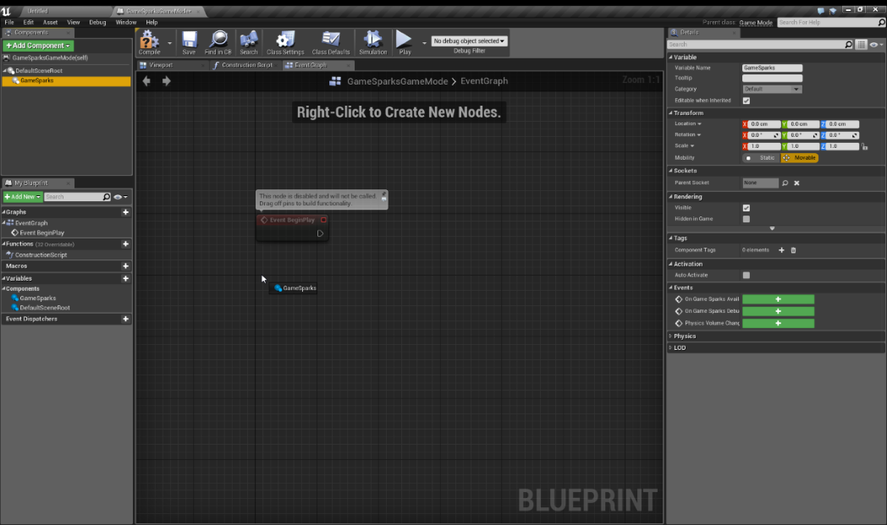
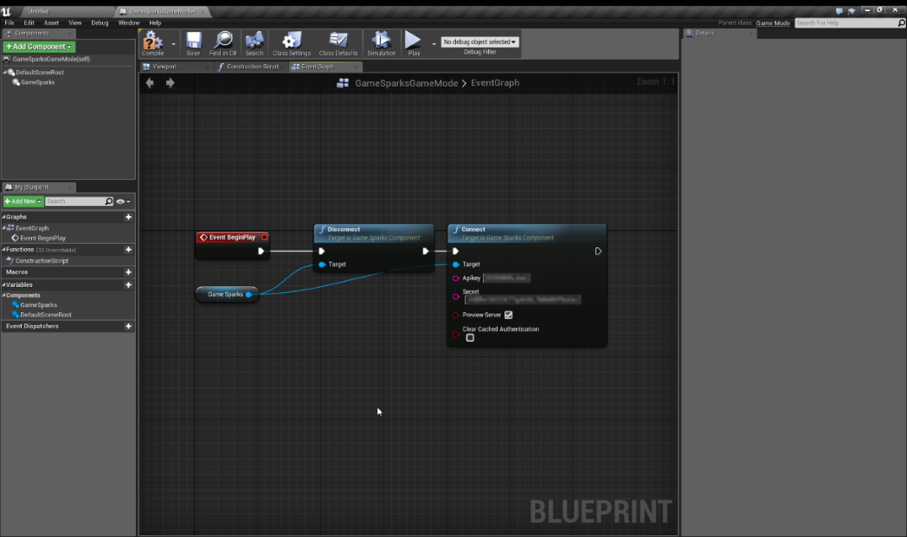
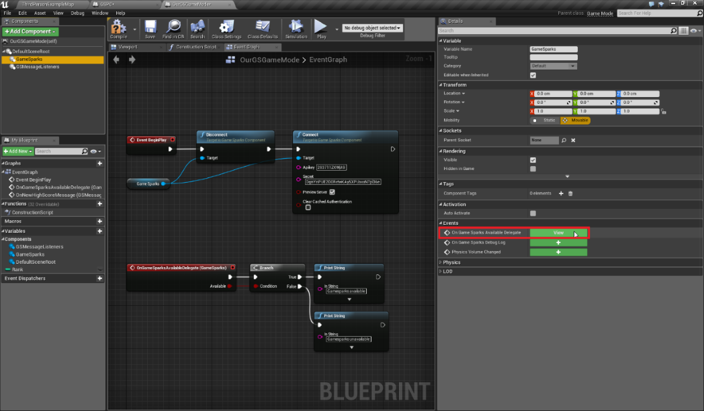
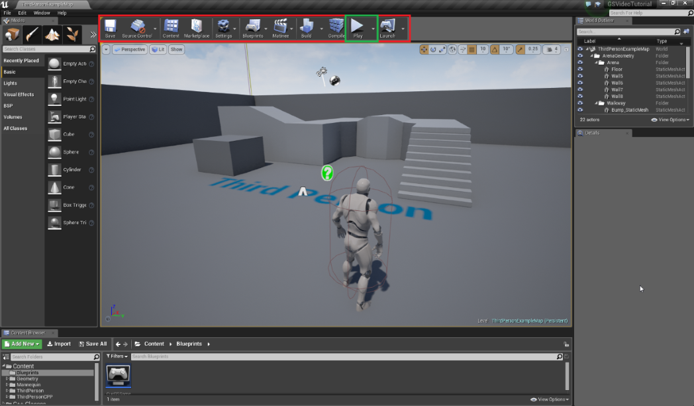

# Unreal Setup

## Introduction

This tutorial guides you through the process of setting up your Unreal game and integrating the GameSparks plugin and explains:
* How to download and integrate the GameSparks SDK into your game.
* The different steps you will need to perform, depending on whether you are creating:
  * A new game.
  * A Blueprint only project.
  * A mixed project.

## SDK Download and Setup

You'll require the following to compile and run the Unreal Engine SDK provided by GameSparks:

  * [Unreal Engine](https://www.unrealengine.com/dashboard).
  * GameSparks [SDK](https://bitbucket.org/gamesparks/gamesparks-cpp-unreal/downloads) for Unreal Engine.
  * Compiler based on your OS.
    * Windows - [Visual Studio 2013](https://www.visualstudio.com/en-us/downloads/download-visual-studio-vs.aspx)
    * Mac OSX - [Xcode](https://developer.apple.com/xcode/download/)

Once you've downloaded the required tools and installed them successfully, you're ready to start developing.

## Creating a New Mixed Project

To create a new Mixed Project:
* Launch the Unreal Engine from the Epic Launcher. You'll be prompted with the Unreal Engine project browser.
* Here, select the "New Project" tab, and then select the C++ tab.
* You'll then need to select your game template (we've used Third Person Template in our Tutorials), name your project and click "Create Project".



You have now successfully created a Mixed Project and you can skip the Blueprint Only Project tab and move on to the Mixed Project tutorial.


## Blueprint Only Project

If your game is a Blueprint only project with no C++ files, you'll need to modify it to ensure you have have the right components to compile the GameSparks SDK and build your game without any issues.

To do this:
1. Create a new C++ Class in your project.
2. Click *File>New C++ Class...* in your Unreal Engine. At this point, you'll be prompted to select a *Parent Class*.
3. Select "*None*", then click *Next*.
4. Name your class and mark it as *private* (This is a C++ specific differentiation which won’t matter to us at this point).
5. Hit "Create Class" to initiate the generation of C++ files for your game.



Your game is now a mixed project and is ready to receive the GameSparks SDK files. This is covered in the next section.

## Mixed Project

To enable the GameSparks SDK in your Unreal Engine Project, you'll have to grab the "*plugin*" folder from the SDK you've downloaded and move it to your Project folder. Be sure to rename this folder as "*Plugins*". If you don't, the folder will not be recognized by the Unreal Engine Compiler:



In your project's build file (Located under *Source> ProjectFolder* folder) add "GameSparks" to the *PublicDependencyModuleNames* array:

```

PublicDependencyModuleNames.AddRange(new string[] { "Core", "CoreUObject", "Engine", "InputCore", "GameSparks" });

```

To compile the plugin, simply run the *.uproject* file (If you don't have Visual or XCode installed this step will not work). When the Project has been compiled, you'll want to connect it to GameSparks Service to ensure everything's working as intended. Now you must create your own custom Blueprint Game Mode, which will contain the connection between the Game and the Service.

To do this simply follow the steps shown:



Once the new Game Mode has been created, make a new GameSparks Component for it:



Now you will need to drag-and-drop the component into the Event Graph pane in the Unreal Engine. This allows you to call the GameSparks Functions within the Editor:



For this tutorial we'll be using the pre-built "*Begin Play*" Event to connect to the GameSparks Service:
* Because a reference to the GameSparks object is available in the Event Graph, you can drag-off two functions from it, one should be "*Disconnect*" and the other one should be "*Connect*".
* Link everything together with "*Begin Play*" Event:



<q>**Note:** The "Connect" function will require your GameSparks *API* *Key* and *Secret* to work. If you've forgotten these, refer to the Game Set Up guide, which can be found [here](./README.md).</q>

At this point, you'll want to receive feedback from the module to ensure that you have actually connected. To do this, you need an *OnGameSparksAvailableDelegate* Event from the GameSparks component. By clicking on the GameSparks component you will see the Event has linked to it and can be clicked and dropped into the Event Graph.

When you've added the *OnGameSparksAvailableDelegate* Event, you'll get an extremely useful tool to check whether your GameSparks connection is valid. You can use the Event Graph to output some information about the connection to GameSparks:



The above Event Graph will try to connect to the GameSparks Service and print out a string whether the connection is valid or not.

Now, simply click *Play* and you should be connected to GameSparks successfully:


