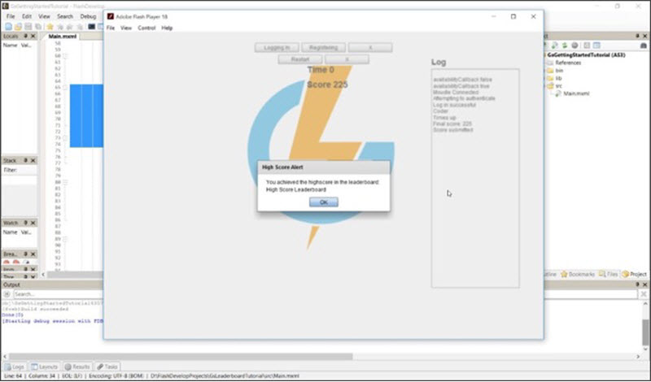

# ActionScript Leaderboards

## Introduction

The previous [tutorial](./README.md) taught you how to create a Leaderboard and Event that submits your player's score. Now you can incorporate them into your ActionScript project.

For this tutorial, we've created a sample game that runs for 10 seconds. In those 10 seconds:
* The player must collect as many points as possible.
* If the player beats the current high score, they'll be notified by a message.


**Setting up the Event Log Request**

  * Set up a function that logs the Event that submits the player's score.

**Creating the Message Handler**

  * Create a message handler that listens for the message type *NewHighScoreMessage*.
  * Create a function that handles the *NewHighScoreMessage*.

**Testing the Leaderboard**

  * Play your game and beat the high score to receive a message.

</br>
**Example ActionScript Leaderboard** code can be downloaded [here](http://repo.gamesparks.net/docs/tutorial-assets/ActionscriptLeaderboardMXML.zip)

## Setting up the Event Log Request

You'll need a function that calls the Event that submits the player's score:
* Make a function that builds the [LogEventRequest](/API Documentation/Request API/Player/LogEventRequest.md) to pass through the score value.
* The *requestBuilder* has been triggered for when the timer of the game reaches 0.
* The player's score will be sent after the game session ends.
* Call the previously-made *Event key* of the Event (for more information see the Portal's Leaderboards [tutorial](./README.md)) and set the *SCORE* attribute.

```

if (endTime <= now)
	  {
		timer.stop();
		requestBuilder.createLogEventRequest().setEventKey("Leaderboard_Score").setNumberEventAttribute("SCORE", Score).send(ScoreResponse);
		SpriteWrapper.removeChildren();
		RestartBtn.enabled = true;
		logger("Times up");
	  }

```

## Setting up the Message Handlers

Once you've set your *LogEventRequest* to upload the player's score, you can now set up a *NewHighScoreMessage* handler. Handlers are very useful tools, which allow you to intercept *messages* that are passed in to your authenticated player.

For this tutorial, we'll be dealing with *NewHighScoreMessage*.
* We'll place the initialization of the message handler in the same function which connects the *GS* *module*.
* To do this use *gs.getMessagerHandler()* and resume to choose which type of message you wish to intercept, followed by the function which will deal with the message.
* In our case *HighScoreMessageListener* is a variable of type *GS*.

```
    	gs.getMessageHandler().setNewHighScoreMessageHandler(HighScoreMessageListener);

```

Create the function which deals with the *message*. The parameters of the function would take a variable of type '*NewHighScoreMessage*'. This function allows you to simplify the structure of the *message* and access some useful data.

In this tutorial, we retrieve the Leaderboard's name to show the highscore *message* as an alert.

```
    	private function HighScoreMessageListener(message:NewHighScoreMessage):void
    			{
    				Alert.show("You achieved the highscore in the leaderboard: " + message.getLeaderboardName(), "High Score Alert")
    			}
```

 

## Testing the Leaderboard

Run your game and try to beat the high score. If you do, you'll receive a message informing you that you have beaten the high score in that Leaderboard.


