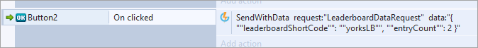

# Construct 2 Leaderboards

This tutorial shows how to send a score from your game, create a Leaderboard entry from it, and set up a message interceptor/listener to process specific messages sent to the currently authenticated player.

## Reacting to a New High Score

We want to set up a way to trigger some action when a player submits a new high score. For example, maybe an image appears with “CONGRATULATIONS”. When a score is submitted via an Event, sometimes a [NewHighScoreMessage](/API Documentation/Message API/Leaderboards/NewHighScoreMessage.md) will be sent.

<q>**Parsing JSON in Construct 2!** Remember, you'll need to find a way to parse JSON in Construct 2. We use the [JSON plugin](https://github.com/FrenchYann/JSON_for_construct2) by Yann, which the following examples will use.</q>

First, we need to set up our Message listener. This will monitor all incoming messages and load them into a JSON object:

Now that we have JSON being loaded for every Message coming in, we need to find a way to react specifically to the *NewHighScoreMessage*. We can do this by checking the “@class” key once we have valid JSON. If it is *NewHighScoreMessage*, then we can trigger a custom action:

## Submitting a Score

As we found in the [previous tutorial](/Getting Started/Creating a Leaderboard/README.md), we want to send a request to an Event. In that tutorial, we saw how to set up this Event. Now let's send a score to the Leaderboard.

If the score is the new high score, you should be getting the *NewHighScoreMessage* we described above. Since we’re setting some custom data, we’ll have to use the “SendWithData” action.

## Loading Leaderboard Data

We can submit a [LeaderboardDataRequest](/API Documentation/Request API/Leaderboards/LeaderboardDataRequest.md) to retrieve an array of Leaderboard entries for a given Leaderboard:

We can then retrieve these data and load them into a JSON object by setting up an “onLeaderboardDataResponse” or “onCustomResponse” listener:

We now have a valid JSON object full of Leaderboard data. However, iterating through an array of JSON objects in Construct 2 is not straightforward. One way we can go about doing this is by using a System action that will repeat for a given count of values. In this case, the count will be the length of the array of entries returned by the *LeaderboardDataRequest*. In this example, we simply append the specific Leaderboard data to a Text string, but it's possible to store these values into variables, strings, array objects, and so on:

* Note that we use JSON.Size(0,”data”) because the “data” key returned by the response is an array of JSON objects.
* We can then reference specific entries using the “loopindex” member in the action, in this case, getting the Rank and UserName for the leaderboard.

<q>**More Leaderboards Requests?** There are a few more requests that deal with Leaderboards, please check our [API Documentation](/API Documentation) under the *Request API* section for more information.</q>
