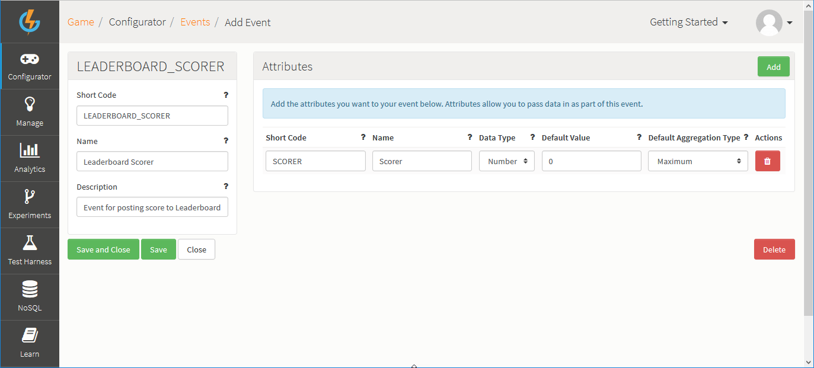
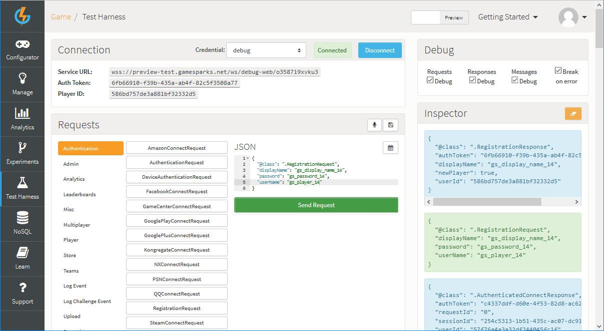
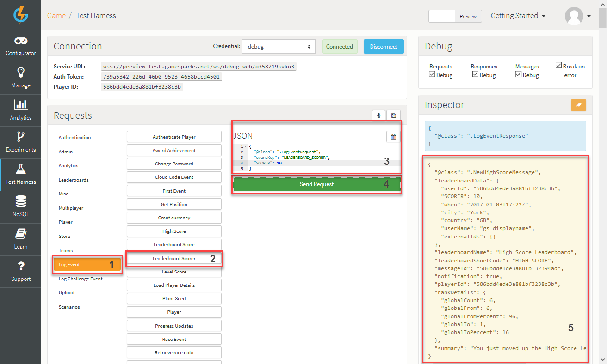

# Creating a Leaderboard

## Introduction

Leaderboards are typically restricted to tracking and reporting the leading players in a game. GameSparks leaderboards offer you much more, both for tracking comparisons within your player pool and for controlling how comparisons are displayed in-game to the players:
* **Complex comparison scenarios** - define what and how players will be compared.
* **Meaningful player displays** - monitor player performance and provide in-game filters to flexibly display comparisons to players.
* **In-game notifications** - enable dynamic messaging within your player groups.
* **Rich socialization features** - exploit a robust framework for building social and competitive features into your game

In this tutorial, we'll go over the steps required to create an Event, attach it to a Leaderboard, post a score, and receive a HighScore Message.

## Creating an Event

<q>**More Details on Events?** For an in-depth guide on Events click [here](/Documentation/Configurator/Events.md).</q>

*1.* First, navigate to *Configurator > Events*.

*2.* Click *Add*. The *Add Event* page opens.

*3.* Enter the details for the new Event:

  * *Short Code* - This mandatory field is the reference by which we'll identify and call the Event. Short Codes are always unique.
  * *Name* - This mandatory field is used when representing the Event in the Test Harness as well as [Cloud Code](/Documentation/Configurator/Cloud Code.md).
  * *Description* - This mandatory field is used to display what the Event is used for. You can use this field for your own benefit by entering a description of the Event's purpose.

*4.* To add an *Attribute* to the Event, under *Attributes*, click *Add*.

*5.* Enter the details for the Attribute:
  * *Attribute Name* - This field is referenced in the Test Harness and Leaderboards.
  * *Attribute Short Code* - This is the reference we'll be using to pass in an Attribute into the Event.
  * *Data Type* - The type of data being passed in - String, Number, or JSON. Select *Number*
  * *Default Value* - The default value that would be used for this Event Attribute if it's not passed into the [LogEventRequest](/API Documentation/Request API/Player/LogEventRequest.md).
  * *Default Aggregation Type* - This determines how values are tracked in the Running Totals.

<q>**Note:** You don't need to understand fully the concept of Running Totals for the purposes of this tutorial. For the Event Attribute, we set *Default Aggregation Type* to *Maximum* because we want to track the highest score posted for your player in the example we're setting up. Any Event that you create with an Attribute which *doesn't have* the *Default Aggregation Type* set to *Used in Script* will appear for selection as a Running Total when you configure a Leaderboard. (You can learn more about Running Totals [here](/Documentation/Configurator/Running Totals.md).)</q>

*6.* Click to *Save and Close* the new Event with *Scorer* Attribute. You are returned to the *Events* page where the new Event will be added.

## Creating a Leaderboard

<q>**More Details on Leaderboards?** For an in-depth guide on Leaderboards click [here](/Documentation/Configurator/Leaderboards.md).</q>

*1.* First, navigate to *Configurator > Leaderboards*:

*2.* Click *Add*. The page adjusts for adding a new Leaderboard.

*3.* Enter the details for the new Leaderboard: 
  * *Short Code* - This mandatory field is the reference by which we'll call the Leaderboard. The *Short Code* is always unique.
  * *Name* - This mandatory field is used as a reference in the Test Harness.
  * *Description* - This mandatory field is used to display what the Leaderboard is used for and is primarily for your own benefit when you are working with your Leaderboards in the Configurator.
  * *High Score Notifications* - Set this to *ON*. Players will be sent a [NewHighScoreMessage](/API Documentation/Message API/Leaderboards/NewHighScoreMessage.md) when they submit a new high score.

*4.* Under *Fields*, click *Add*. Enter the details of a *Running Total* for the new Leaderboard:
  * *Running Total* - Select the Event we created previously.
  * *Collector* - This is the Attribute you have set up in your Event.
  * *Sort* - How do you want your values to be sorted - DESC, ASC, or NONE.

  

  <q>**Other Configuration Options?** For this tutorial, all configuration options that are not listed can be left as default.</q>

  *5.* Click to *Save and Close* the new Leaderboard with Running Total.

## Test Harness

When you've created your Leaderboard, navigate to the Test Harness. At this point, follow the steps you've used in the [Authentication](/Documentation/Key Concepts/Authentication.md) tutorial to create a second player.

*1.* *Re-authenticate* using your *first* player. The authentication tutorial used userName: *gs_player* and password: *gs_password*.

*2.* When this completes, you'll need to click on [LogEventRequest](/API Documentation/Request API/Player/LogEventRequest.md) and select the *Leaderboard Scorer* Event you created previously

*3.* In the JSON builder, change the *SCORER* Attribute of the Event to *1* and click *Send request*. This will log an Event, and since the Event is attached to a Leaderboard, it will post a score into that Leaderboard. The player will then receive a [NewHighScoreMessage](/API Documentation/Message API/Leaderboards/NewHighScoreMessage.md) indicating that their score has been updated in the Leaderboard:

*4.* Repeat this process for the *second* player, but this time entering a score of *2*.

*5.* You can now validate that the Leaderboard has worked correctly, that our sorting has taken place, and that both player scores have been logged by calling a [LeaderboardDataRequest](/API Documentation/Request API/Leaderboards/LeaderboardDataRequest.md), passing in the Leaderboard *Short Code* and the *Entry Count*.

<q>**Note:** You will have additional JSON fields pre-filled, simply remove those as they are not used in this tutorial, all you need is *leaderboardShortCode* and *entryCount*.</q>

##  Listing Entries

 To print out the entries of a Leaderboard or entries specific to a player, follow this tutorial [here](/Tutorials/Social Features/Retrieving Leaderboard Entries.md).

## SDK Instructions

* [Unity](/Getting Started/Creating a Leaderboard/Unity Leaderboards.md)
* [Unreal](/Getting Started/Creating a Leaderboard/Unreal Leaderboards.md)
* [ActionScript](/Getting Started/Creating a Leaderboard/ActionScript Leaderboards.md)
