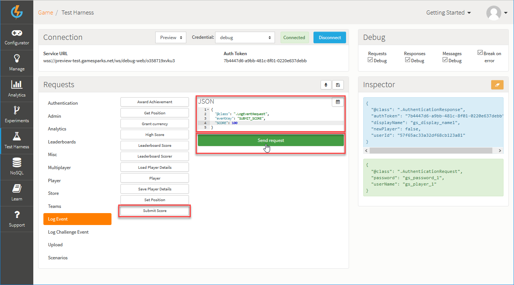
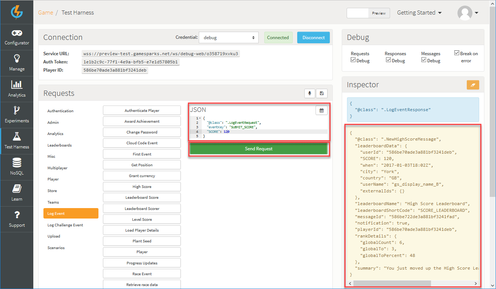
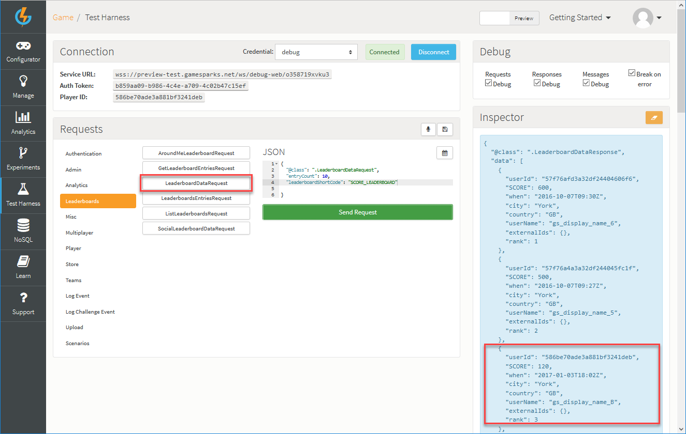

# Unity Leaderboard

## Introduction

This tutorial will go over the process of creating a Leaderboard, along with an Event which will be used to post scores to that Leaderboard. You will then see how in Unity:
* The scores can be submitted.
* You can retrieve Leaderboard data.
* You can receive High Score Messages.

You don’t need anything extra to follow this tutorial, but if you’d like to see the project you can download it:

* **Example Unity Leaderboard** code can be downloaded [here](http://repo.gamesparks.net/docs/tutorial-assets/UnityLeaderboard_Tutorial.zip)

## Creating the Score Event

The first thing you need to do is create an Event that will push the player’s score to the Leaderboard.

<q>**More Details on Events?** For an in-depth guide about Events click [here](/Documentation/Configurator/Events.md).</q>


For this tutorial, your new Event needs one Attribute, which will be the score, and you can call the Event something like *Submit Score*. The options for creating an Event are as follows:

*   *Short Code* – This mandatory field is the reference by which you will call the Event. *Short Codes* are always unique.
*   *Name* – This mandatory field is used when representing the Event in Test Harness as well as in Cloud Code.
*   *Description* – This mandatory field is used to display what the Event is used for. You can use this field for your own benefit by entering a description of the Event's purpose.
* For the Attribute:
	*   *Name* - This field is the name of the Attribute you want to pass into the Event. In your case this will be *Score*.
	*   *Short Code* – This is the reference you'll be using to pass in an Attribute into the Event from Unity. In your case this will be *SCORE*.
	*   *Data Type* – The type of data being passed in - String, Number, JSON. In your case, select *Number*.
	*   *Default Value* – This would be the default value that would be used for this Event Attribute if it’s not passed into the [LogEventRequest](/API Documentation/Request API/Player/LogEventRequest.md) , that is, a score of zero would be the default.
	*   *Default Aggregation Type* – This determines how values are tracked in the Running Totals. In your case you want the score to record the *Maximum*, which means the Leaderboard will only record the player’s highest score. If a player submits a lower score to the board, it will not be recorded.


## Creating the Leaderboard

Next you'll need to create your Leaderboard.

*1.* Navigate to *Configurator > Leaderboards*.

*2.* Click *Add*. The page adjust for adding a new Leaderboard.

<q>**More on Leaderboards?** Most of the details you see here can be left as default for this tutorial but you can get more information about Leaderboard configuration [here](/Documentation/Configurator/Leaderboards/README.md).</q>

*3.* The important details for us in this example are:
* *Short Code*
* *Name*
* *Description*
* *High Score Notifications*

*4.* Under *Fields*, click *Add* to add *Running Total* to the Leaderboard:
* If the *Submit Score* created above is the first Event you've created in your game, this will be pre-selected for the new *Running Total*. This is because it's the only applicable Event you have in your game at the moment.


## Testing the Leaderboard

Now you're ready to send some scores to your Leaderboard. However, before you go into Unity, you should test this Leaderboard in the *Test Harness*.

After authenticating yourself as a Player, find your Event under *LogEvent*, enter a score, and send the Event.



Immediately after you send the request, you will see a message appear in the *Inspector*. This is a *NewHighScoreMessage* and when you go back into Unity you are going to set up an Event listener to execute some code whenever a player gets this Message.




### Getting the Leaderboard Data

You can also check your Leaderboard data entries from the Test Harness using the [LeaderboardDataRequest](/API Documentation/Request API/Leaderboards/LeaderboardDataRequest.md):
* You can find this in the *Leaderboards* tab on the *Test Harness*.
* This request gives you a lot of control over the entries it will return. However, you are only concerned with the Leaderboard *Short Code* and the *entry count* (the number of entries this request will return).
* When you send the request, you'll see the list of Leaderboard entries returned on the *Inspector* on the right:




Now you're ready to start sending and receiving Leaderboard data in Unity.

### Getting the Leaderboard Data in Unity


In the previous tutorial on Cloud Code, you've already seen how to send a *logEventRequest* in Unity, which you can check out [here](/Getting Started/Using Cloud Code/Unity Cloud Code.md). The code is as follows:

```

new GameSparks.Api.Requests.LogEventRequest().SetEventKey("SUBMIT_SCORE").SetEventAttribute("SCORE", "1234").Send((response) => {
	if (!response.HasErrors) {
		Debug.Log("Score Posted Successfully...");
	} else {
		Debug.Log("Error Posting Score...");
	}
});

```

To get the Leaderboard data back, you need to call a *LeaderboardDataRequest*, the same way you did using the Test Harness:

```

new GameSparks.Api.Requests.LeaderboardDataRequest().SetLeaderboardShortCode("HIGHSCORE_LEADERBOARD").SetEntryCount(100).Send((response) => {
	if (!response.HasErrors) {
		Debug.Log("Found Leaderboard Data...");
		foreach(GameSparks.Api.Responses.LeaderboardDataResponse._LeaderboardData entry in response.Data) {
			int rank = (int) entry.Rank;
			string playerName = entry.UserName;
			string score = entry.JSONData["SCORE"].ToString();
			Debug.Log("Rank:" + rank + " Name:" + playerName + " \n Score:" + score);
		}
	} else {
		Debug.Log("Error Retrieving Leaderboard Data...");
	}
});

```

The important thing here is to get the information back out of the Leaderboard Data:
* *response.Data* contains a collection of Leaderboard data you can iterate through and get the entry details back.
* *LeaderboardData* has a lot of information you can access, and you can check out more information about it [here](/API Documentation/Request API/Leaderboards/LeaderboardDataRequest.md).


Now, running the Request will print out the details of each of the Leaderboard entries in the console:


## Message Listeners

Finally you'll want to hook up the *NewHighScoreMessage* listener so that you can have some custom code execute when the player receives a new High Score:
* In Unity, player messages have listeners you can assign delegate functions to. Then, each time the player receives a message, the method will execute and you can get details about the message from within these methods.
* It's best to apply the listener in an *Awake()* method, because the player could have messages waiting on the server for them that they might miss if the code cannot execute the moment they log on.

```

void Awake() {
	GameSparks.Api.Messages.NewHighScoreMessage.Listener += HighScoreMessageHandler;
}
void HighScoreMessageHandler(GameSparks.Api.Messages.NewHighScoreMessage _message) {
	Debug.Log("NEW HIGH SCORE \n " + _message.LeaderboardName);
}

```

Now, to test this out, enter a new High Score for your player in the Unity sample project. You should see the *NEW HIGH SCORE* message appear in the console window:


