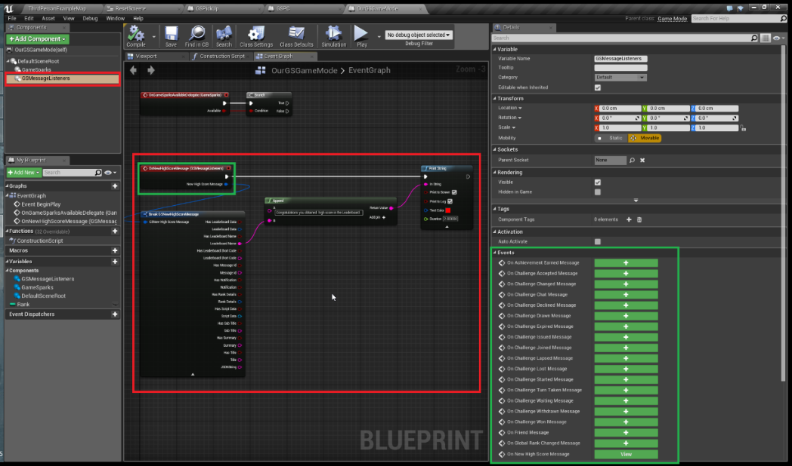

# Unreal Leaderboards

## Introduction

If you've followed the [tutorial](./README.md) for making an Event and a Leaderboard, then for this tutorial you only need to call your Event.

Here's an overview of what we'll cover in this tutorial:

**Gamesparks Message Listeners**

  * Creating a GS *MessageListeners* Component in your Game Mode class.
  * Retrieving the *OnNewHighScoreMessage* Event using the Listener.
  * Breaking the received message and printing out the name of the Leaderboard to the currently authenticated player.

**Calling the Event**

  * Call an Event that is linked to the Leaderboard.
  * Pass the SCORE value through to the Event.
  * Play the game and beat the High Score to receive feedback from the Service.

 
**Example Unreal Leaderboard** code can be downloaded [here](http://repo.gamesparks.net/docs/tutorial-assets/UnrealLeaderboard_Tutorial.zip)

## Setting up the Message Listener

*1.* First, we'll need to create a *GSMessageListeners* component (highlighted in red) in the Game Mode:

The *GSMessageListeners* component is an extremely useful tool, which will allow you to intercept messages from the Portal to your authenticated player, then break them down and use them in your sequences.

*2.* Here we're going to demonstrate the use of one message type interception by using the event *OnNewHighScoreMessage.* This can be dropped into the Event Graph after clicking the *GSMessageListeners* component:

And accessing its Events (highlighted in Green):

Once we drop the Event in, we can break the message down and access data that is useful to us.

For this tutorial, we'll be retrieving the name of the Leaderboard to inform the player on which Leaderboard they have achieved a High Score.

## Setting up the Event Call

Once the Listener is ready, we can call the *Leaderboard_Score* event from anywhere we wish to upload the final score to. For this tutorial, we've placed it right after our game countdown reaches zero and the points we collected during the game are uploaded to the Leaderboard. If a new High Score is achieved for the currently authenticated player, a message will be sent to notify them.

Now, execute the Event that was previously set up on the Portal using *GS LogEventRequest*:
* You will have to pass in the *SCORE* attribute into the Event. In this instance, we *Floor* our float score to round it off to the closest int and transform this value into an int. Then use the *Set Number* to set the value for the attribute.

## Testing

Finally, you can play the game.

Here you can authenticate, play the game, and, if you beat the High Score, you'll receive a message saying you did so:

## Retrieving Leaderboard Entries

One way to retrieve entries from a Leaderboard is the [LeaderboardDataRequest](/API Documentation/Request API/Leaderboards/LeaderboardDataRequest.md). The *LeaderboardDataRequest* retrieves a list of entries from top of the Leaderboard to a stated number set in the Entry Count input. For our example we'll be using this request.

Another useful request is [AroundMeLeaderboardRequest](/API Documentation/Request API/Leaderboards/AroundMeLeaderboardRequest.md), which retrieves a number of entries above and below the current player's entry in a specified Leaderboard. Both requests return Leaderboard entry structures that can be used in the same way.

For our example, we'll be calling a *LeaderboardDataRequest* and looping through every entry in the 'Data' array.

We'll get the Rank, Username, and our custom value used to rank the entries 'SCORE'.

