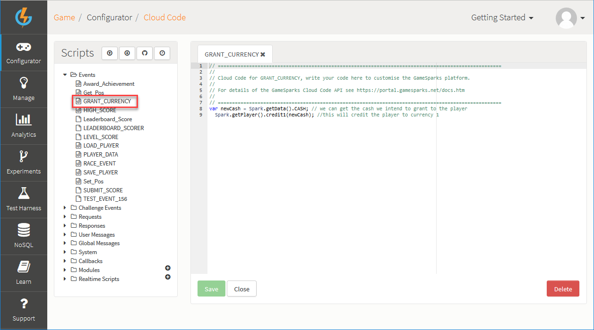

# ActionScript Virtual Goods

## Introduction

Once you've created [Virtual Goods](./README.md) on the Portal, you can incorporate them in your game.

This tutorial shows you how to buy and consume goods using a shop interface:

**Creating a 'Grant Currency' Event**

  * To help test the Virtual Goods, create an Event on the portal which takes an attribute of type NUMBER.
  * Using Cloud Code, accredit the player an amount of currency passed in through the NUMBER attribute.

**Creating the Buy and Consume functions**

  * Create a function to log the *BuyVirtualGoods* request and a function for the *ConsumeVirtualGoods* request.
  * Create a function to handle the *BuyVirtualGoods* request.
  * Create a function to handle the *ConsumeVirtualGoods* request which logs an Event to accredit the authenticated player with extra currency.

**Keeping track of player details**

  * Create a function that updates the player's currency and amount of Virtual Goods owned by using the *AccountDetailsRequest*.

**Testing Virtual Goods**

  * Launch your game, buy and consume Virtual Goods to see your details being updated accordingly.

</br>
**Example ActionScript Virtual Goods** code can be downloaded [here](http://repo.gamesparks.net/docs/tutorial-assets/ActionscriptVirtualGoodsMXML.zip)

## Creating the 'Grant Currency' Event

*1.* Navigate to *Configurator > Events* and click *Add*. The *Add Event* page opens.

*2.* Create an Event that credits the authenticated player with extra *currency*.

*3.* Add an *Attribute* that will be used to indicate the amount to credit.

You will log this Event whenever the authenticated player *consumes* a Gold Coin (Virtual Good).


*4.* Save the *Grant currency* Event and navigate to *Configurator > Cloud Code* and under *Scripts* click *Events*.

*5.* Select the *Grant currency* event to open the Cloud Code Editor. In the Cloud Code Editor create a variable that holds the amount being passed in the Event through the *CASH* Attribute, and call it *money*:

*6.* Next, get the player object using *Spark.getPlayer()* and credit their *currency1* with the *money* value.


 
Here's the Cloud Code:

```
var money = Spark.getData().CASH;

Spark.getPlayer().credit1(money);

```

*7.* Click to *Save* the Cloud Code you've added to the *Grant currency* Event.

## Creating the Buy and Consume Functions

*8.* Create a function which will log a *buyRequest* when called by using [BuyVirtualGoodsRequest](/API Documentation/Request API/Store/BuyVirtualGoodsRequest.md). The *BuyVirtualGoods* request needs a *currency* type, a *quantity*, and the *Short Code* for the item to be purchased.


```
    			private function PurchaseItem():void
    			{
    				logger("Buying Virtual Good...");
    				requestBuilder.createBuyVirtualGoodsRequest().setCurrencyType(1).setQuantity(Number(BuyQnt.text)).setShortCode("Gold_Coin").send(BuyResponse);
    			}
```

*9.* Create a function for the consumption of *Virtual Goods*, this will use the [ConsumeVirtualGoodRequest](/API Documentation/Request API/Store/ConsumeVirtualGoodRequest.md). The *ConsumeVirtualGoodRequest* needs a *quantity* and *Short Code* of the item to be consumed.

```
    	private function ConsumeItem():void
    			{
    				logger("Consuming Virtual Good...");
    				requestBuilder.createConsumeVirtualGoodRequest().setQuantity(Number(ConsumeQnt.text)).setShortCode("Gold_Coin").send(ConsumeResponse);
    			}
```

*10.* Now you can make the *response* *handler* functions for your *consume* and *buy* requests. Both *response handlers* will be similar. For our tutorial, we won't need them to do much:
* Have the functions check the response for errors.
* If the response has no errors then send a *string* to the *logger*.
* For the *consume* *response*, if there are no errors, call the Event which accredits the player with extra *currency*.
* When either *response handler* reaches the end of their sequence, the shop data will be updated.

```
    	private function BuyResponse(response:BuyVirtualGoodResponse):void
    			{

    				if (response.HasErrors())
    				{
    					logger("Problem occurred");
    				}
    				else
    				{
    					logger("Item bought");
    				}

    				requestBuilder.createAccountDetailsRequest().send(UpdateDetailsForShop);
    			}

    	private function ConsumeResponse(response:ConsumeVirtualGoodResponse):void
    			{
    				if (response.HasErrors())
    				{
    					logger("Problem occurred");
    				}
    				else
    				{
    					requestBuilder.createLogEventRequest().setEventKey("Grant_Currency").setNumberEventAttribute("CASH", Number(ConsumeQnt.text)).send(GeneralLogResponse);
    					logger("Item consumed");
    				}

    				requestBuilder.createAccountDetailsRequest().send(UpdateDetailsForShop);
    			}
```

## Keeping Track of Player Details

*11.* To update the shop details, request the *account* *details* for the currently authenticated player:
* For the *currency* it's a simple text display.
* For the *Virtual* *Goods,* retrieve the *Virtual Goods* through *getVirtualGoods()* method, followed by the *Short Code* of your *Virtual Good* which retrieves a *Number* of the *Virtual Goods* of that type.

```
    	private function UpdateDetailsForShop(response:AccountDetailsResponse):void
    			{
    				ShopCurrency.text = response.getCurrency1().toString();
    				NOwned.text = response.getVirtualGoods().Gold_Coin.toString();
    			}
```

## Testing Virtual Goods

Create a way for the player to *buy* and *consume* Virtual Goods in your project. Test your shop to make sure that:
* When you click *buy*, the *currency* depletes in exchange for an increased amount of Virtual Goods.
* When you *consume* items, the *currency* should go up but the amount of Virtual Goods owned should decrease.


