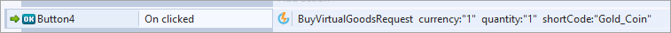

# Construct 2 Virtual Goods

This tutorial will demonstrate how to purchase Virtual Goods and view player records.

## Purchase Request and Response

Create an action that will build and send the [BuyVirtualGoodsRequest](/API Documentation/Request API/Store/BuyVirtualGoodsRequest.md). We'll be buying the *Gold_Coin* Virtual Good we created in the [previous tutorial](/Getting Started/Creating a Virtual Good/README.md). Set the quantity and currency type to 1 and set the Short Code to the name of the item. Here is an example of the request in Construct 2:

The response will help you confirm the item that's been purchased and whether or not any errors occurred. As we did in the [Leaderboard tutorial](/Getting Started/Creating a Leaderboard/Construct 2 Leaderboards.md), we have to load the response into a JSON object. Then, using the Repeat System command to check the size of the *boughtItems* array in the response, we can loop through and check exactly what was bought. In this case, we loop through the bought items to append the *Item* and *Quantity* to in-game Text:

If the player doesn't have the needed funds, the response will come back with a useful error message:
* These messages can be relayed to players to inform them that they need to earn a little more to be able to afford this item.
* For full list of errors please check our [API Documentation](/API Documentation).

## Using AccountDetailsRequest

Now we’ll create an action which will retrieve your player's record. With this you can iterate through various fields to display to the game or keep them on record for any in-game logic.

*1.* Create an action that builds the [AccountDetailsRequest](/API Documentation/Request API/Player/AccountDetailsRequest.md) and sends it:

*2.* Next we load the data into JSON:

From here we can do a number of things. We can:
* Iterate through the array of Achievements returned to list them in a progress page.
* Find how much of a particular Virtual Good a player has.
