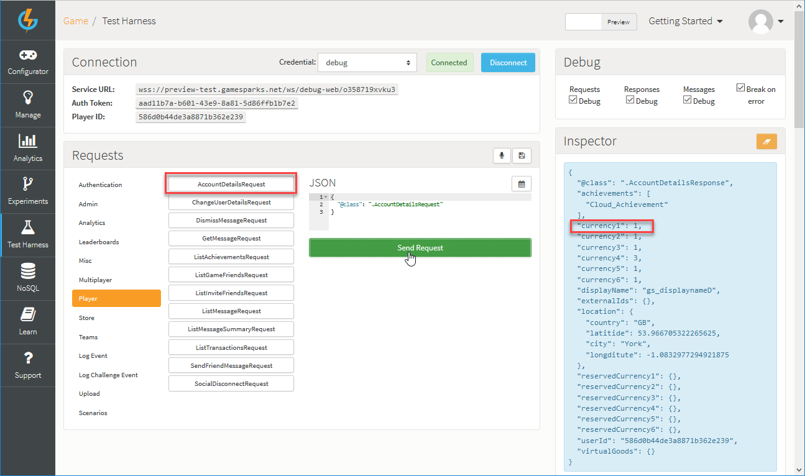

# Creating a Virtual Good

## Introduction

In the context of the GameSparks platform, a Virtual Good is any in-game asset that can be awarded, accumulated, or bought. This would cover XP points and in-game currencies as well as specific goods that deliver benefits in-game (such as convenience, customization, competitive advantage, and so on). These can be used and consumed cross-platform:
* You can set up Virtual Goods to be bought as In-App Purchases (IAPs). This is when you associate the Virtual Goods with the Product IDs of the corresponding items on the stores and when a good is purchased we can reconcile the store receipts with the items.
* You can define relationships between your Virtual Goods so they can be traded or converted.

There are many ways of awarding Virtual Goods. In this tutorial, we'll award the player with a Virtual Good by "purchasing" it. This is done via a [BuyVirtualGoodsRequest](/API Documentation/Request API/Store/BuyVirtualGoodsRequest.md).

## Setting Up a Virtual Good

*1.* First, navigate to *Configurator > Virtual Goods*. The *Virtual Goods* page opens:

Any existing *Virtual Goods* are listed and you can edit or delete them.

*2.* Click *Add*. The *Add Virtual Good* page opens:

*3.* Next, enter the details of the new Virtual Good:

  * *Short Code* - This mandatory field is the reference by which we'll award the Virtual Good. *Short Codes* are always unique.
  * *Name* - This mandatory field is used when listing Virtual Goods in all of the returns.
  * *Description* - This mandatory field is used to display what the Virtual Good is used for - use it for your own benefit to keep track of the Virtual Goods in a game.
  * *Currency 1* - This is the amount of Currency 1 that is required to "purchase" this Virtual Good.

You can leave the other configuration options as default.

<q>**Other Configuration Options?** For more details on the configuration options for Virtual Goods, click [here](/Documentation/Configurator/Virtual Goods.md).</q>

## Purchasing the Virtual Good in the Test Harness

Now everything is set up, you'll need to navigate to the Test Harness and authenticate with one of the players you have [registered](/Getting Started/Using Authentication/README.md) previously. The [previous](/Getting Started/Creating an Achievement/README.md) tutorial showed you how to award your player with some currency via an Achievement. Now you are ready to purchase your first Virtual Good.

*1.* To start, and just to be sure, let's validate that the player has enough of Currency *1* to purchase the Virtual Good using the [AccountDetailsRequest](/API Documentation/Request API/Player/AccountDetailsRequest.md):

*2.* To get the Virtual Good, under *Requests* click *Store* and select [BuyVirtualGoodsRequest](/API Documentation/Request API/Store/BuyVirtualGoodsRequest.md). To submit this request, you'll have to fill the following values in the JSON builder:

  * *currencyType* - This is the currency you're "paying" with. Here, it's *1*.
  * *quantity* - This is the quantity of the given Virtual Good that you wish to purchase. Here, it's *1*.
  * *shortCode* - The Short Code of your Virtual Good you'll be using in this request. Here, it's *"GOLD_COIN"*.

*3.* Click *Send Request*

Receiving a successful *BuyVirtualGoodsResponse* is a good indication everything has succeeded. However, you should still validate this by doing an [AccountDetailsRequest](/API Documentation/Request API/Player/AccountDetailsRequest.md). You should see that the Currency 1 has decreased by 1 and that you've been awarded with 1 Gold Coin.

 

## SDK Instructions

* [Unity](/Getting Started/Creating a Virtual Good/Unity Virtual Goods.md)
* [Unreal](/Getting Started/Creating a Virtual Good/Unreal Virtual Goods.md)
* [ActionScript](/Getting Started/Creating a Virtual Good/ActionScript Virtual Goods.md)
* [Lua](/Getting Started/Creating a Virtual Good/Lua Virtual Goods.md)
