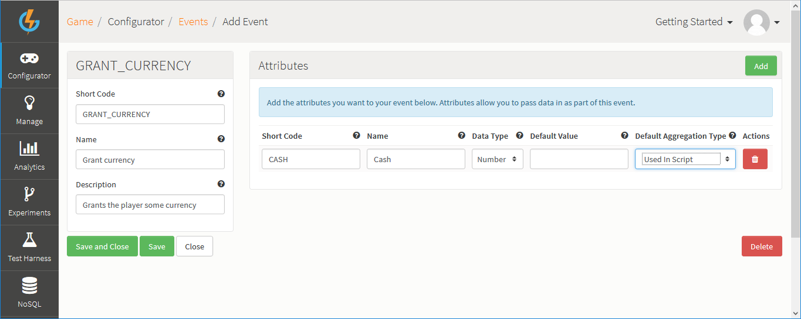
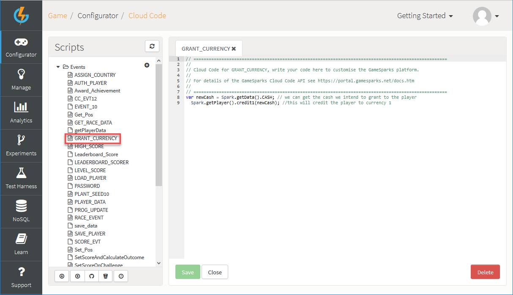
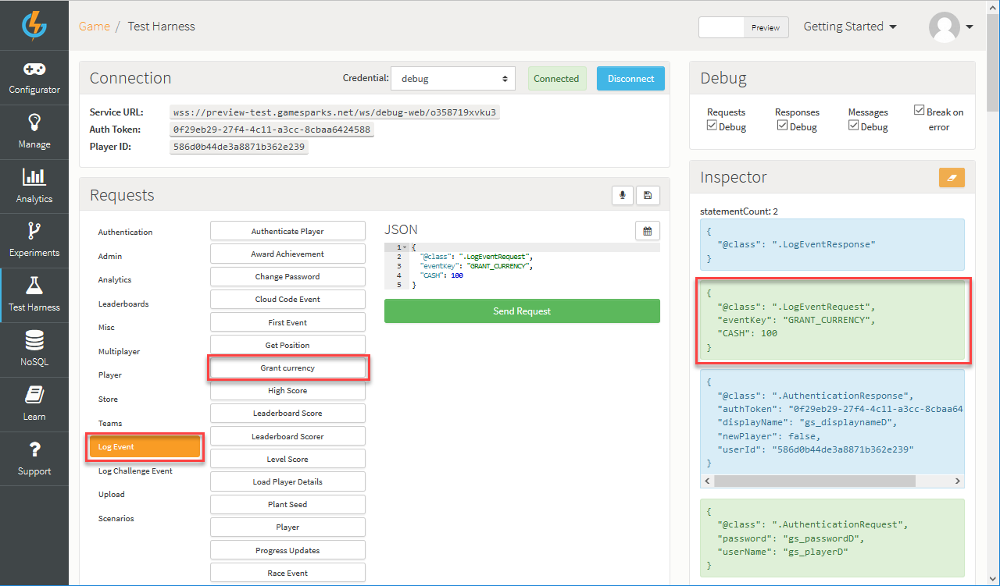

# Unity Virtual Goods

## Introduction

This tutorial shows you how to buy and consume Virtual Goods when using Unity with the GameSparks platform. You'll also see how to get a list of what Virtual Goods are owned by the player.

Before following this tutorial, make sure you have checked out the previous tutorial [Creating Virtual Goods](./README.md). Nothing else is needed to carry out this tutorial. However, if you would like to see the project, you can download it.

* **Example Unity Virtual Goods** code can be downloaded [here](http://repo.gamesparks.net/docs/tutorial-assets/UnityVirtualGoods_Tutorial.zip)

## Granting Currency

To begin with, you'll need to create a new Event with some Cloud Code that will grant the player some currency.

*1.* Navigate to *Configurator > Events* and click *Add*:



For this tutorial we've:
* Called the Event *Grant currency*.
* Added a *Cash* Attribute to the Event.

*2.* Click to *Save and Close* the new Event.

*3.* Navigate to *Configurator > Cloud Code* and under *Scripts* click *Events*.

*4.* Select the newly-created *Grant currency* Event. The *Cloud Code* editor opens for this Event and you can add the required Cloud Code:



This is the Cloud Code:

```

  var newCash = Spark.getData().CASH; // we can get the cash we intend to grant to the player
  Spark.getPlayer().credit1(newCash); //this will credit the player to currency 1


```

## Setting up the Shop

If you have downloaded the sample project for this tutorial, you'll find that these interfaces are already set up in your project. If not, you'll need to create a really simple interface where you can buy and consume gold coins.

The shop set up works as follows.

### Fetching Player Data

When the Shop is selected or transitioned, you need to call the [AccountDetailsRequest](/API Documentation/Request API/Player/AccountDetailsRequest.md) in order to get the player’s account details from GameSparks:
* You can then get and set the current currency and number of gold coins the player owns.
* You can find out more about *AccountDetailsRequest* [here](/API Documentation/Request API/Player/AccountDetailsRequest.md).
* If you have read the previous tutorial on [Achievements](/Getting Started/Creating an Achievement/Unity Achievements.md), you will be familiar with what data you can get back from the *AccountDetailsResponse*.


One of the details in the Response is a list of Virtual Goods. You can get that data back using the Short Code for your gold coins and the *GetNumber()* method.

```
    new GameSparks.Api.Requests.AccountDetailsRequest().Send((response) => {
    	if (!response.HasErrors) {
    		Debug.Log("Account Details Found...");
    		string playerName = response.DisplayName; // we can get the display name
    		int cashAvailable = (int) response.Currency1;
    		int goldCoinsAvailable = (int) response.VirtualGoods.GetNumber("GOLD_COIN");
    	} else {
    		Debug.Log("Error Retrieving Account Details...");
    	}
    });
```

### Awarding the Player some Virtual Goods

So, before you can buy Virtual Goods you need make sure your player has some currency to spend. In this case, the gold coins are going to cost one *currency1* each:
* At the start of this tutorial you created a *Grant Currency* Event that will give the player some currency. You need to call this event using the *LogEventRequest* either in Unity, or in the *Test Harness* of the GameSparks platform.
* If you need a recap on how to use the *LogEventRequest*, check out the tutorial [here](/Getting Started/Using Cloud Code/Unity Cloud Code.md).



Here's what we've entered in the Test Harness JSON builder for the *LogEventRequest* and submitted by clicking the play  icon:

```
{
"@class": ".LogEventRequest",
"eventKey": "GRANT_CURRENCY",
"CASH": 100
}

```

### Buying Virtual Goods

In order to buy Virtual Goods you need to call the *BuyVirtualGoodsRequest*. This request takes a few attributes, such as the *currencyType* (currency1 in your case) the* quantity* (amount to buy) and the *Short Code* for your Virtual Good (in your case *GOLD_COIN* is the *Short Code*).


```
    new GameSparks.Api.Requests.BuyVirtualGoodsRequest().SetCurrencyType(1).SetQuantity(1).SetShortCode("GOLD_COIN").Send((response) => {
    	if (!response.HasErrors) {
    		Debug.Log("Virtual Goods Bought Successfully...");
    		UpdatePlayerDetails();
    	} else {
    		Debug.Log("Error Buying Virtual Goods...");
    	}
    });
```


### Consuming Virtual Goods

The next thing to do is give your player the ability to use their Virtual Goods and communicate with your GameSparks game to check that the Virtual Good has been consumed. To do this you need to call the *ConsumeVirtualGoodRequest*, which requires you to enter the *Short Code* and quantity of the Virtual Good.


```
    new GameSparks.Api.Requests.ConsumeVirtualGoodRequest().SetQuantity(1).SetShortCode("GOLD_COIN").Send((response) => {
    	if (!response.HasErrors) {
    		Debug.Log("Virtual Goods Consumed Successfully...");
    		UpdatePlayerDetails();
    	} else {
    		Debug.Log("Error Consuming Virtual Goods...");
    	}
    });
```

### Testing Your Shop

You'll now have the ability to buy and consume Virtual Goods, as well as grant your players some currency and retrieve and update the account details each time an action is taken. If you are working from the GameSparks sample project for this tutorial, you'll see the following screen.


