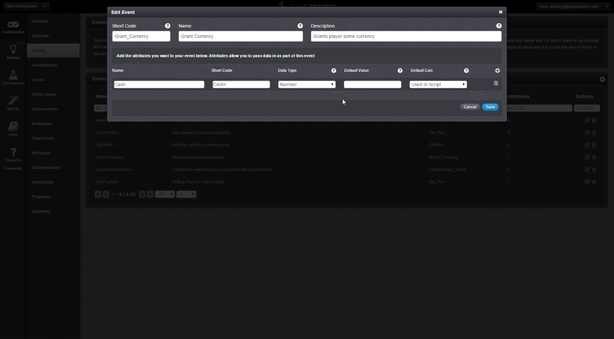
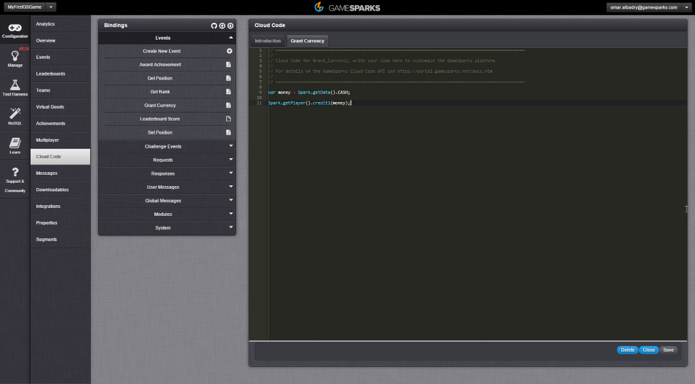

# Unreal Virtual Goods

## Introduction

After following the tutorial [Creating a Virtual Good](./README.md), you are ready to integrate the same functionality into your Unreal Engine Game - you can now set up the ability for your authenticated players to buy and consume Virtual Goods and retrieve a list of exactly what Virtual Goods your authenticated player have in their inventory.

Here's what we'll cover in this tutorial:

**Setting up the Shop Screen**

  * Make a shop screen for the user to buy and consume Virtual Goods.
  * The shop needs to update the players Currency and the number of owned Virtual Goods.

**Buying a Virtual Good**

  * Use a GS *BuyVirtualGoodRequest* node to purchase Virtual Goods by passing in the Currency type, quantity and the Short Code values.
  * Immediately update the details of the authenticated player.

**Consuming a Virtual Good**

  * Use a GS *ConsumeVirtualGoodRequest* node to consume Virtual Goods by passing in the quantity, and the Short Code values.
  * Log an Event called *Grant Currency* to credit the player with extra currency by passing in the *Cash* attribute.
  * Update the player details.

**Using the Shop**

  * Click the buy and consume buttons to change the currency and the number of Virtual Goods owned.
  * Ensure that details are being correctly updated.

 
**Example Unreal Virtual Goods** code can be downloaded [here](http://repo.gamesparks.net/docs/tutorial-assets/UnrealVirtualGoodsUassets.zip)

## Using Virtual Goods

### Creating the 'Grant Currency' Event

*1.* Create an Event that credits the *authenticated* player with extra currency.

*2.* Add an *Attribute* that will be used to indicate the amount to credit.

This event will be logged whenever the *authenticated* player *consumes* a Gold Coin Virtual Good:

*3.* In the Events *Cloud Code,* create a variable that holds the amount being passed in the Event through the *CASH* Attribute and call it *money*.

*4.* Now get the Player object using *getPlayer* and credit them *currency1* by the *money* value:

### Setting up the Shop Screen

*5.* Create a shop screen in your game, with one item for sale - the Gold Coin. The *authenticated* player is going to have the option to *buy* and *consume* gold coins. The player will also be able to see how many Gold Coins they have in their inventory and how much *currency* they hold in their Currency1 slot.

When the player transitions to the shop screen, the values for the player's *Display Name*, *Currency* and the amount of Gold Coins owned need to be updated.

*6.* To update the values, request them using *GS AccountDetailsRequest* node.

*7.* To retrieve the amount of gold coins owned, use the node *Get Number* dragged from the *Account DetailsResponseVirtualGoods* port on the *AccountDetailsRequest* node with the *Short code* of the item you're looking for - in this example, it's *Gold_Coin*:

### Clicking to Buy

When the *Buy* button is clicked, a Gold Coin needs to be purchased.

*8.* To buy a Virtual Good, call the *BuyVirtualGoodRequest* node which takes the type of *currency*, *quantity*, and the *Short Code* for the item being bought, which in this case is *Gold_Coin*.

*9.* After the player has purchased a Virtual Good, update their details so they are aware of the change.

### Clicking to Consume

Check to see if the player has Gold Coins to consume.

*10.* If the player has enough Gold Coins, call the *GS ConsumeVirtualGoodRequest* node, which takes a *quantity* and the *Short* *Code* of the Virtual Good.* *The *ConsumeVirtualGood* Event automatically decrements the overall *quantity* owned in the player's inventory.

*11.* After the Gold Coin is *consumed,* log the *Grant_Currency* Event to accredit the *authenticated* player with a value of 1 passed through the *CASH* Attribute.

### Using the Shop

If the *authenticated* player uses the shop they should be able to *buy* and *consume* the Gold Coin Virtual Good and see their information update correctly.

