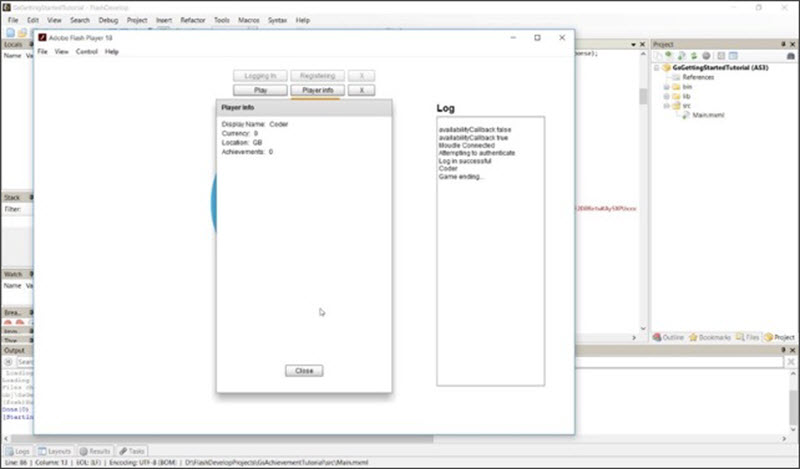
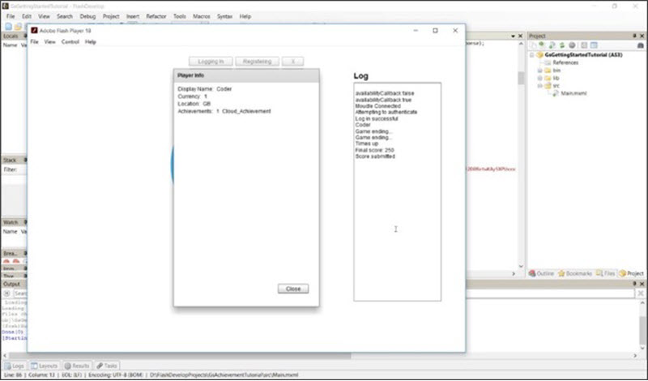

# ActionScript Achievements

## Introduction

After making an Event that awards your player an Achievement using Cloud Code in the Portal, you can incorporate them into your game. This tutorial shows you how to award the player an Achievement and how to check the Achievements a Player has earned in-game.

**Setting up the Account Details Request and Earning an Achievement**

  * Create a function which logs an Account Details request using the request builder.
  * Create a function which handles the Account Details response and organizes it in a way that can be displayed to the user.
  * Log the Event which awards the authenticated Player an Achievement through Cloud Code.

**Testing the Achievement**

  * Request the authenticated player's details to see that the player has no Achievements.
  * Achieve the conditions to log the Event which awards the player an Achievement. In this tutorial's game, we'll beat the highscore in the allotted time.
  * After meeting the condition to earn the Achievement, request the player details to see that the account has earned the Achievement.

</br>
**Example ActionScript Achievements** code can be downloaded [here](http://repo.gamesparks.net/docs/tutorial-assets/ActionscriptAchievementsMXML.zip)

## Setting up the Account Details Request and Earning an Achievement

Before you award the authenticated Player an *Achievement*, you'll have to give them the ability to check the *Achievements* that they've earned. To do that you must request *account details* using the *createAccountDetailsRequest* using the *requestBuilder*.

```
    	private function requestDetails():void
    			{
    				requestBuilder.createAccountDetailsRequest().send(PlayerDetails);
    			}
```

The response received by the *createAccountDetailsRequest* can be broken down to access a large amount of useful data.

For our example, we'll retrieve *Display name, currency, location*, and *Achievements*. The *Achievements* can be *retrieved* as a *vector* type and can be looped and listed conveniently. In our function, we're setting our labels' text to the data we're retrieving and looping through the *Achievements* earned to display them in a list.

```
    	private function PlayerDetails(response:AccountDetailsResponse):void
    			{

    				var vec:Vector.;
    				PlayerInfo.visible = true;
    				AInv.removeAllElements();
    				vec = response.getAchievements();
    				DNameTxt.text = response.getDisplayName() ;
    				C1Txt.text = response.getCurrency1().toString();
    				LocTxt.text = response.getLocation().getCountry();
    				ATxt.text = response.getAchievements().length.toString();
    				for (var i:int = 0;  i < vec.length; i++)
    				{
    					if (vec[i] != null)
    					{
    						addAchievements(vec[i]);
    					}
    				}

    			}

```

Finally, to finish the *Achievement* set up, all you have to do is call the Event that awards the Player the '*Cloud Achievement'* that has been created in the Portal.

In this tutorial, we're going to call the Event when the authenticated Player receives a highscore message:

```
    	private function HighScoreMessageListener(message:NewHighScoreMessage):void
    			{
    				Alert.show("You achieved the highscore in the leaderboard: " + message.getLeaderboardName(), "High Score Alert")
    				requestBuilder.createLogEventRequest().setEventKey("Award_Achievement").send(GeneralLogResponse);
    			}

```

## Testing the Achievement

*1.* Log in a player and request the details to see that everything is in order. You should receive the Player's *Display name, currency, location*, and zero *Achievements*:



*2.* Play the game and beat the highscore. Once you've received a message informing you that you've beaten the highscore, you should automatically receive the *Achievement*.

*3.* Request the account details again and check to see if the account has earned the *Achievement*:


