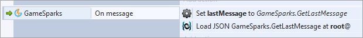
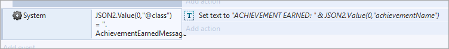
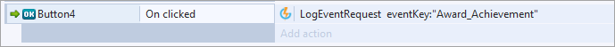

# Construct 2 Achievements

This tutorial shows you how to reward a player with an Achievement configured in the [previous tutorial](/Getting Started/Creating an Achievement/README.md) and how to notify the player that they've received it.

## Setting up your Listener

Similar to the [Leaderboard tutorial](/Getting Started/Creating a Leaderboard/Construct 2 Leaderboards.md), we need to set up a listener for the [AchievementEarnedMessage](/API Documentation/Message API/Player/AchievementEarnedMessage.md). We can do this by loading the last message received and checking the “@class” of the message to determine if we have earned an Achievement:

Next, we check this JSON value and if it's an *AchievementEarnedMessage*, then we can fire an action, which in this case is simply displaying the name of the Achievement in text:

## Awarding the Achievement to the Player

We'll be using the Event we configured in the [previous tutorial](/Getting Started/Creating an Achievement/README.md) to award the player the Cloud Achievement. Since we don’t need to add any attributes or additional data, we can use the out-of-the-box [LogEventRequest](/API Documentation/Request API/Player/LogEventRequest.md):

Once sent, the player will receive a message congratulating them on their new Achievement if it's the first time they've earned it!
