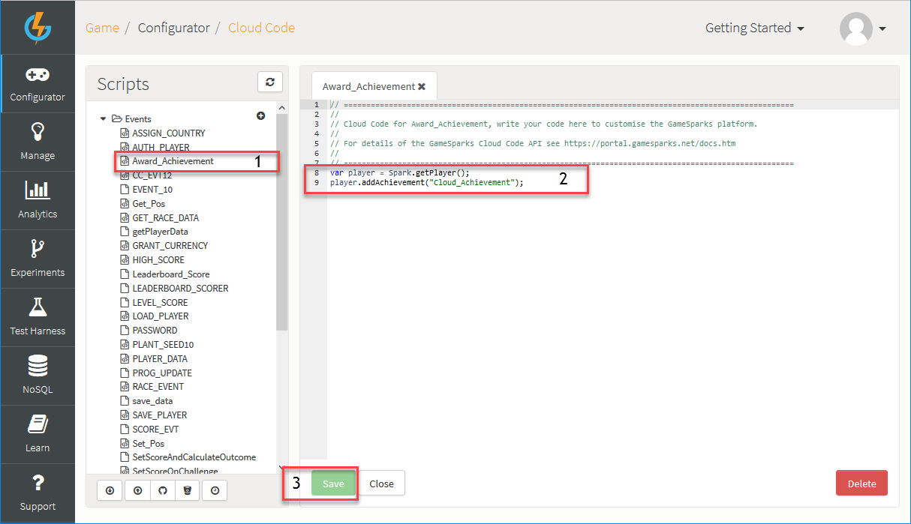
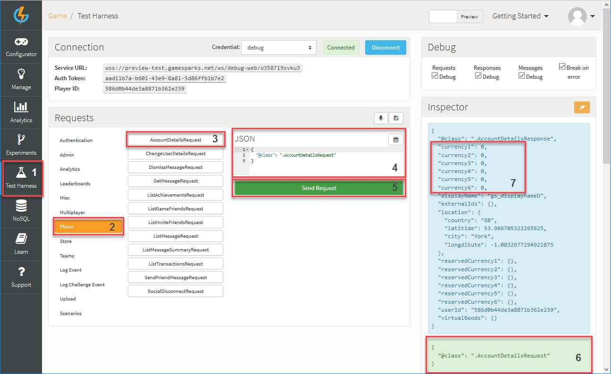
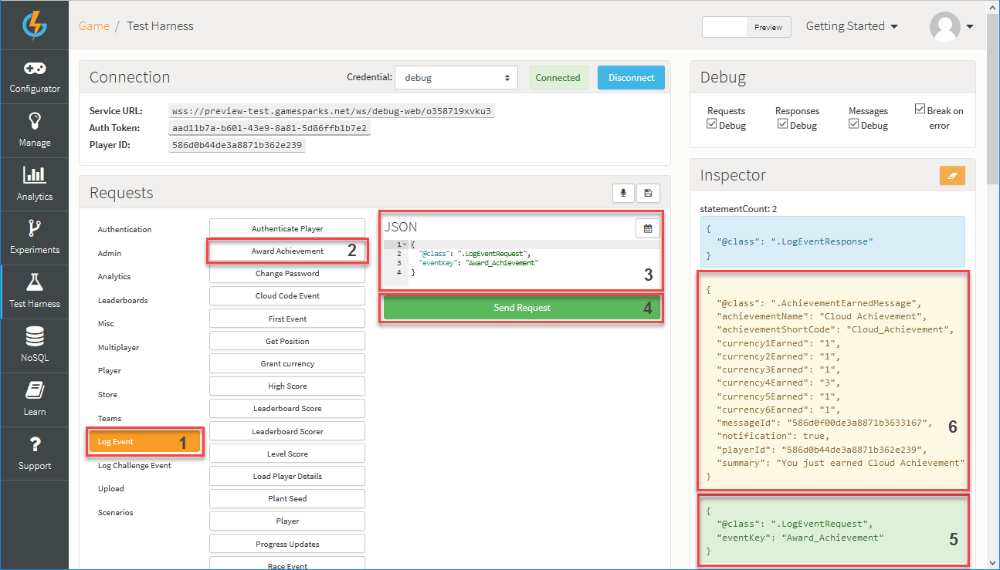

# Creating an Achievement

## Introduction

GameSparks Achievements support the rewarding of players for accomplishments within a game and are highly configurable with respect to both rewards and the criteria used to control when rewards are delivered:
* **Rewards.** Achievements support traditional achievements systems where virtual goods (such as badges or items) are won for completion of a particular task or combination of tasks. They can also be used to reward level completion or experience points (XP) progress bonuses, basic “crafting”, and rewards for breaking into the top [x] of a Leaderboard.
* **Cross-Platform Deployment.** Achievements are cross-platform. This conveniently means you don't have to set them up in each store and can support cross-platform play for your game. This is because game-progress can be tracked, allowing rewards to be used across multiple platforms.
* **Award Flexibility.** Achievements can be awarded:
  * Through Leaderboard Events.
  * Based on some custom logic defined in Cloud Code.

In this section you'll learn how to award an Achievement using custom Cloud Code. To do this, you'll need to:
* [Create an Achievement](#Creating an Achievement).
* [Create an Event](#Creating an Event).
* [Attach Custom Cloud Code to the Event](#Attaching Cloud Code to the Event).
* Finally, [run the Event](#Running the Event in the Test Harness).

## Creating an Achievement

*1.* First, navigate to *Configurator > Achievements*.

*2.* Click *Add*. The *Add Achievement* page opens.

*3.* Enter the details for the new Achievement:

  * *Short Code* - This mandatory field is the reference by which we'll award the Achievement. *Short Codes* are always unique.
  * *Name* - This mandatory field is used when listing Achievements in all of the Returns.
  * *Description* - This mandatory field is used to display what the Achievement is used for. This is primarily for your own benefit when you are working with your  Achievements in the Configurator.
  * *Currency 1-6* - The amount of each currency that will be awarded when the Achievement is earned.
  * *Leaderboard* - This field is used to either set up a *Leaderboard* or *Script Trigger*. For this tutorial, select *None - Triggered by Script*.

<q>**More on Achievements?** For an in-depth guide about Achievements click [here](/Documentation/Configurator/Achievements.md).</q>

<q>**Other Configuration Options?** All other Achievement configuration options that are not listed above can be left as default for this tutorial.</q>

*4.* Click *Save and Close*. The *Add Achievement* page closes and you are returned to the *Achievements* page where your new Achievement is added.

## Creating an Event

Following creation of an Achievement, you'll need to create a new Event. You can reference back to [Creating a Leaderboard](/Getting Started/Creating a Leaderboard/README.md) if you need to refresh on how to do this:
* We'll call the Event *Award Achievement*.

## Attaching Cloud Code to the Event

After you've created and configured the *Award Achievement* Event, you'll need to attach some custom Cloud Code to it to award the Achievement when the Event is called.

*1.* Navigate to *Configurator > Cloud Code > Events > Award_Achievement*. The *Cloud Code* editor opens for the Event.

*2.* In the *Cloud Code* editor, add your custom Cloud Code for this Event.

*3.* Click *Save*.

* This piece of Cloud Code takes hold of the player object that is currently authenticated:

    var player = Spark.getPlayer();

* This piece of Cloud Code actually awards the Achievement to the player:

    player.addAchievement("Cloud_Achievement");

The Achievement is now fully configured to be awarded!

## Running the Event in the Test Harness

*1*. Since everything is set up, you now need to navigate to the Test Harness and authenticate with one of the players you have previously [registered](/Getting Started/Using Authentication/README.md).

*2.* At this point the Achievement you have configured awards some currency, and you need to validate that the player currently doesn't have any currency associated with their account. To do this you'll need to select Player tab and send an [AccountDetailsRequest](/API Documentation/Request API/Player/AccountDetailsRequest.md):

*3.* Now you'll need to send the [LogEventRequest](/API Documentation/Request API/Player/LogEventRequest.md) for the Event you've configured earlier and using the  *Award_Achievement* Short Code you gave it as the *eventKey*:
* This will award the Achievement to the currently authenticated player and send the [AchievementEarnedMessage](/API Documentation/Message API/Player/AchievementEarnedMessage.md).
* Additionally, if you've enabled debug mode on your requests, the debugger should activate and you will be able to step through your Cloud Code. This only happens if your Requests/Responses/Messages have Cloud Code attached to them. You can read more about debugging Cloud Code [here](/Documentation/Test Harness/Debugger.md). After you've stepped through or exited the debugger, your player will be awarded the Achievement you've configured:

*4.* Finally, you can validate that the currency was awarded by calling the [AccountDetailsRequest](/API Documentation/Request API/Player/AccountDetailsRequest.md) again:

   

## SDK Instructions

* [Unity](/Getting Started/Creating an Achievement/Unity Achievements.md)
* [Unreal](/Getting Started/Creating an Achievement/Unreal Achievements.md)
* [ActionScript](/Getting Started/Creating an Achievement/ActionScript Achievements.md)
* [Lua](/Getting Started/Creating an Achievement/Lua Achievements.md)
* [Construct 2](/Getting Started/Creating an Achievement/Construct 2 Achievements.md)
