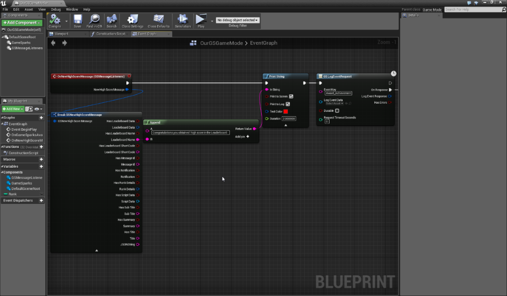
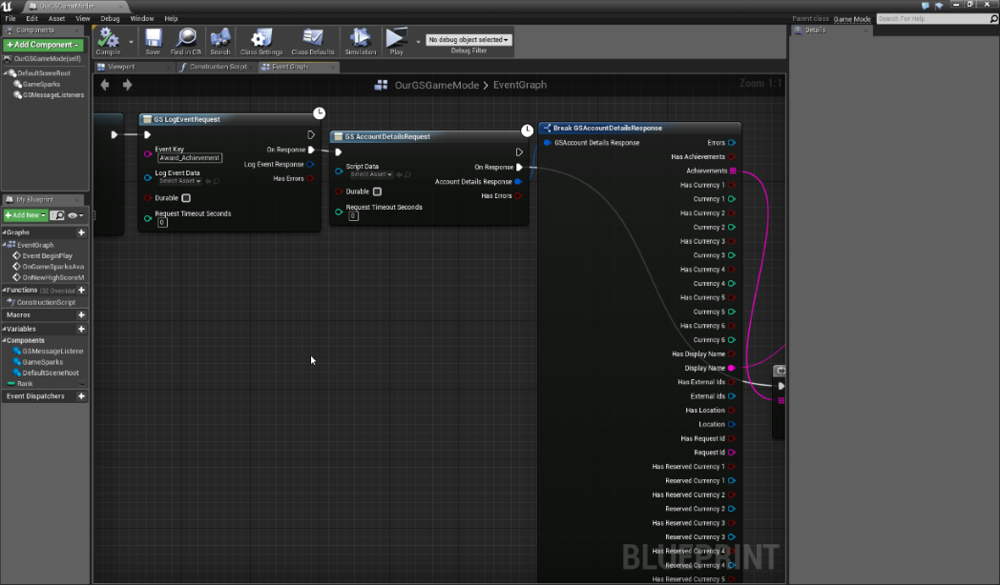
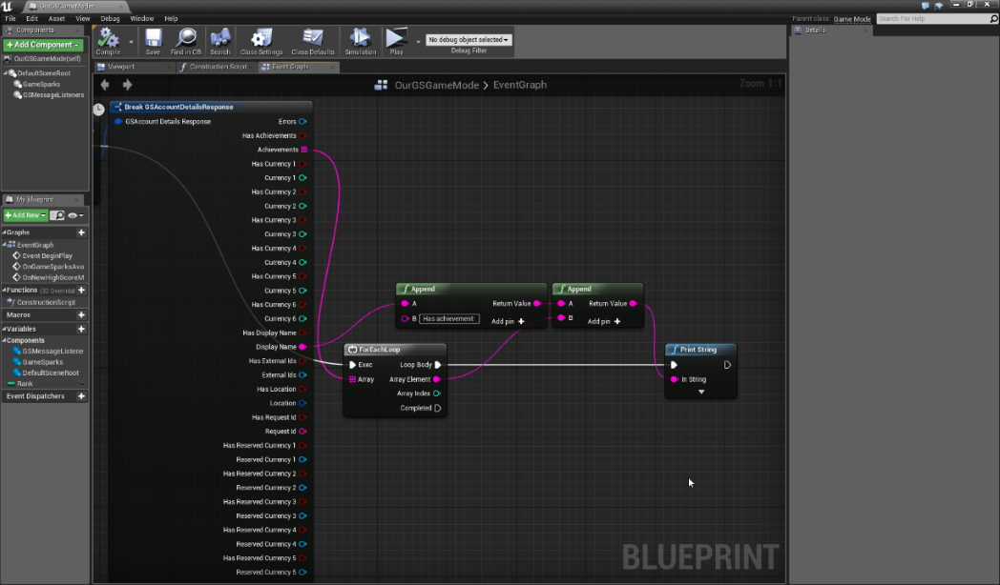
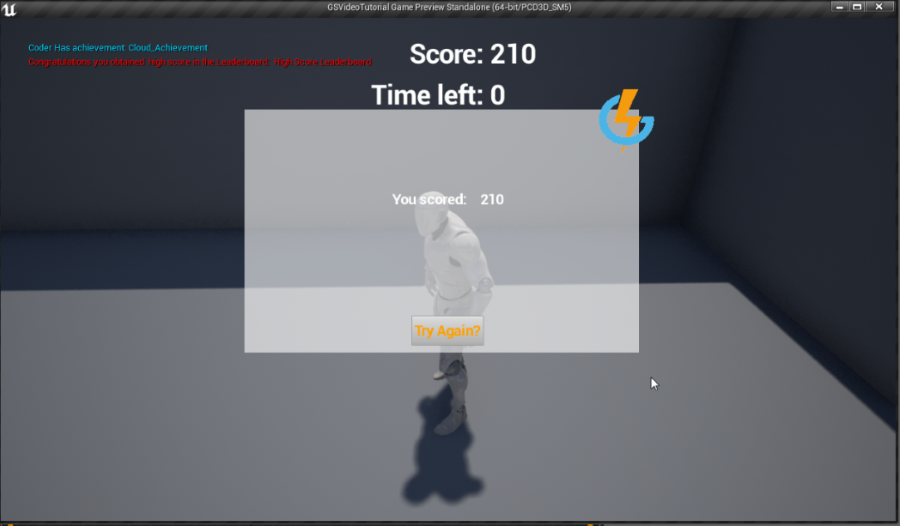

# Unreal Achievements

## Introduction

This tutorial assumes you have completed the [Creating an Achievement](/Getting Started/Creating an Achievement/README.md) tutorial and are ready to integrate the same functionality into your Unreal Engine Game.

Here's what we'll cover in this tutorial:

**Awarding an Achievement**
  * Execute a *GS LogEventRequest* and call the Event that will award an Achievement to the currently authenticated player.

**Account Details Response**

  * Create the *GSAccountDetailsResponse* node and *Break* the Account Details Response struct.
  * From the Account Details Response node retrieve the authenticated player's Achievements.
  * Print a message when the Achievement is unlocked.

**Testing the Achievement**

  * Play a game that will award you an Achievement if the conditions are met.

 
**Example Unreal Achievements** code can be downloaded [here](http://repo.gamesparks.net/docs/tutorial-assets/UnrealAchievementsUassets.zip)

## Awarding An Achievement

It's very simple to award an Achievement to the player using Unreal Engine SDK. All you have to do is call the Event that grants the authenticated player the Achievement, just like you did in the Achievements tutorial:

 

## Account Details Response

You can access many details about the *authenticated* player using *GSAccountDetailsResponse* node. This is where you can validate your player has received an Achievement, what currencies they own, and so on:

In this tutorial, we'll print out the authenticated player's *Display Name* and the *Achievements* they have unlocked, as long as they achieve a new High Score, because that will be our trigger:

 

## Testing the Achievement

The following image displays this in action. When we play the game and beat the High Score on the Leaderboard, we're notified about the High Score and all of our Achievements are printed out:

