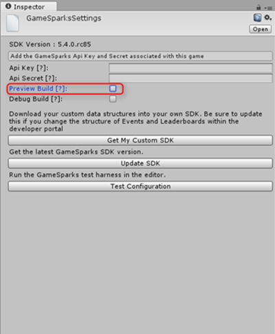
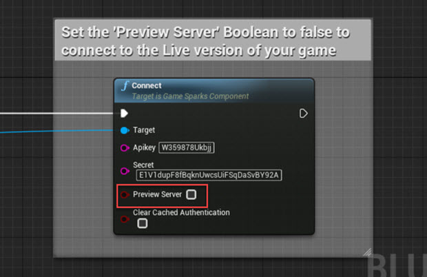
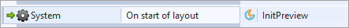
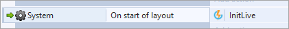

# Going Live Checklist

This *Going Live Checklist* is written for game owners who have created an account on the GameSparks platform and created and developed a game - it's intended to help you to go Live with your game as quickly as possible.

When you have completed your game configuration, created a Snapshot, and you are ready to publish the Snapshot to Live, follow the steps below.

<q>**Please Let us Know about your Game Launch!** When you're approaching live launch of your game, please let us know with an advance notice email to: <a href="mailto:david.anderson@gamesparks.com;Anthony.mulhall@gamesparks.com?Subject=Going%20Live!">going live</a>. We'd like to make absolutely sure your game launch goes as smoothly as possible!</q>

*1.*	Have you previously published a game Snapshot?
* **Yes.**	Go to Step 3.
* **No.**	Go to Step 2.

*2.*	Is the *publish* icon  button missing from your unpublished Snapshots?

* **Yes.** This means you can only work in Preview stage on the platform with your game and to proceed you must upgrade your account. The account package you'll want depends on your game's needs:
  * **Enterprise packages.** Please [follow this link](https://www.gamesparks.com/enterprise-packages/) to arrange a call with our Sales team – we want to make sure established enterprise developers get the best solution to serve anticipated player volumes through a combination of upfront and ongoing fees, premium support, SLA, configuration support and more.
  * **Indie & Student Program.** We allow free access to the platform to encourage aspirational but resource-constrained developers - [follow this link](https://www.gamesparks.com/indie-student-programme-faq/) for an FAQ page to see if you are eligible for this program. If you are, you can [apply here](https://www.gamesparks.com/indie-student-programme/).
* **No.**	Go to Step 3.

*3.*	Make sure your Release Candidate Client is pointing to Live?
* How to point to Live in:
  * [Unity](#Pointing to Live in Unity)
  * [Unreal](#Pointing to Live in Unreal)
  * [Android](#Pointing to Live in Android)
  * [ActionScript](#Pointing to Live in ActionScript)
  * [C++](#Pointing to Live in CPP)
  * [cocos2d-x](#Pointing to Live in cocos2d-x)
  * [iOS](#Pointing to Live in iOS)
  * [JavaScript](#Pointing to Live in JavaScript)
  * [Marmalade](#Pointing to Live in Marmalade)
  * [Corona](#Pointing to Live in Corona)
  * [Construct 2](#Pointing to Live in Construct 2)


*4.*	Publish the Snapshot to Live.

## Additional Notes

Please also note the following when you Publish to Live:
* **Mongo Database Collections.** Not all Collections in the Preview stage Mongo database are transferred to the Live stage Mongo database:
  * **Runtime** and **System** Collections *ARE NOT* transferred to the Live stage when a Snapshot is published:
    * They start from empty on first publish because an entirely new Mongo database is created for the game’s Live stage.
    * They are untouched when future Snapshots are published.
  * **Metadata** Collections *ARE* transferred to the Live stage:
    * You can make changes to Meta Collections in Preview stage but any you make *after you’ve published* your Snapshot won't be reflected on Live until the next Snapshot is published.
* **Integrations.** Make sure you have finished setting up your Integrations in the Snapshot that you are getting ready to push to Live. If you create a Snapshot, add an Integration, and then publish the Snapshot without fully setting up your game Integrations, you will get an error on Live. You can do a quick test of your Integrations in the Test Harness before publishing.

## Pointing to Live in Unity

To make sure your Unity client is pointing to *Live*, in the *GameSparksSettings* window, uncheck *Preview Build*:



## Pointing to Live in Unreal

To make sure your Unreal client is pointing to *Live*, in the *Connect* function, uncheck *Preview Server*:



## Pointing to Live in Android

To make sure your Android client is pointing to *Live*, set the 4th parameter for the *initialise* method to *true*:

```

GSAndroidPlatform.initialise(this, "yourApiKey", "yourApiSecret", true, true);

```

## Pointing to Live in ActionScript

By default, the ActionScript SDK will connect to the *Preview* server. To make sure that the SDK is pointing to *Live*, call the *setUseLiveServices* method with *true* as its parameter:

```

gs.setApiKey("yourApiKey")
	.setApiSecret("yourApiSecret")

	.setUseLiveServices(true)

	.setLogger(writeText)
	.connect();

```

## Pointing to Live in CPP

To make sure your C++ client is pointing to Live, set the 3rd parameter on the constructor to *false*:

```
GS gs;
NativePlatformDescription platform;
gs.Initialise(&platform);

```

```

class NativePlatformDescription : public IGSPlatform
{
public:
	NativePlatformDescription():IGSPlatform
	(
		"<GameSparks Api Key>", // insert your auth key
		"<GameSparks Api Secret>", // insert your secret
		false, // use the preview server?
		true // do you want verbose debugging?
	)
	{
		...
	}


	...
};


```

## Pointing to Live in cocos2d-x

To make sure your cocos2d-x client is pointing to Live, set the 3rd parameter on the *GameSparksCocos():platform* constructor to *false*:


```
class  AppDelegate : private cocos2d::Application
{
  ...

	struct GameSparksCocos
  {
	   class OnScreenLoggingCocosPlatform : public GameSparks::Core::Cocos2dxPlatform
     {
     public:
      OnScreenLoggingCocosPlatform(const gsstl::string& apikey, const gsstl::string& secret, bool usePreviewServer, bool verboseLogging = false):GameSparks::Core::Cocos2dxPlatform(apikey, secret, usePreviewServer, verboseLogging)
			{
				...
			}

	    ...
		};

		GameSparksCocos():platform("yourApiKey", "yourApiSecret", false, true)
    {
      GS.Initialise(&platform);
    }

    OnScreenLoggingCocosPlatform platform;

    GameSparks::Core::GS GS;

		...
	};

	...
};


```


## Pointing to Live in iOS

To make sure your iOS client is pointing to Live, set the *andPreviewMode* parameter to *false*:

```

self.gs = [[GS alloc] initWithApiKey:@"yourApiKey" andApiSecret:@"yourApiSecret" andPreviewMode:false];

```


## Pointing to Live in JavaScript

To make sure your JavaScript client is pointing to Live, call the *initLive* method of the *GameSparks* instance:

```

<script type="text/javascript">

	var gamesparks = new GameSparks();

	function init(){
		gamesparks.initLive({
      key:"yourApiKey",
      secret:"yourApiSecret",
      and so on...
		});
	}


	...
</script>


```

## Pointing to Live in Marmalade

To make sure your Marmalade client is pointing to Live, set the 3rd parameter on the constructor to *false*:

```

MarmaladePlatform gsPlatform("yourApiKey", "yourApiSecret", false);
GS.Initialise(&gsPlatform);

```

## Pointing to Live in Corona

To make sure your Corona client is pointing to *Live*, call the *setUseLiveServices* method with *true* as its parameter:

```
gs.setLogger(writeText)
gs.setApiKey(apiKey)
gs.setApiSecret(apiSecret)
gs.setAvailabilityCallback(availabilityCallback)

gs.setUseLiveServices(true)

gs.connect()


```

## Pointing to Live in Construct 2

Pointing to Live in Construct 2 is straightforward. Simply replace the *InitPreview* action with the *InitLive* action wherever you have initialized GameSparks. Make sure that your API Key and Secret are correct!




