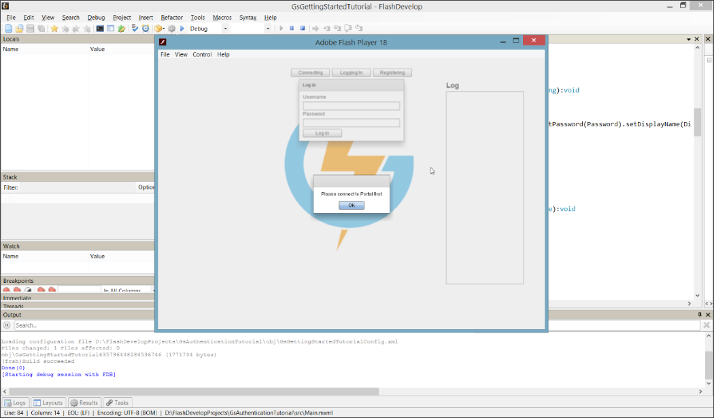
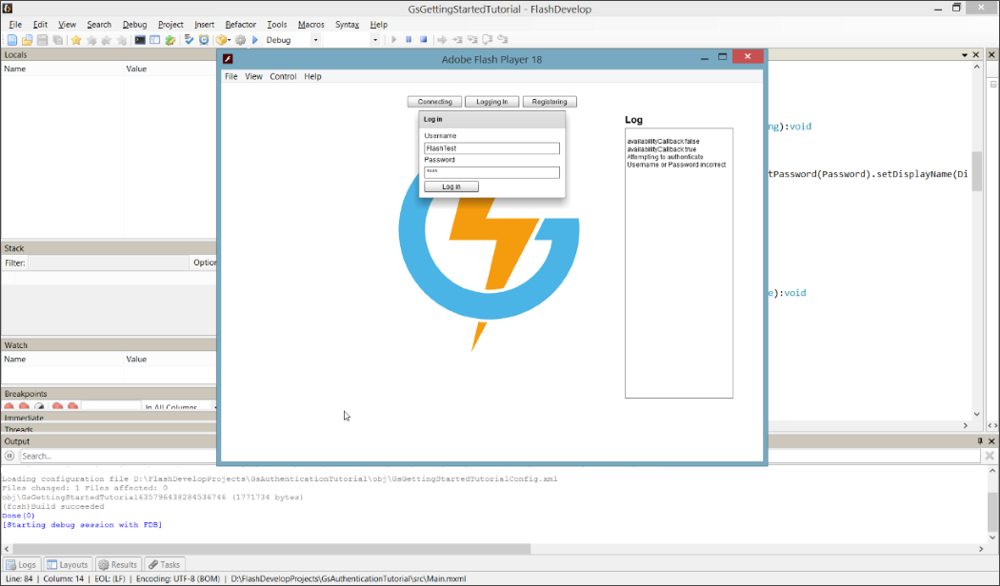
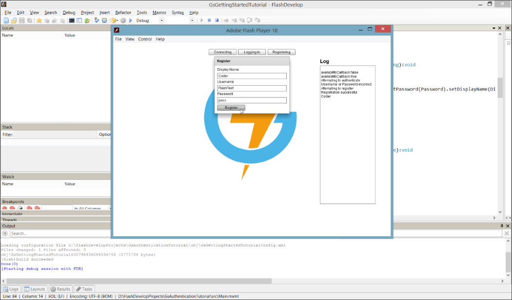
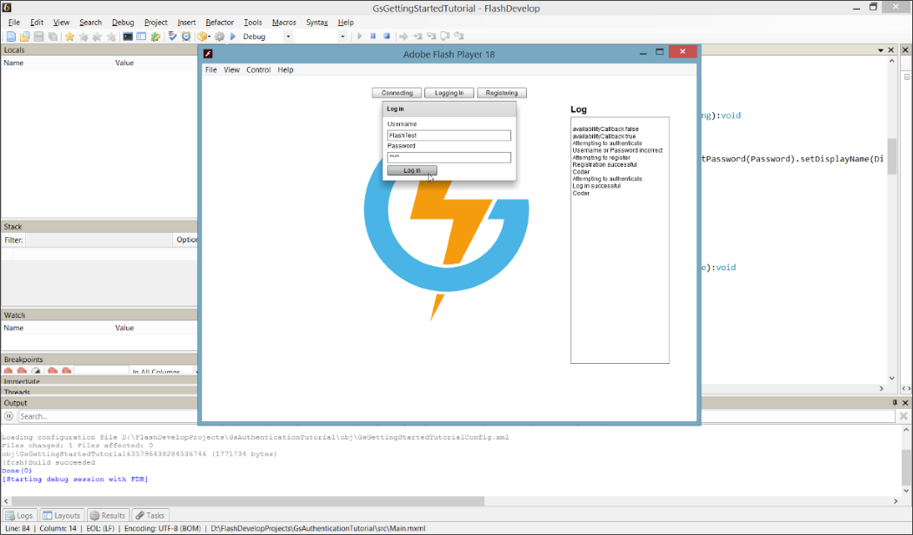

# ActionScript Authentication

## Introduction

The previous tutorial showed us how to [Authenticate players](/Getting Started/Using Authentication/README.md) with the platform using basic username/password Registration and Authentication. These next steps will show you how to set up ActionScript Authentication with GameSparks, teaching you how to set up a login and registration form with logic to go with them.


**Setting up the Authentication and Registration**

  * Establish a way to ensure no requests are sent if the GS module is not connected.
  * Create a function which sends an *AuthenticationRequest* and a function to handle the response.
  * Create a function which sends a *RegistrationRequest* and a function to handle the response.

**Testing the Authentication and Registration**

  * Attempt to login without connecting to the Portal.
  * Attempt to login with a user that doesn't exist.
  * Register a new user.
  * Log in with the new user.

</br>
**Example ActionScript Authentication MXML** code can be downloaded [here](http://repo.gamesparks.net/docs/tutorial-assets/ActionscriptAuthenticationMXML.zip)

## Setting up the Authentication and Registration

Before creating any functions for *Authentication*, you'll need a way to check if the GS module is connected to the Portal. Checking if a connection has been established before requesting any GameSparks API calls will stop exceptions being thrown.

To do this, make a boolean which defaults to *false*. Once the GS module callback returns "available" upon connecting, set the boolean to *true*.

```
    public function availabilityCallback(isAvailable : Boolean):void {
      if (isAvailable) {
        Alert.show("You are now connected");
        IsConnected = true;
      }					
      else {
        IsConnected = false;
      }
    }
```

To *Authenticate* users you'll need to create a function that sends an *AuthenticationRequest*.

To make any request:

  * You'll have to use the *request builder*
  * Followed by the type of *request*
  * Followed by the *parameters* necessary for that *request*
  * And finally ended with a *.send()*

For the *AuthenticationRequest*, you'll need to submit a username and a password. You can pass in a function in the send parameter that will handle the response received by the GS module. This is vital to determine what to do, whether the authentication was successful or not. Follow the tutorial to learn how to make a function that deals with responses.

```
    public function Authenticate(Username:String,Password:String):void {
      if (IsConnected) {
        requestBuilder.createAuthenticationRequest().setUserName(Username).setPassword(Password).send(handleAuthenticationResponse);
        logger("Attempting to authenticate");
      } else {
        Alert.show("Please connect to Portal first");
      }
    }

```

In this function, which we'll *'handleAuthenticationResponse'* to check if the response has any errors:
* If the response does come back with errors, it means either the username or password wasn't recognized.
* If the response comes back with no errors, assume the authentication has been successful and print the player's display name to the Logger.

```
    public function handleAuthenticationResponse(response:AuthenticationResponse):void {
      if (response.HasErrors()) {
        logger("Username or Password incorrect");
      } else {
        logger("Log in successful");
        logger(response.getDisplayName());
      }
    }
```

The *RegistrationResponse* function needs more information. If the response returns with errors it could be because the username that someone is trying to register with is already taken. It's useful to print this out by checking if the *'NewPlayer'* boolean is *false*.

```
    public function handleRegistrationResponse(response:RegistrationResponse):void {
      if (IsConnected) {
        if (response.HasErrors()) {
          logger("There was a problem with the registration");
          if (!response.getNewPlayer()) {
            logger("Username taken");
          }
        } else {
          logger("Registration successful");
          logger(response.getDisplayName());
        }
      } else {
        logger("Please connect to Portal first");
      }
    }
```

The *Register* function is similar to the *Authenticate* function, except that it has an extra parameter for *DisplayName*.

```
    public function Register(Username:String, Password:String, DisplayName:String):void {
    	if (IsConnected) {
    		requestBuilder
          .createRegistrationRequest()
          .setUserName(Username)
          .setPassword(Password)
          .setDisplayName(DisplayName)
          .send(handleRegistrationResponse);
    		logger("Attempting to register");
    	} else {
    		Alert.show("Please connect to Portal first");
    	}
    }
```

## Testing Authentication and Registration


*1.* Attempt to login without connecting to the Portal. You should receive an alert asking you to connect to the Portal to ensure no exceptions are thrown. In future tutorials, connections will be done automatically without need for a trigger.



*2.* Attempt to sign in with a user that doesn't exist. You should get a log back saying that the entered username or password is incorrect:



*3.* Now register a new user:



*4.* Log in using the details you just registered. The user should be recognized and you should now be authenticated.


