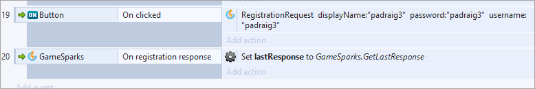
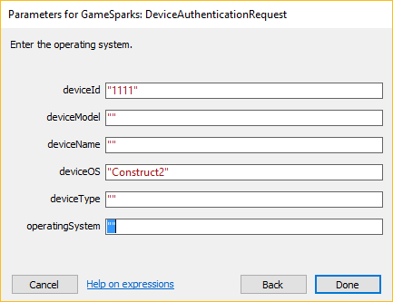

# Construct 2 Authentication

There are three ways to authenticate using GameSparks:

* *GameSparks Authentication* - Uses a username/password that players register to.
* *Device Authentication* - Uses a unique string ID (created by the Developer) and an OS identifier.
* *Social authentication* - Requires you to use a token from the social provider to authenticate users using the information gathered from their profiles.

In this tutorial we'll only cover GameSparks and Device authentication because Social authentication is different for every provider and that is beyond the scope of this tutorial.

## GameSparks Authentication

With the Construct SDK, sending a plain request into the GameSparks platform is not feasible - you'll get a response back but you won't be able to interpret the response. Each request to the GameSparks platform should be paired with an event listener that will trigger on response.

Before authenticating on the platform you must first Register with a UserName and Password. This creates a “player” on GameSparks that can be used to log in. Here's an example of Registering a Player once a Button has been pressed:

You can use *onInit* to run additional events once the Initialization to GameSparks has completed. In the example below, we make an *AuthenticationRequest* once the platform has been initialized:

Sending the request will result in the game receiving a response from GameSparks, so we need a way of reacting to the response when it comes in and performing some sort of action. The GameSparks object has various event listeners that perform this, such as “onAuthenticationResponse”, and which can be used in this respect. With this setup we can do a variety of different things. For example, set the *Text* of what comes back in the response, set an instance or global variables, or call additional functions:

## Device Authentication

Device authentication doesn't need registration and relies on the Device ID (which must be unique) and the Device OS. However, the Device OS is not restricted to designating operating systems and for this example we mark the OS as *Construct2*:

* Once a player authenticates they can now make requests and use GameSparks.
* Authenticated players can also be linked to social accounts once created.
* A player that authenticated via Device Authentication can decide to link their social account to their user and use their social credential to login in the future.
