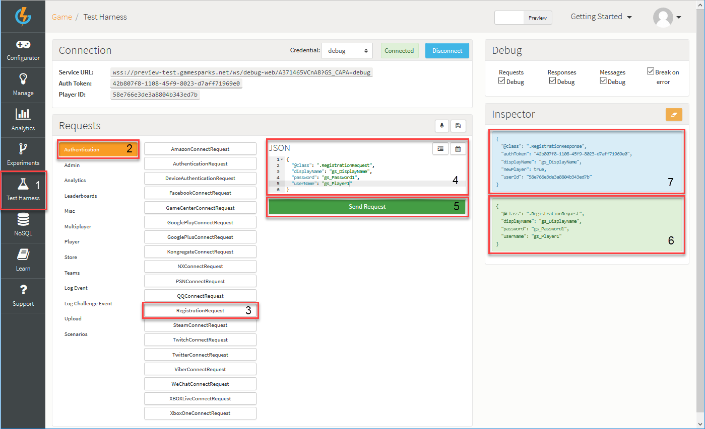
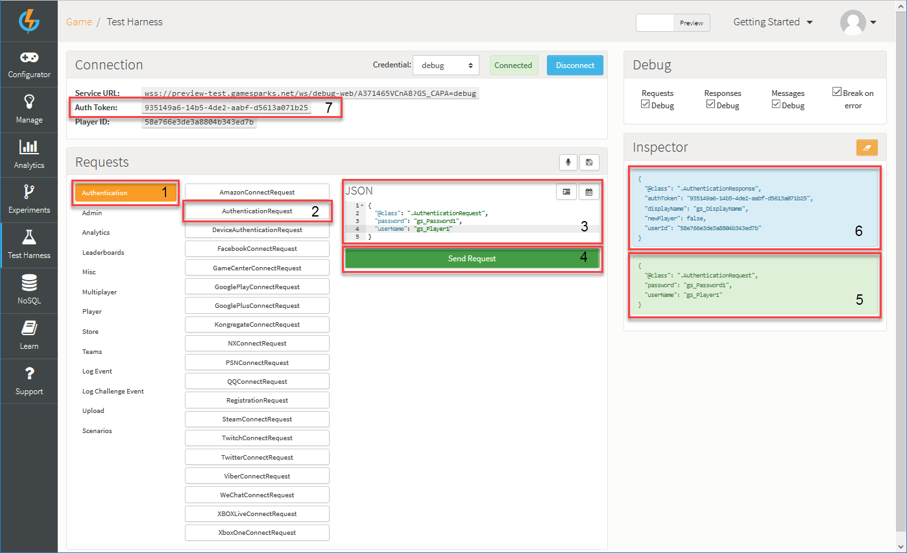

# Using Authentication

## Introduction

Before a player can perform any operations they need to authenticate with the platform. There are a few authentication options, and some can be used in combination with others. The full list of Authentication Types can be found [here](/Documentation/Key Concepts/Authentication.md). However, for this tutorial we'll be using basic username/password Registration and Authentication.

## Registering and Authenticating

To test your game and see if it is ready for Authentication:

*1.* Navigate to the [Test Harness](/Documentation/Test Harness/README.md).

*2.* Click *Authentication* and then select *RegistrationRequest*.

*3.* Then simply enter the desired registration details in the JSON builder for your player and hit *Send Request*. You'll see GameSparks receiving the [RegistrationRequest](/API Documentation/Request API/Authentication/RegistrationRequest.md). When processed, the server will send you a *RegistrationResponse*:

<q>**Note:** You might have to remove some additional or unwanted fields (that are auto-generated) to match the example and take note of the player you've just registered. This will be required for upcoming Getting Started tutorials.</q>

Receiving a successful response is an indication of a successful registration.

To validate this:

*1.* Click *Authentication* and select *AuthenticationRequest*.

*2.* Add your player's details into the JSON builder.

*3.* Click *Send request*. An [AuthenticationRequest](/API Documentation/Request API/Authentication/AuthenticationRequest.md) is sent and you'll then receive an *AuthenticationResponse*:

In addition to receiving a successful Response, you'll also notice that you've received an *Auth Token* for the current player's session.
 
You have now successfully Registered and Authenticated a player. The next tutorial will show you how to set up the SDK of your choice for authentication with GameSparks.

<q>**Deleting Players!** You can delete registered players through Cloud Code using the *SparkPlayer.deletePlayer* method, but we urge you to exercise caution when doing this - see [Updating Player Records](/Tutorials/Social Authentication and Player Profile/Updating Player Records.md).</q> 

## SDK Instructions

* [Unity](/Getting Started/Using Authentication/Unity Authentication.md)
* [Unreal](/Getting Started/Using Authentication/Unreal Authentication.md)
* [ActionScript](/Getting Started/Using Authentication/ActionScript Authentication.md)
* [Android](/Getting Started/Using Authentication/Android Authentication.md)
* [Lua](/Getting Started/Using Authentication/Lua Authentication.md)
* [Construct 2](/Getting Started/Using Authentication/Construct 2 Authentication.md)
