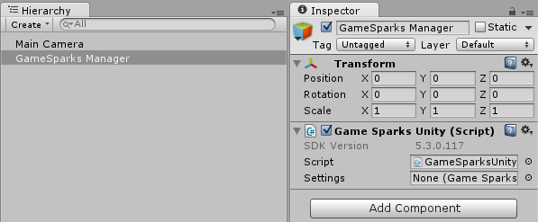
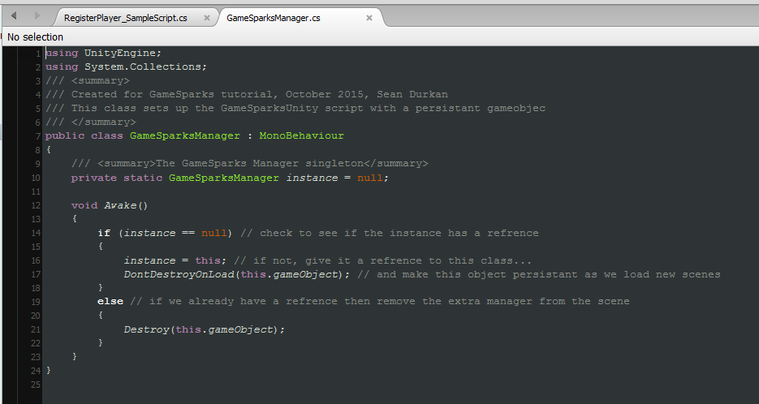
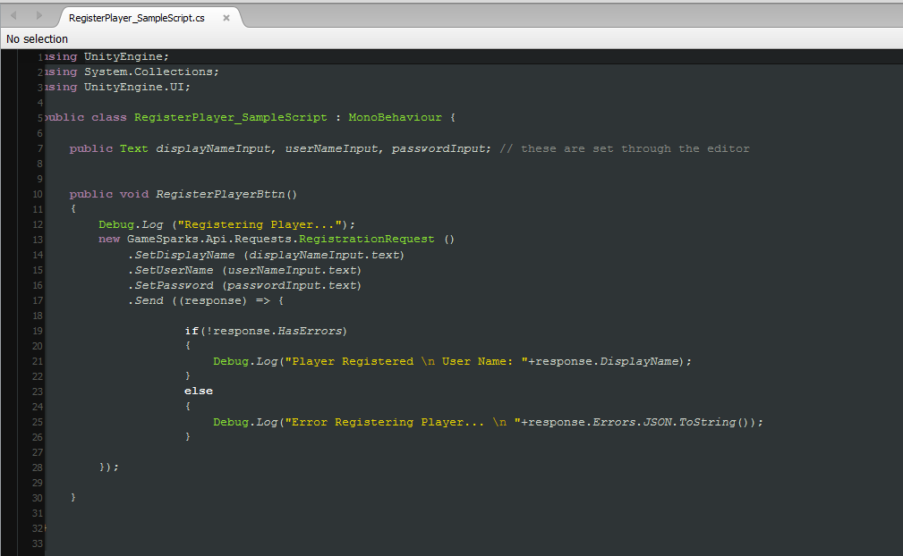
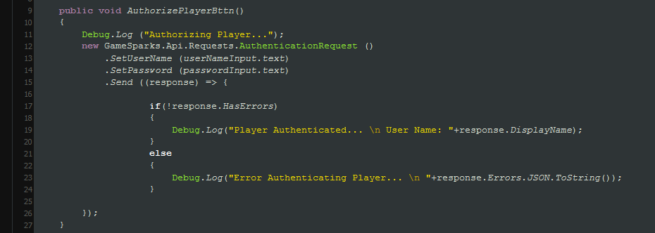
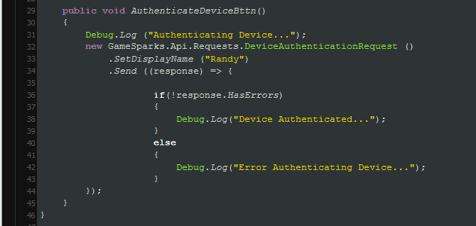

# Unity Authentication

This tutorial will get your Unity project communicating with GameSparks by registering and authenticating players to your game.

In order to have a player connect to your GameSparks game and start sending and receiving game-data, they first need to be authenticated with your GameSparks game. This is like being logged into GameSparks, and before you log in, the user needs to be registered so they are recognized by the game when they log in.

**Example Unity Authentication** code can be downloaded [here](http://repo.gamesparks.net/docs/tutorial-assets/UnityAuthentication_Tutorial.zip)

## Create the GameSparks Persistent Object

Before you start adding players to your game, you need to make sure that the GameSparks SDK is set up as a persistent object. This is to ensure that you don’t get multiple instances of the SDK running as you load between levels.

To begin with, you need to add a new *GameObject* to the scene. Call this *GameObject* *GameSparksManager*, and drop the script called *GameSparksUnity.cs* onto that object. You can find the script in the GameSparks folder of your project.

It’s a good idea to add this to whatever your launch-scene is. For example, if you have a loading scene or splash scene, you might add it to the scene. Likewise, if you have a *Game State Manager* in your game, you could drop the script directly on your *Game State Manager*. So long as your *Game State Manager* is persistent, you'll be good to go.

## Apply Settings to GameSparks Manager



You can see that the *GameSparksUnity* script expects a settings file. This file was automatically generated when you ran the Test-Scene in the previous tutorial. You can find the settings file in the *GameSparks > Resources* folder. Apply them to the Settings in the *GameSparksUnity* script.


## The GameSparks Manager Singleton


Next, you need to create a new script and add it to the object. This script will make sure that there is only ever one instance of the GameSparks manager running, so call it something like *GameSparksManager*. In this script, you're going to create a really simple singleton. All you need is a static reference to the class itself, and in the Awake() method you'll check to see if the reference is set up already. If it's not, then give a reference and set the *GameObject* to be persistent between scenes. If it loads a different *GameSparksManager* object, you will immediately destroy that object. It’s very simple, but you need it to ensure that there's only ever one GameSparks Manager running throughout the game.




```

/// <summary>The GameSparks Manager singleton</summary>
private static GameSparksManager instance = null;
void Awake() {
	if (instance == null) // check to see if the instance has a reference
	{
		instance = this; // if not, give it a reference to this class...
		DontDestroyOnLoad(this.gameObject); // and make this object persistent as we load new scenes
	} else // if we already have a reference then remove the extra manager from the scene
	{
		Destroy(this.gameObject);
	}
}

```

## Registering Players

Registration creates a new player in your game. As with any registration, a few pieces of information are needed in order to register a player:

  1. *Display Name* – The name of the player that will normally be shown in the game.
  2. *Password* – A unique key for that player to login with.
  3. *User Name* – This is distinct from the display name, because the user name can also be auto-generated in some cases where users login with their device. In which case, their device-id is used to generate the username.




Once you have this information, you can register a player by calling a *RegistrationRequest* using the following code:

```

new GameSparks.Api.Requests.RegistrationRequest()
  .SetDisplayName("Randy")
  .SetPassword("test_password_123456")
  .SetUserName("Test User 1")
  .Send((response) => {
  	if (!response.HasErrors) {
  		Debug.Log("Player Registered…”);
  	}
  	else
  	{
  		Debug.Log("Error Registering Player);
  	}
  }
);

```

## Authenticating Players

GameSparks allows quite a few ways to Authenticate your players. In this section, we'll be covering the common authentication methods.

### Player Authentication

Now that your player has been registered, you need to authorize them so they can gain access to the game-data. There are several ways you can authorize players through GameSparks - it all depends on how you want users to interact with your game.

For this tutorial we will ask the player to submit their username and password:



You can do this by calling the *AuthenticationRequest* method as shown in this code sample:

```

new GameSparks.Api.Requests.AuthenticationRequest().SetUserName("Test User 1").SetPassword("test_password_123456").Send((response) => {
	if (!response.HasErrors) {
		Debug.Log("Player Authenticated...");
	} else {
		Debug.Log("Error Authenticating Player...");
	}
});
```    

### Device Authentication

You can also authenticate your player from the device they are currently using:



To do so, you can use the *DeviceAuthenticationRequest*. By using this authentication method, you can bypass the user registration and just call this request. It will register the device and authenticate it at the same time.

```

new GameSparks.Api.Requests.DeviceAuthenticationRequest().SetDisplayName("Randy").Send((response) => {
	if (!response.HasErrors) {
		Debug.Log("Device Authenticated...");
	} else {
		Debug.Log("Error Authenticating Device...");
	}
});

```   

## Testing Registration and Authentication

Before you're comfortable with the GameSparks API, you’ll probably want to check to see if your requests are working the way you want them to. There are several ways you can perform these checks.

### Response Data

For each request you send you'll get a response from the server. You've already seen through our C# examples that this response allows us to check out any errors that occurred with your request. However, you can extract other useful information from these server responses. For requests such as registration and authentication, you can get information about the player back, such as their userID (a unique code for each player registered), their display name, username, and so on.

Take a look at the sample project for examples.

### NoSQL Explorer

 One of the most useful and trusty tools on the GameSparks portal is the *NoSQL Explorer*. You can use this to check all of the mongo information you have saved for your game. You can check results and filter information for whatever you need (check out [this](/Documentation/NoSQL Explorer.md) tutorial for more info). You may want to check that your players have been authenticated properly, or later on, when your game is live, to check your player-data.

 To do so, simply navigate to the *NoSQL* tab in your GameSparks portal, select the *player* collection from the Collection list, then click on the *Find* button. In the output panel you can see the player details for any player you have authenticated. Now you are set up and connected with GameSparks and you are ready to send and receive some data. Check out the next tutorial on Events and Cloud Code [here](/Getting Started/Using Cloud Code/README.md "Using Cloud Code").


