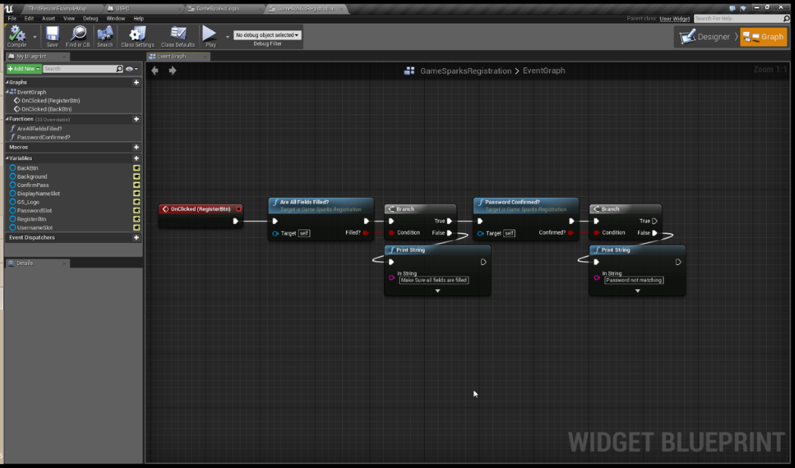
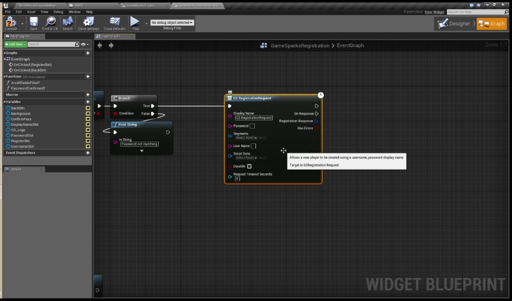
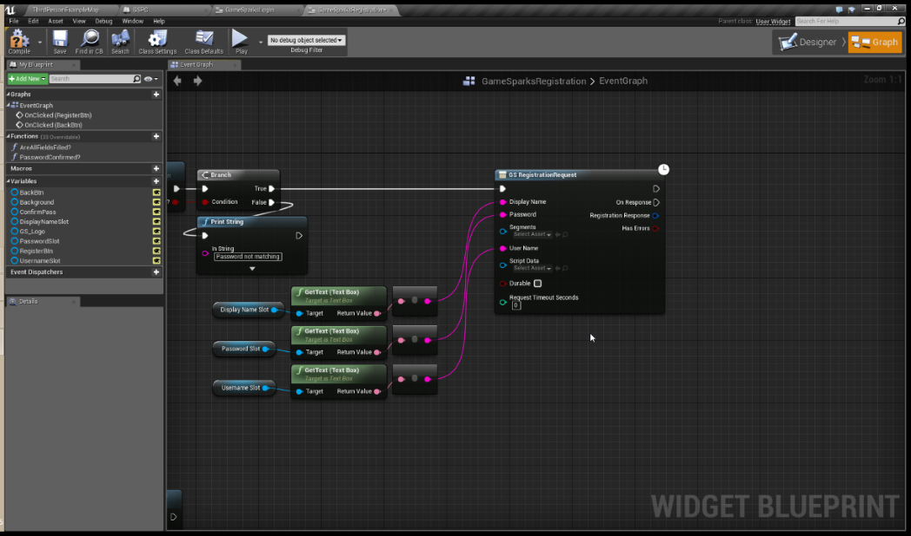
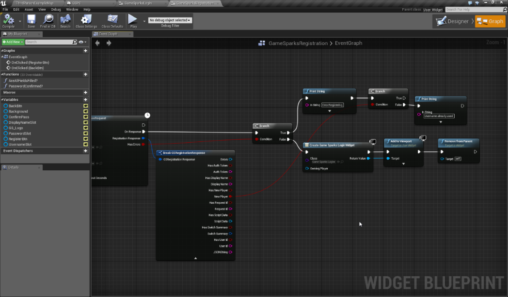
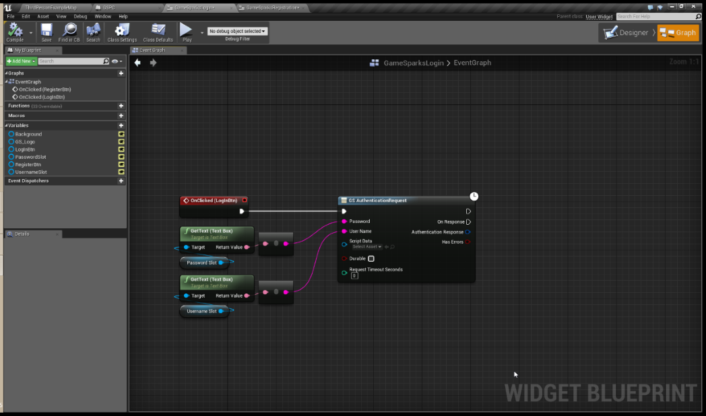
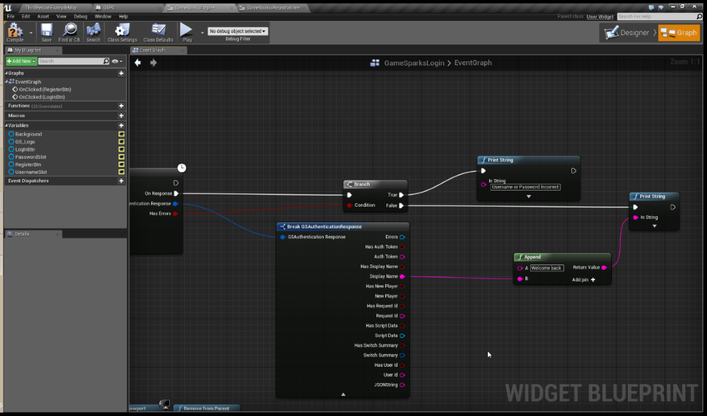
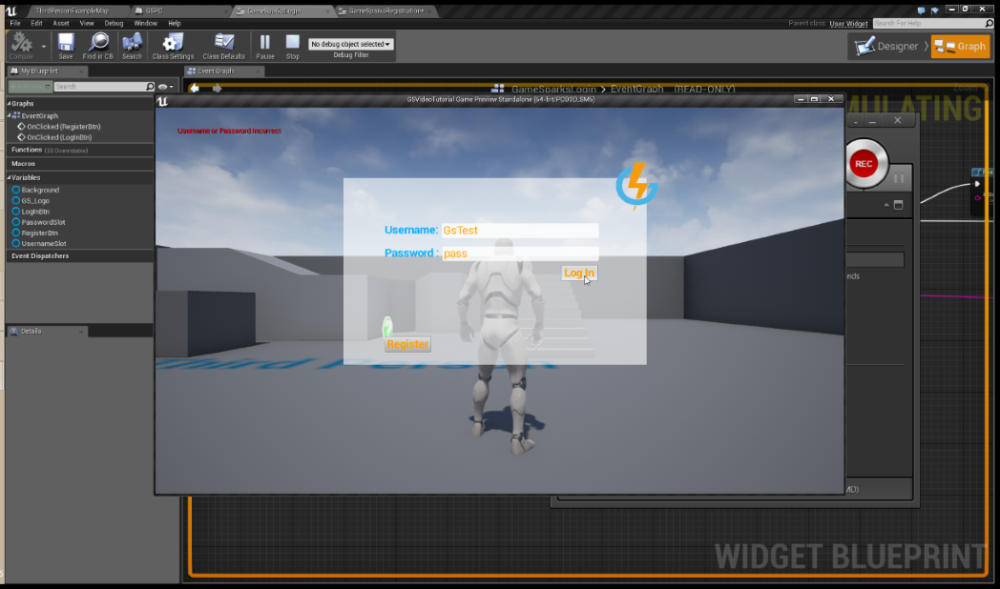
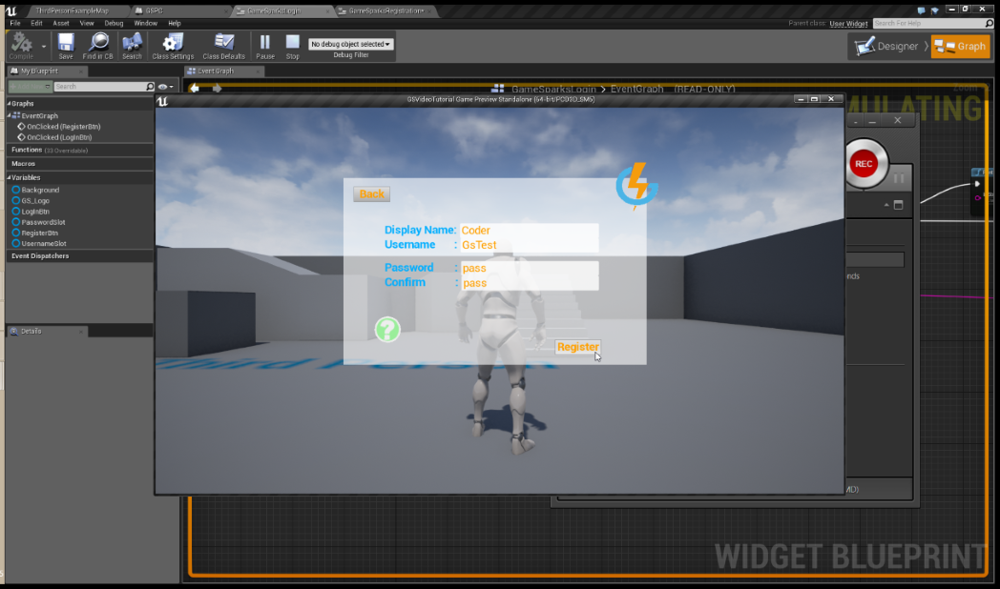
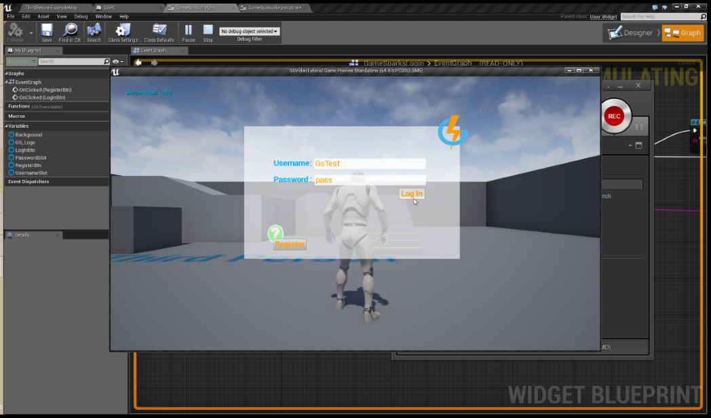

# Unreal Authentication

## Introduction

This tutorial guides you through the process of registering and authenticating a player to your game, allowing them to begin communicating with it. Requirements:

  * Make sure you have a game [created](/Getting Started/Creating a Game/README.md).
  * Make sure you are [connected](/Getting Started/Creating a Game/Unreal Setup.md) to your game.
  * Have an input method to pass the user data into the GameSparks nodes. In this tutorial we're using Widgets. They are available for download below:

 
**Example Unreal Authentication Uassets** code can be downloaded [here](http://repo.gamesparks.net/docs/tutorial-assets/UnrealAuthenticationUassets.zip)

## Registration

The Registration menu has a basic functionality that makes sure all fields are filled in correctly and that the passwords match. This functionality exists to notify you in the UI if there are any problems that occur whilst registering:

You'll need to attach some GameSparks nodes to the Event Graph.

The first one will be the *GSRegistrationRequest* node. The *GSRegistrationRequest* node takes 3 strings:
* *Display Name*
* *Username*
* *Password*

To authenticate, a user will need to supply both the username and the password. The display name can be used for cosmetic purposes, because many users can have the same display name. However, usernames must be *unique*.

We can also limit what goes through this registration node from the engine itself. You can add rules to prevent your players doing things you don't want them to do, such as:
* No special characters or white spaces.

Once that node is executed, if all the details are supplied and the registration is unique, a new player will be created in the game:

Now, you need to connect all of the user inputs to the request:

After the *Registration Request* is sent, we can check if it has registered our user or check if the response contains errors. For instance, we can check if the username is already being used by breaking the registration request up and connecting the "*New Player*" condition to a branch. Before doing so, we need to check whether the response actually had errors.

After a successful Registration, you will be sent to the Login Widget.

## Authentication

In your Login Widget, you'll need to add the *GSAuthenticationRequest* node and connect it to a button. Click and input the required valid username and password to make it work:

You can "drag-off" a *Break* node from *GSAuthenticationRequest* node’s Authentication Response struct to gain access to some information that might be useful for your development.

In this example, we break the struct to expose the data sent by GameSparks to expose the *Display name* string value and use it to print a message to the player that just logged in. We’ll also make sure that if we get errors, we log that out to give your users some valuable feedback:

## Testing

You can now run your Unreal Engine game and test your Registration and Authentication. You'll need to double-check that the Game Mode [created previously](/Getting Started/Creating a Game/Unreal Setup.md) is running before proceeding. Try logging into the platform without having previously Registered. An error will then be shown:

Navigate to the Registration widget and register a new Player:

Finally, try to authenticate with the player you've just Registered, this should succeed:

This concludes the Unreal Authentication tutorial. You've learned how to register and authenticate your players to the GameSparks platform!
