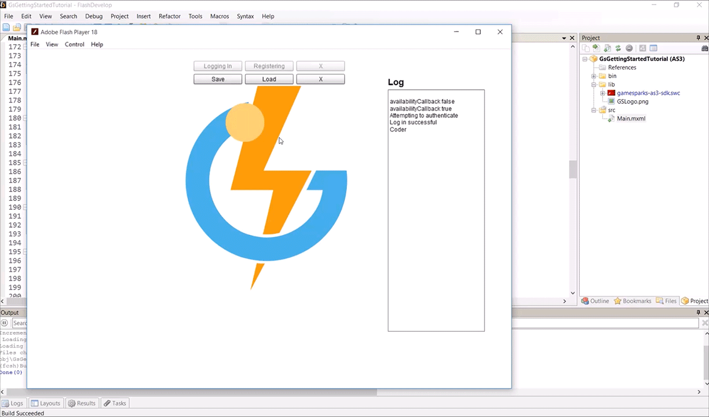

# ActionScript Cloud Code

## Introduction

After making the *Set_Pos* and *Get_Pos* Events in the portal, it's time to call them from your game. In this tutorial, you'll learn how to use a persistent variable saved against the player to change their sprite location.

**Setting up your Set and Get Functions**

  * Create the set function, which logs the *Set_Pos* Event from the portal to pass through the player's current location.
  * Create the get function, which logs the *Get_Pos* from the portal.
  * Create a response handler for the *Get_Pos* Event, which retrieves the player's saved location.

**Testing the Set and Get Functions**

  * Create a game or scenario to test your new functions on.

</br>
**Example ActionScript Cloud** code can be downloaded [here](http://repo.gamesparks.net/docs/tutorial-assets/ActionscriptCloudCodeMXML.zip)

## Setting up your Set and Get Functions

You'll notice that from here on the tutorials will automatically connect to the Portal. You can set your *URL* and *API* *Secret* before the game launches.

```
    	private function ConnectToPortal():void
    			{
    				gs.setAvailabilityCallback(availabilityCallback).setUrl("wss://preview.gamesparks.net/ws/293711ZXWjA9").setApiSecret("DgnYnPUE2D0RetwKAy5XPUxxxN7pl36e").connect();
    			}
```

Start by creating a function that will save the player's location. This function will be logging an Event request. Similar to Authenticating and Registering, this function will build a request:
* You will be requesting an Event that saves the player's position using the Short code *Set_Pos*. (For more information, see the [Using Cloud Code](./README.md) tutorial.)
* The request builder will need an *Event Key* that looks for a *Short Code* to log the Event.
* For the *Set_Pos* Event, the request builder will also need an *Attribute* of *Data Type* - *JSON*.
* Declare a variable of type *Object*, which will save the location of your player. Add two properties to that variable to save the X and Y values.
* To send that variable as a *JSON* through the request builder, use *.SetJSONEventAttribute("POS", VariableName)*. The attribute *POS* is the same as was made in the Portal tutorial. This will be used to save the player's location by passing in the X and Y values.

```
    	public function SetPos():void
    			{

    				var location:Object = {};

    				location.X = Player.x;
    				location.Y = Player.y;

    				requestBuilder.createLogEventRequest().setEventKey("Set_Pos").setJSONEventAttribute("POS", location).send(SetPosResponse);

    				logger("Saving Position...");
    			}
```

Optionally, you can have a Response handler which logs out when the Event is successfully requested:

```
    	public function SetPosResponse(response:LogEventResponse):void
    			{
    				logger("Saving X pos = " + Player.x.toString());
    				logger("Saving Y pos = " + Player.y.toString());
    			}
```

Create a function that will retrieve the position of the player by calling the *Get_Pos* Event. You'll need to build a request that is similar to the previously created *SetPos* function, but this time you'll won't need an Attribute. It's important to set a *response* *handler* function as a parameter for the send() method:

```
    		public function GetPos():void
    			{
    				logger("Retrieving Position...");
    				requestBuilder.createLogEventRequest().setEventKey("Get_Pos").send(PosReturn);

    			}
```

In the response handler for the *Get_Pos* Event you'll need to break down the response and retrieve the values that are passed in by *Script Data*.
* Declare a variable of type *Object* and set it as the *Script Data* passed in through the response.
* Declare two new variables of type *NUMBER* and set them as the X value or the Y value saved in the *JSON* *'POS'.* This is held in the *Script Data*.
* When your variable of type *Object* has been set as the *response's* *Script Data*, you can access its values as you do in the Portal.

In this example, you can access the X value simply by using *script.POS.X*. After setting the two variables of type *NUMBER* as X and Y, simply set your player's location to the retrieved values.

```
    	public function PosReturn(response:LogEventResponse):void
    			{
    				var script:Object = response.getScriptData();

    				var PlayerXPos:Number = script.POS.X;
    				var PlayerYPos:Number = script.POS.Y;

    				Player.x = PlayerXPos;
    				Player.y = PlayerYPos;

    				logger("Loading X pos = " + PlayerXPos.toString());
    				logger("Loading Y pos = " + PlayerYPos.toString());
    			}
```

 

## Testing your Set and Get Functions

Set up your game to Set and Get your Player's position. Here we've made a simple game where you can save and load the sprite's location. Make sure you *authenticate* your player because the location will be saved against their database. Having no Player authenticated means you cannot call the Events on the Portal, even if you are connected to that Portal.


