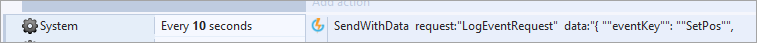

# Construct 2 Cloud Code

We expect you to have followed the Cloud Code getting started [tutorial](/Getting Started/Using Cloud Code/README.md).

We’ve set up our Event in Cloud Code and now we want to be able to get and set the position from our Construct 2 game. You can build an X and Y function instead of an XYZ function by simply omitting the Z variable for each of the steps in the tutorial.

## SetPos

Because our *SetPos* Cloud Code Event requires a JSON attribute to be attached with it, we’ll need to use a special request called *SendWithData*. Here we'll get the player's position and send it to GameSparks.

Suppose I wanted to set the position every 10 seconds. I would set up my Event like this:

<q>**Authenticate First!** REMEMBER to make sure you are authenticated before sending requests to GameSparks.</q>

Our *SendWithData* action looks like the following:

<q>**Formatting for JSON!** Note the Double Quotes around our keys and values, this is how Construct 2 interprets a JSON string.</q>

Now, if your Cloud Code is set up correctly, the player will have a position variable saved in their *scriptData* object. You can check this by calling an [AccountDetailsRequest](/API Documentation/Request API/Player/AccountDetailsRequest.md):

* Through your game and printing out the value of scriptData's 'POS' field.
* Through the [Test Harness](/Documentation/Test Harness/README.md) and checking the scriptData object's contents.

## GetPos

As we did with *SetPos*, for *GetPos* we'll set up a [LogEventRequest](/API Documentation/Request API/Player/LogEventRequest.md) to GameSparks. This request has no attributes associated with it, so we can use the built-in *LogEventRequest* action:

We have to pair this with an Event Listener that will fire when a *LogEventRequest* is returned to the Client:

* You'll have to parse the response into some form of JSON builder to retrieve the specific positional data. We recommend the [JSON plugin](https://github.com/FrenchYann/JSON_for_construct2) by Yann, which is used in the example above.
