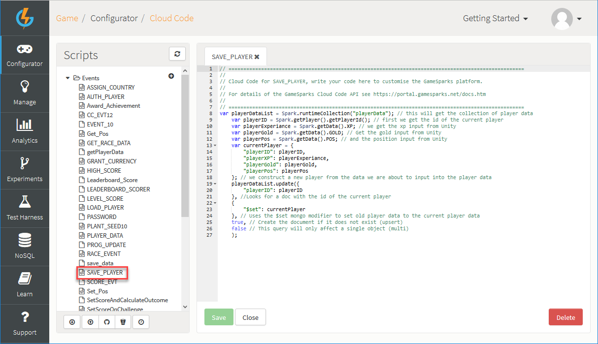
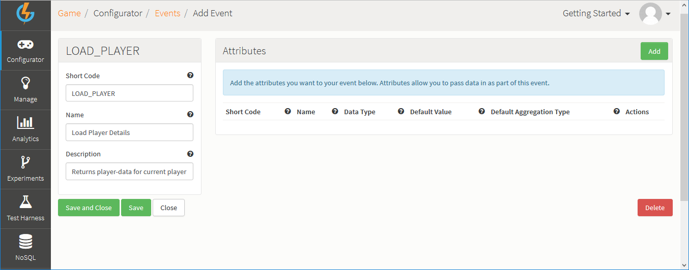
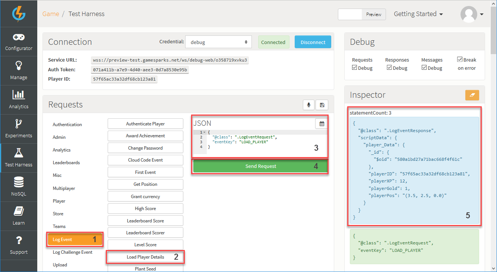
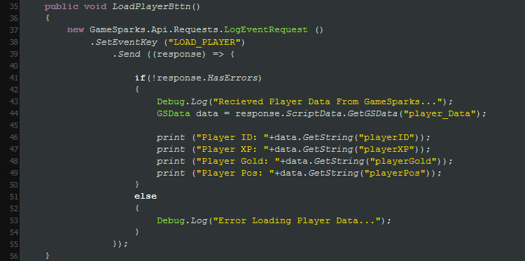

# Unity Cloud Code

## Introduction

GameSparks offers a lot of useful features out of the box, like Challenges, Leaderboards, and Messaging systems. However, using Cloud Code also allows you to create your own custom Events to pass data to and from the servers.

In this tutorial we're going to use two Events to save and load some basic player information.

**Example Unity Cloud** code can be downloaded [here](http://repo.gamesparks.net/docs/tutorial-assets/UnityCloudCode_Tutorial.zip)

## Creating an Event


Firstly, we'll create an Event that will save some player details.

*1.* Navigate to *Configurator > Events* and click *Add*. The *Add Events* page opens.

*2.* Enter the details for the Event:

* *Short Code* - This is a unique code used to define this Event when it is called.
* *Name* - This is used to identify the Event within the Portal.
* *Description* - A few details that explain the purpose of the Event.
* *Attributes* - These are the values that the Event will take. Effectively, the data the Event will take from the client to the server (from Unity to GameSparks).

In this example, we've created the Event and saved it and then opened the Event to edit it and add the required *Attributes* - we'll save the player’s experience points, position, and gold. We'll load these later using another method:


## Calling the Event Request

You can call the Events in Unity using the [LogEventRequest](/API Documentation/Request API/Player/LogEventRequest.md) method. This is a default method that will take some variable data depending on what you need. In contrast with the other requests you have used in previous tutorials, the *LogEventRequest* needs information about the Attributes and their Short Codes before you send the request.

### Saving Player Data

Calling the *LogEventRequest* method works as follows:

```
    new GameSparks.Api.Requests.LogEventRequest().SetEventKey("SAVE_PLAYER").SetEventAttribute("XP", 123456).SetEventAttribute("POS", playerPosition.ToString()).SetEventAttribute("GOLD", 100).Send((response) => {
    	if (!response.HasErrors) {
    		Debug.Log("Player Saved To GameSparks...");
    	} else {
    		Debug.Log("Error Saving Player Data...");
    	}
    });

```


The *LogEventRequest* will execute the custom Event you've created:
* You'll need to provide the Event *Short Code* that was previously defined when creating the Event to the *LogEventRequest*.
* You'll also need the Short Codes of the Event Attributes you've set in your Event. In this case, they are **XP** (ExperiencePoints), **POS** (position), and **GOLD** (gold).

If you have the Sample Project open, you can enter these details in the scene and hit the *Save Player* button. You should see GameSparks sending and receiving this request in the console:


### Saving the Data in GameSparks

Now you've sent the *LogEventRequest* from Unity, you'll now be able to save the Players details in GameSparks. To do this, you need to set some custom Cloud Code in the GameSparks Portal.

*1.* Navigate to *Configurator > Cloud Code* and under *Scripts* click to open *Events* and then select the *Save Player Details* Event:

*2.* In the *Cloud Code* editor on the *SAVE_PLAYER* tab, you'll be able to access the data sent via Unity:



*3.* You can then add this as the Player data to your collection.

```
    var playerDataList = Spark.runtimeCollection("playerData"); // this will get the collection of player data
    var playerID = Spark.getPlayer().getPlayerId(); // first we get the id of the current player
    var playerExperiance = Spark.getData().XP; // we get the xp input from Unity
    var playerGold = Spark.getData().GOLD; // Get the gold input from Unity
    var playerPos = Spark.getData().POS; // and the position input from Unity
    var currentPlayer = {
    	"playerID": playerID,
    	"playerXP": playerExperiance,
    	"playerGold": playerGold,
    	"playerPos": playerPos
    }; // we construct a new player from the data we are about to input into the player data
    playerDataList.update({
    	"playerID": playerID
    }, //Looks for a doc with the id of the current player
    {
    	"$set": currentPlayer
    }, // Uses the $set mongo modifier to set old player data to the current player data
    true, // Create the document if it does not exist (upsert)
    false // This query will only affect a single object (multi)
    );
```

<q>**Don't forget to Save!** Make sure to hit the *Save* button in order to save the Cloud Code for your Event.</q>

## Testing your Cloud Code

You can now head back to Unity and run your [LogEventRequest](/API Documentation/Request API/Player/LogEventRequest.md) with some XP and gold values. In the next section, you're going to get that data back from your GameSparks game. However, if you want to check that your player’s data was updated, you can select the *playerData* collection under *NoSQL*, and click the *Find* button:


## Loading Data

Loading the data will work in a similar fashion. You need to create an Event called *Load Player Details*, this Event doesn't require any Event Attributes because we'll not be passing any data into it. First you'll have to create an Event:



Then, before you head back to Unity, you'll need to write some Cloud Code for this Event.

*1.* Again, navigate to *Configurator > Cloud Code* and under *Scripts* click to open *Events* and then select the *Load Player Details* Event.

*2.* In the *Cloud Code* editor, select the *LOAD_PLAYER* tab:


*3.* All you need to do is grab the entry in your playerData collection that corresponds to the player ID of the current player, and return that player’s data via the script data:

```
var playerData = Spark.runtimeCollection("playerData"); // get the collection data
var currentPlayer = playerData.findOne({
	"playerID": Spark.getPlayer().getPlayerId()
}); // search the collection data for the entry with the same id as the player
Spark.setScriptData("player_Data", currentPlayer); // return the player via script-data

```

*4.* Click *Save* to save the Cloud Code script you've attached to this Event.

## Testing the Load Event

You can test your Events in the *Test Harness*. You can get to this section by clicking on the *Test Harness* tab on the left hand side of the GameSparks Portal. You will need to authenticate yourself as one of your registered players, then you can select your *Load Player Details* Event and submit a *LogEventRequest* and run the Event by clicking on the *Send* button.

By running the Event you should see your Script Data output in the *Inspector* window:



From this set of data you'll load the information into a sorted form and output it in Unity. You can call the *LogEventRequest* for *Load Player Details* the same way you did when requesting the *Save Player* Event. In this example, you'll only be interested in the data that comes back from the Portal, specifically the *ScriptData*. There are plenty of ways to extract data from your response. However, this method has the advantage of allowing you to get the data you want using the Attribute keys, and it’s very handy when you have multiple sets of data to extract from the data bundle.




```
new GameSparks.Api.Requests.LogEventRequest().SetEventKey("LOAD_PLAYER").Send((response) => {
	if (!response.HasErrors) {
		Debug.Log("Received Player Data From GameSparks...");
		GSData data = response.ScriptData.GetGSData("player_Data");
		print("Player ID: " + data.GetString("playerID"));
		print("Player XP: " + data.GetString("playerXP"));
		print("Player Gold: " + data.GetString("playerGold"));
		print("Player Pos: " + data.GetString("playerPos"));
	} else {
		Debug.Log("Error Loading Player Data...");
	}
});
```


## Summary

You've had a look at *LogEventRequests* and how they can be used to send and receive data from GameSparks games. You've also learned how to create custom collections for storing information, such as player details. GameSparks also comes with some of its own special kinds of collections such as Leaderboards. In the next tutorial of the Getting Started sequence, we're going to look at setting up a Leaderboard and implementing it in Unity.
