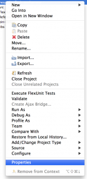
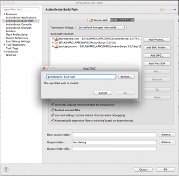

# ActionScript SDK Setup

The GameSparks ActionScript SDK allows you to interact with the GameSparks platform from any ActionScript environment(Flash, Flex, Air etc.)
*Note*: Since the SDK is auto generated from our latest platform builds, all of the Requests/Responses that you see in the Test Harness will be available for use in the SDK. It will also give you full auto complete in your preferred IDE.

These instructions will concentrate on how to use the SDK from Adobe Flash Builder.

## Getting the SDK

The SDK is available via BitBucket [here](https://bitbucket.org/gamesparks/gamesparks-as3-sdk)

A pre-compiled swc is available [here](https://bitbucket.org/gamesparks/gamesparks-as3-sdk/raw/master/gamesparks-as3-sdk/bin/gamesparks-as3-sdk.swc)

## Adding the SDK to your Project

Right click your project and select "Properties".



Select "Flex Build Path" or "ActionScript Build Path" (Depending on your project type). Add "gamesparks-as3-sdk.swc" to your library path.



## Initialising the SDK

All calls to GameSparks are managed through a connection to the server. To create a new connection you can create and initialize a GS object using it's builder methods.

We recommend you create a single static instance of the GS object in your game.

```
import com.gamesparks.*;
import com.gamesparks.api.requests.*;
import com.gamesparks.api.responses.*;
import com.gamesparks.api.messages.*;

private static var gs:GS = new GS();

```

When using the builder methods, you should supply:

* The URL to connect to (you can get your games preview or live url from the test harness).
* The APi secret of your game.
* A function that should be called once the SDK has become available.
* An optional logger for debug messages.

```
gs.setAvailabilityCallback(availabilityCallback)
    .setLogger(logger)
    .setUrl("wss://preview.gamesparks.net/ws/290466xUylXa")
    .setApiSecret("YOUR_SECRET")
    .connect();
```

The availability callback is a function that takes a single boolean parameter. This function will be called when the SDK connects or disconnects, passing in the connection status when called.

```
//Callback to handle when the SDK is available and ready to go
public function availabilityCallback(isAvailable : Boolean):void{
    //Your code here
}
```

## Registering a Callback for Asynchronous Messages

Each GS instance has it's own asynchronous message handler, and you can attach a function to each message type you want to handle. To assign a function to a message type, you can use the *getMessageHandler()* function on GS to get the handler, you can then set the handler for a specific type.

The following shows how to listen for *ScriptMessage*:

```
gs.getMessageHandler().setHandler(ScriptMessage.MESSAGE_TYPE,scriptMessageHandler);
```

The function you attach should accept a single parameter of the same type that you are listening for, the definition of *scriptMessageHandler* in the example above is as follows :

```
public function scriptMessageHandler(message:ScriptMessage):void{

//Your code here				

}
```

## Sending Requests to GameSparks

Each request type available on the platform has it's own class within the sdk. To create a new request, you use the *createXXXRequest()* methods within the request builder object that is attached to your GS instance. To send an authentication request with username "SDK_Tester" and password "password" the following line of code should be used:

```
gs.getRequestBuilder()
    .createAuthenticationRequest()
    .setUserName("SDK_Tester")
    .setPassword("password")
    .send(handleAuthenticationResponse);
```

When calling send, you can optionally supply a callback that will be invoked when the response is received from the server. This function should take a single parameter of the response type you are expecting from the request.

```
public function handleAuthenticationResponse(response:AuthenticationResponse):void {
    //Your code here
}
```
