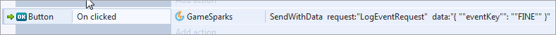

# Construct 2 SDK Setup

The GameSparks Construct 2 SDK allows you to interact with the GameSparks platform from the Construct 2 Game Engine. Since the SDK is based on our existing JavaScript SDK you can expect the same level of functionality when utilizing it in your game.

## Getting the SDK

The SDK is available via BitBucket [here](https://bitbucket.org/gamesparks/gamesparks-construct2.git)

## Adding the SDK to Construct 2 Plugins

Once you’ve downloaded the SDK, unzip the gamesparks folder into the plugins folder of your Construct 2 Installation:
* .../Construct 2/exporters/html5/plugins.
* Make sure that the plugins folder contains only file folders, which includes a gamesparks .js files folder, but not the top-level gamesparks folder:

You should now be able to insert a *GameSparks* object into any projects you create in Construct 2:

## Initializing the SDK

When the GameSparks object has been added to your project, you can edit the properties on the *Properties* pane. Here you can insert the API Key and Secret for your game configuration on the portal:

<q>**Where do I get the API Key and Secret?** You can copy the API Key and API Secret from the [Game Overview](/Documentation/Game Overview/README.md) page of your game in the GameSparks portal.</q>

When you've entered your game's API Key and Secret, you can initialize the SDK. Before we can make any requests to the GameSparks platform, we first have to initialize for the stage we are at. There are 2 actions for this: *initPreview* and *initLive*.

An example of initializing the SDK is to initialize at the start of the layout. In the event sheet this would look like this:

## Sending Requests to GameSparks

With the Construct SDK sending a plain request into the GameSparks platform is not feasible - you'll get a response back but you won't be able to interpret the response. Each request to the GameSparks platform should be paired with an event listener that will trigger on response.

For example, you can use *onInit* to run additional events once the Initialization to GameSparks has completed. In the example below, we make an *AuthenticationRequest* once the platform has been initialized:

Pairing this with an event listener that will run when Authentication completes, we can do a variety of different things. For example, setting the Text of what comes back in the response, setting instance or global variables, or calling additional functions:

Sending requests with additional optional JSON such as LogEventRequests can make use of the “SendWithData” action. Note that the data is in essence a JSON string, but the formatting requires quotes around all keys and values. ( "{ ""eventKey"": ""FINE"" }" )

You can set up many Request events and Response Listeners, but you can also set up Message Listeners to be used in conjunction with our [Messaging](/Documentation/Key Concepts/Messaging.md) suite.
