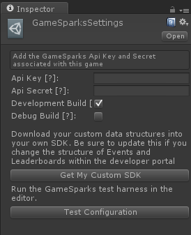

# Unity3D SDK

Download the GameSparks [Unity SDK v5.4 package](http://repo.gamesparks.net.s3-eu-west-1.amazonaws.com/unity-sdk/Gamesparks_Unity_5.4.0.59.unitypackage)

## V5.4.0

* Remove native plugins for sockets
* Use TLSv1.2 for all socket connections
* Add update checker to keep SDK up to date
* API Updates to V67

## V5.3.3

* Added PS4 Support (Contact customer services for PS4 specific unitypackage).
* Added XBOX One Support (Contact customer services for XBOX specific unitypackage).
* Resolved connection pauses with malformed query string.
* API Updates to include all Server requests for V59

## v5.3

* Fixed potential deadlock on WP8 devices.
* Durable queue updates to enforce processing in order.
* xcodeproj post processing updates for new project version.
* API Updates to include all Server requests.

## V5.2

* IL2CPP updates.
* xcodeproj post processing modified to support append and replace.
* API Updates to include all Server requests.

## V5.1

* Per player durable queue, this means a request sent with durable as a player will only ever go as that player.
* Unity 5.1.0 Support (There is currently a defect in Unity preventing WP8 builds).
* API Updates to include all Server requests.
* Ability to have multiple GSInstance objects to aid testing

## V5.0

* Full Unity 5 support
* WebGL
* IL2CPP
* Version number visibility within Unity.

## Using the SDK

The following steps will show in detail how to integrate the GameSparks Unity 3D SDK into a new Unity Project.

### Creating a new Unity project


### Downloading the new SDK

The GameSparks Unity3D SDK is provided as a standard unity package and can be downloaded above.

### Importing the SDK


Select the package you just downloaded, you will then be presented with the following screen. Make sure that all items are ticked and click Import.


Your project folder should now contain Assets/GameSparks and Assets/Plugins.


### Configuring the SDK

To configure the SDK for use with your game, select "GameSparks -> Edit Settings" from the menu bar.

<q>**GameSparks not Showing?** If the GameSparks menu item is not visible, click another one and it will appear. This is a nuance of menu items in Unity - clicking the other item rebuilds the menu and brings in the GameSparks item.</q>


You will then be presented with an Editor pane that allows you to configure the SDK for your needs.



Fill the pane with the following settings:

**Api Key** – The “GameSparks Api Key” value from the Overview Menu in the portal Configurator.

**Api Secret** – The “GameSparks Api Secret” value from the Overview Menu in the portal Configurator.


**Development Build** - Select this option when you want to run the SDK against the unpublished configuration

**Debug Build** - Select this option to get extended debugging out of the SDK (useful for support purposes).

### Testing Your Configuration

Click the "Test Configuration” button in the GameSparks settings editor. This will open the test harness - you will be prompted to save your current scene. You should see JSON messages being sent and received by Unity from the service.


### Authenticating against the service

On the first run, you will see the label “NOT AUTHENTICATED”. To send requests to the platform, you need to be authenticated. There are a number of requests that can authenticate you:

*AuthenticationRequest* – User to authenticate using details previously provided in a *RegistrationRequest*.

*DeviceAuthenticationRequest* – Uses the unique identifier for the device to create an anonymous user, the Unity SDK deals with all the parameters required for this.

*FacebookConnectRequest* – Uses a Facebook authentication token to register and or authenticate with the platform - this requires you to have set up an app on: https://developers.facebook.com/

*RegistrationRequest* – Allows a new user to be created with a username & password.

The test UI contains a button to do a device authentication. Click this button and the current player will be authenticated.


### Adding the SDK to your Own Game

To add to your own game, you need to add the *GameSparksUnity* class to one of your own components. A good way to do this is to create an Empty GameObject, name it GameSparks, and drag the *GameSparksUnity.cs* script onto the GameSparks GameObject.

<q>**Note:** It’s best to do this on the very first scene your game load, so you can begin analytics or start logging your user in as soon as possible.</q>

You only need to add it to one scene. *GameSparksUnity.cs* uses *DontDestroyOnLoad()*, which ensures that the script will live throughout your game’s scene changes.

### Sending requests

You’ll need the following using directives:

```
1
2 using GameSparks.Api.Requests;
3 using GameSparks.Api.Responses;
4
```

Each request type in the platform now has it’s own class. To send an authentication request, you can use the following:

```
1
2 AuthenticationResponse authResponse = new AuthenticationRequest ().SetUserName ("gabriel").SetPassword ("password").Send ();


3
4 if (authResponse.HasErrors) {

5  //It didn't work

6 } else {

7  //It worked!!
8 }
9
```

There are 3 variants of the Send method. Where “OUT” is the specific response type, the request will return

```
public OUT Send ()

```

* Blocking send method, the thread will wait for a response.

```
public void Send (Action<OUT> callback)
```
* Async send method, the provided action will be invoked when the response is received, the action should check for errors in the response using response.HasErrors.

```
public void Send (Action<OUT> callback, int timeoutSeconds)
```
* As above, with user provided timeout value.

```
public void Send (Action<OUT> successCallback, Action<OUT> errorCallback)

```
* Async send method, the SDK will invoke the correct action based on the HasErrors property of the reponse.

```
public void Send (Action<OUT> successCallback, Action<OUT> errorCallback, int timeoutSeconds)

```
* As above, with user provided timeout value.


All async methods are null safe. You can pass a null action in if you do not want to do anything on response:


```
new DeviceAuthenticationRequest ().Send (null);
```


All responses from the SDK are also strongly typed, so you can use your IDE’s auto complete to the available properties.

### Sending JSON

To send a JSON Object as part of a request you can construct a GSRequestData object and add the attributes to it. This is useful for both setting JSON on events, or setting the scriptData attribute on requests.

```
1
2 GSRequestData sd = new GSRequestData ().AddNumber ("somekey", 1).AddString ("another", "data");


3
4 AuthenticationResponse authResponse = newAuthenticationRequest ().SetUserName ("gabriel").SetPassword ("password").SetScriptData(sd).Send ();
5


6 if (authResponse.HasErrors) {

7    //It didn't work

8 } else {
  
9    //It worked!!

10 }
11

```


### Registering for messages

Using the SDK, you can listen for all async messages sent to the SDK using *GameSparks.Api.GSMessageHandler* and setting the *_AllMessages* Action:

```
1
2 GSMessageHandler._AllMessages = (GSMessage e) => {

3    Console.WriteLine ("ALL HANDLER " + e.MessageId);

4 }
5

```

If you want to be more selective, you can listen to each message with an individual action. Each message type has a “Listener” property that you can set, and the SDK will execute it if a message of that type is received. Using this mechanism allows you to be passed a strongly typed object, removing the need to query the message for it’s type information.

```

2 ScriptMessage.Listener = ((ScriptMessage message) => { Debug.Log("We just got a ScriptMessage"); });
3
4FriendMessage.Listener = ((FriendMessage message) => { Debug.Log("We just got a ScriptMessage"); });
5

```
