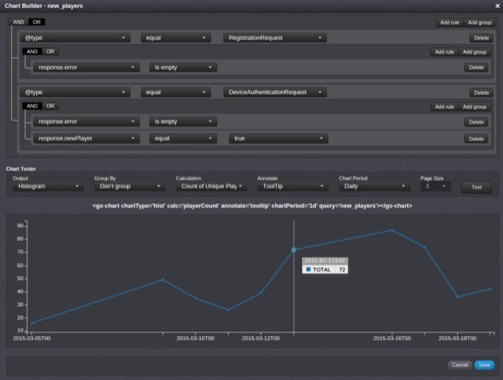
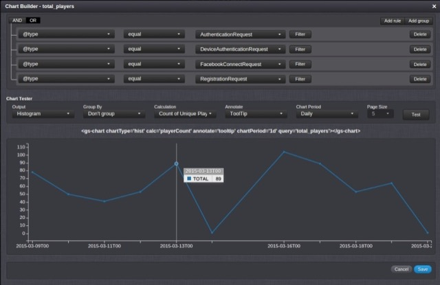
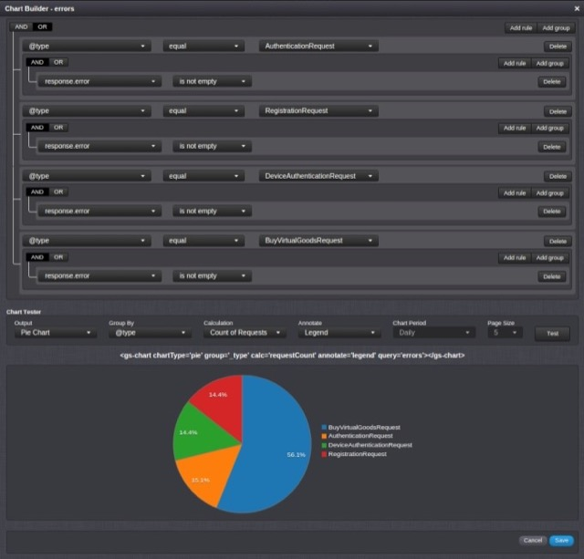
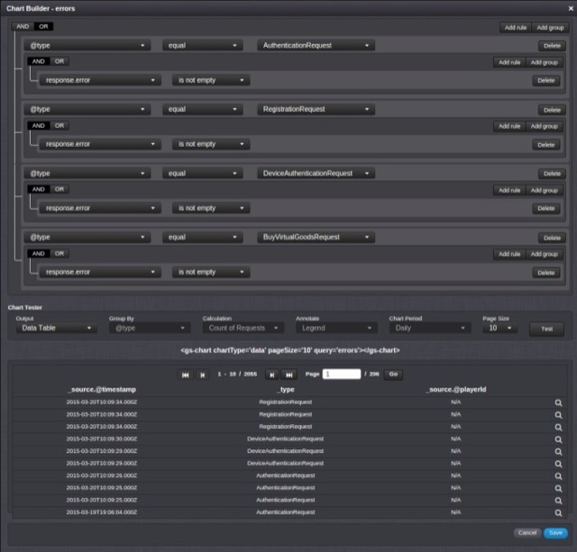

# Building Custom Analytics Dashboards

Using Dynamic Forms you can quickly and easily build a Custom Analytics Dashboard that will have nearly limitless expandability and suit your personal needs. However, we strongly recommend that you read the [Dynamic Forms API](/API Documentation/Dynamic Forms API.md) as well as take a look at the [Dynamic Forms Tutorial](/Documentation/Manage/Working with Dynamic Forms.md) before starting.  

 Since there's no need to over-complicate the full capabilities of Dynamic Forms and Charts in this tutorial, we'll not use any Cloud Code in order to create our Dashboard. For this reason we'll only need to create our Chart templates and Analytics Screen.

 In this tutorial we'll create 3 charts:  

* *New Players* \- displays the chart for new player registrations.  
* *Total Players* \- displays the chart for total unique player connections.  
* *Errors & Errors Table* \- a selection of errors we want to track.  

<q>**Note:** The Charts are game-dependent and will be unique for every game. For this reason, some of the charts in this tutorial might use requests that do not exist in your configuration. For example, you might not be able to group requests by: *@type - equal - DeviceAuthenticationRequest* if your game has never made this request. Simply skip these if they are not applicable to you.</q>

### New Players Chart

This chart was created in the Charts tab of the management section and we used *new_players* shortCode:
* The chart represents the new players entering the game. This is done by grabbing a successful [RegistrationRequest](/API Documentation/Request API/Authentication/RegistrationRequest.md) as well as a successful [DeviceAuthenticationRequest](/API Documentation/Request API/Authentication/DeviceAuthenticationRequest.md) that has been done by a new player (Device Authentication, as well as External Authentications act as a registration for new players).
* We'll display the chart as a histogram, without a grouping, counting only unique player Ids, showing a tool tip, and displaying the results spread out daily.



As seen, clicking *Test* will generate the chart preview as well as the GSML code, that can be copied and pasted into our Screen later on.

### Total Players Chart

Much like New Players, but here we want to keep track of daily total player logins for the game. For this we need to create a chart with shortCode *total_players*:
* Get all different types of authentication and make sure the calculation is set to count unique players.
* Bear in mind that you will most likely have different Authentications, again, this is per-game basis.



### Errors Chart

This chart will be used to display a pie chart and a data table of the error responses for some of the Requests we care about. All we do here is create a chart with *errors* shortCode:
* Find the Responses we're interested in.
* Filter them by the *response.error* value.  

The first chart will display the visual representation of the error count that has occurred:  



The second chart will display and allow viewing of the actual error responses:



<q>**Note:** The only difference between these two charts, is how the chart will be accessed by our GSML.</q>

### Analytics Screen

The Screen will only act as a container for our charts. It's fairly straightforward:
* We'll place all of the charts in a Analytics title block.
* Additionally, each chart will have it's own title block explaining what the chart does.
* Since we have 4 chart views, we'll use 2 rows with 2 columns in each row to place the chart in.  

The GSML in the *Analytics* Screen:

```
    <gs-title-block title="Analytics" padding="10" margin="0">

        <gs-row>
            <gs-col width="6">
                <gs-title-block title="New Players" padding="5" margin="0" height="360">
                    <gs-chart chartType='hist' calc='requestCount' annotate='tooltip' chartPeriod='1d' query='new_players'></gs-chart>
                </gs-title-block>
            </gs-col>
            <gs-col width="6">
                <gs-title-block title="Total Players" padding="5" margin="0" height="360">
                    <gs-chart chartType='hist' calc='playerCount' annotate='tooltip' chartPeriod='1d' query='total_players'></gs-chart>
                </gs-title-block>
        </gs-row>
        <br/>

        <gs-row>
            <gs-col width="6">
                <gs-title-block title="Errors" padding="5" margin="0" height="360">
                    <gs-chart chartType='pie' group='_type' calc='requestCount' annotate='legend' query='errors'></gs-chart>
                </gs-title-block>
            </gs-col>
            <gs-col width="6">
                <gs-title-block title="Errors Table" padding="5" margin="0" height="360">
                    <gs-chart chartType='data' pageSize='10' query='errors'></gs-chart>
                </gs-title-block>
            </gs-col>
        </gs-row>
        <br/>

    </gs-title-block>
```

The final view:


<q>**Note:** All data shown within these forms is time-limited.  Player request data isn't kept forever and it's very likely that when a player has had inactivity for a certain amount of time, the above form can appear empty.</q>
