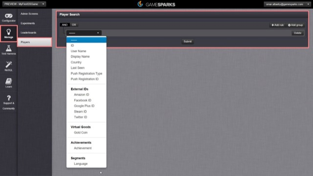
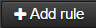
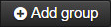
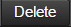
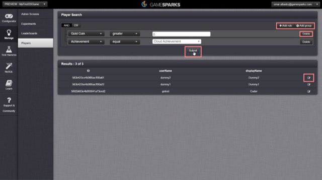
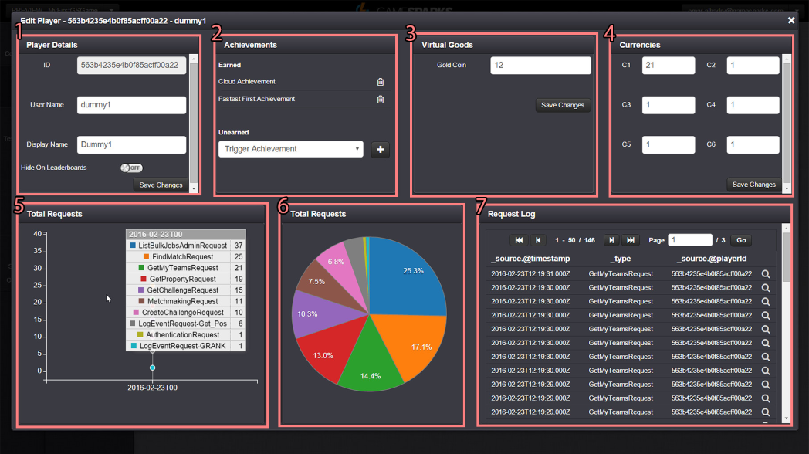

# Player Profile Screen

## Introduction

Gamespark's platform comes complete with many conveniences for developers. One of these conveniences is pre-made management screens for leaderboards and player records. The screens are user friendly, customizable and visual ways of searching, accessing and editing records.

Screens are made to be easy to use without need for code, knowing how to code or access and edit the NoSQL database making it an excellent tool for non-dev members of the team such as customer service.

This tutorial will offer a brief introduction and highlight the aspects of the player profile management screen.

## Searching for players

Once you navigate to the Players tab in the Manage section of the platform you'll be greeted with a 'Player Search' query builder which you can use to build queries to search for specific players or a group of players that fit a certain query. You can add rules with the combination of 'AND' and 'OR' operators as well as include a whole new group of rules.

|    |     |
|---|---|

You can query everything that is linked to your players, this can be custom values such as segments, achievements, virtual goods or pre-defined data such as usernames, display names, country, last seen etc.

You can also remove the queries using the delete button and hit the 'submit' button to retrieve every single player record in your player collection.

|    |     |
|---|---|

For this example we'll query players with 'Gold Coin' virtual good greater than 0 in quantity and have earned the 'Cloud' Achievement.

Once we hit 'submit' this will pull three records that match from our collection. We'll go ahead and click the edit  icon to access the player profile screen.

## Player Profile Screen

The default player profile screen has 7 sections. Those are:

1. *Player Details* - where the ID, Username, Displayname and the toggle between hidden on leaderboards are,
2. *Achievements* - where the achievements are accessed and edited.
3. *Virtual Goods* - Which and and quantity of owned virtual goods.
4. *Currencies* - where currency quantity and the ability to edit them are.
5. *Total Requests* - How many and what type of requests were called throughout the timeline. When hovered shows the type of requests made.
6. *Total Requests* - A chart version of the total requests section but shows percentage of request calls in comparision to each other instead of how many on a timeline.
7. *The Request Log* - Where requests and responses can be reviewed. You can click the inspect  icon to review individual requests from the history.
