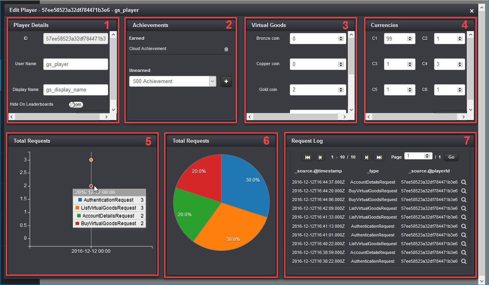

# Player Profile Screen

## Introduction

The Gamesparks platform comes complete with many conveniences for developers. One of these is pre-built management Screens for Leaderboards and Player records. The Screens are user friendly, customizable, and offer very useful ways of visually searching for, accessing, and editing records.

These Screens are easy to use making them very suited to non-technical members of your team, such as Customer Service:
* No coding skills required.
* No knowledge of how to access the NoSQL database and edit records.

This tutorial offers a brief introduction to using these Screens and highlights the main features you'll find on the Player Management screen.

<q>**Importing Pre-Built Screens!** Before commencing this tutorial, you must import the *Player Management* Screen from the library. For details on how to import any of the pre-built Screens, see [Importing/Exporting Admin Screens](/Documentation/Manage/Importing and Exporting Admin Screens.md).

## Searching for Players

When you open the *Player Management* Screen from the *Manage* menu, you'll see a *Player Search* query builder:
* Build queries to search for specific players or a group of players.
* Add rules with the combination of *AND* and *OR* operators as well as include a whole new group of rules.

|    |     |
|---|---|

* You can query everything that is linked to your players, this can be custom values such as Segments, Achievements, Virtual Goods, or pre-defined data items, such as *usernames*, *display names*, *country*, *last seen*, and so on.

|    |     |
|---|---|

* You can also remove the queries using the *Delete* button and click *Submit* to retrieve every single player record in your player collection.

<q>**Lowercase for User Name Search!** If you use a player search query against player usernames, you must use a lowercase alpha-numeric string in the query. For example, if you want to return the players registered as "PLAYer1", "PLAYer2", and "PLAYer3" in your query results, you must use the query: "User Name begins with play". If you use "User Name begins with PLAY", they will not be returned. This is because usernames are always saved into the Mongo DB in lowercase.</q>

For this example, we'll query players with *Gold Coin* Virtual Goods greater than 0 in quantity and who have earned the *Cloud Achievement*:

When we click *Submit*, this returns two records that match from our collection. We'll go ahead and click the edit  icon to access the player profile screen.

## Player Profile Screen

The default player profile screen has 7 sections, where you can review and edit a player's details:

1. *Player Details* - *ID*, *Username*, *Displayname* and a toggle for *Hidden On Leaderboards*.
2. *Achievements* - *Earned* and *Unearned* Achievements.
3. *Virtual Goods* - Virtual Goods owned.
4. *Currencies* - Currencies and amounts.
5. *Total Requests* - Histogram for number and type of requests made throughout the timeline - tool tip shows each request type and number.
6. *Total Requests* - Pie-chart for number and type of requests made throughout the timeline - shows each request type as percentage of total number of requests.
7. *Request Log* - Review requests history - click the inspect  icon to review individual requests from the history.
