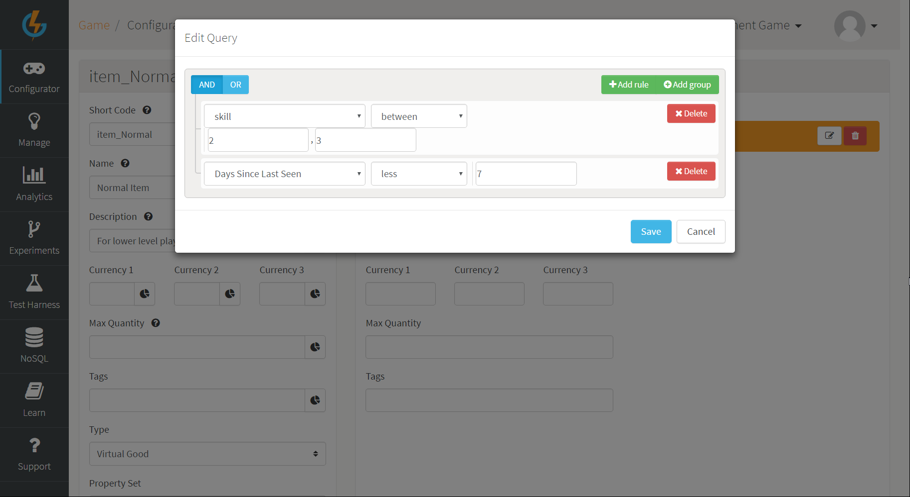
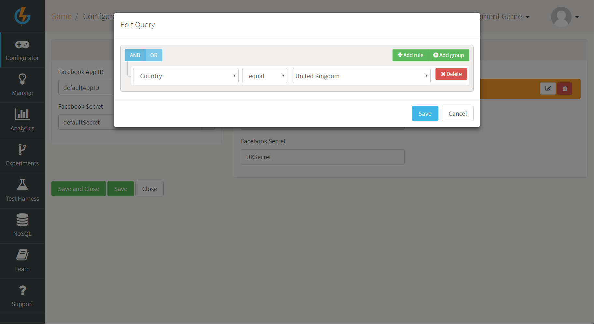
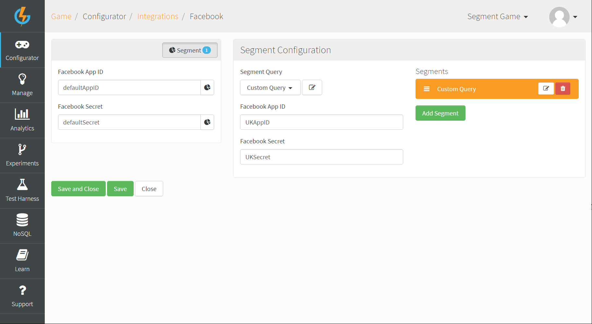
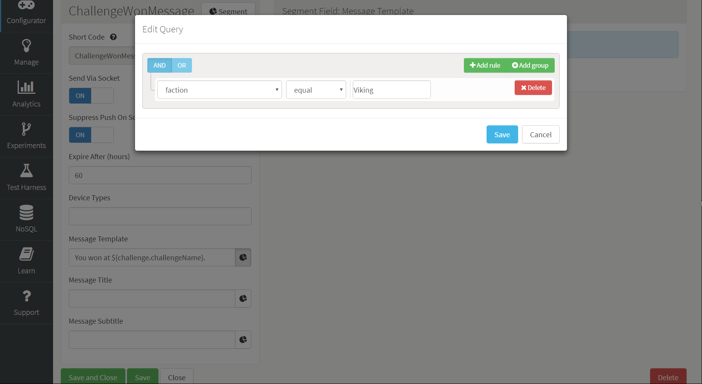
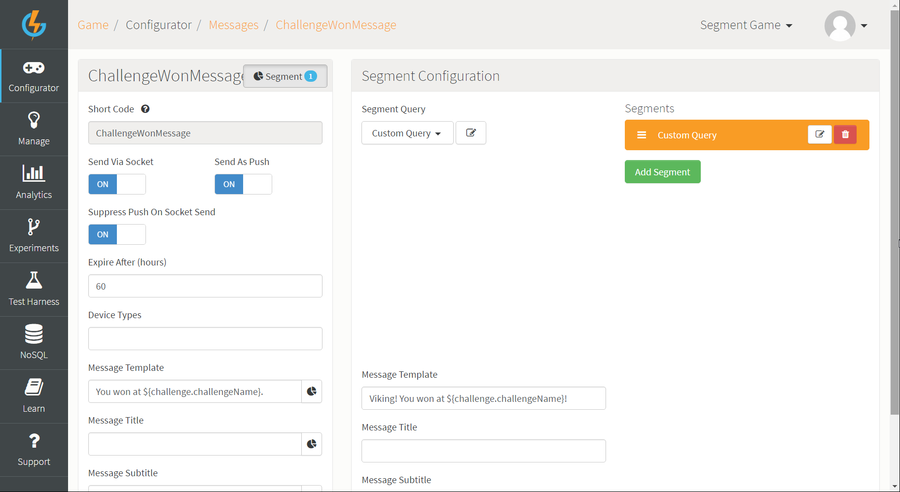

# Direct Segmentation for Configurables

GameSparks now allows you to customize your configuration with segments without having to first create Segments or Segment Queries under *Configurator>Segments*. This feature is especially useful if you want to customize a single configuration object for a very specific segment of players without having to track that segment everywhere across the portal and thereby cluttering your segment drop down list.

When you impose differentiated player experience through direct segmentation in this way the *scope* of the segmentation is restricted to that particular configurable.

## Creating a Direct Segmentation

Configurable objects, integration pages, and message configurations can be customized through the direct segmentation method.

Here are the general steps you must follow to configure direct segmentation on a configurable:

*1.* Open the configurable to edit it.

*2.* Click the *Segment* button on the top of the configurable edit page. The *Segment Configuration* panel appears.

*3.* Click *Add Segment*. The *Segment Configuration* panel adjusts.

*4.* From the *Segment Query* drop-down select *Custom Query*.

*5.* Click the edit  icon button next to *Custom Query*. An *Edit Query* dialog appears.

*6.* Create a query for segmenting the configurable and save.

## Direct Segmentation Examples

Here's a few examples of direct segmentation on configurables:

### Example 1

For this *Virtual Good* we're going to create a niche segment that caters for players between the skill levels of 2 and 3 and who have been online in the last 7 days:

### Example 2

For our *Facebook Integration* we're going to offer our players from the United Kingdom a different *App ID* to connect to which is more catered for them:

### Example 3

For our *Challenge Won* message we're going to segment the message and cater it depending on the player's chosen faction. For this example, we're going to give any player belonging to the Viking faction their own customized message.

