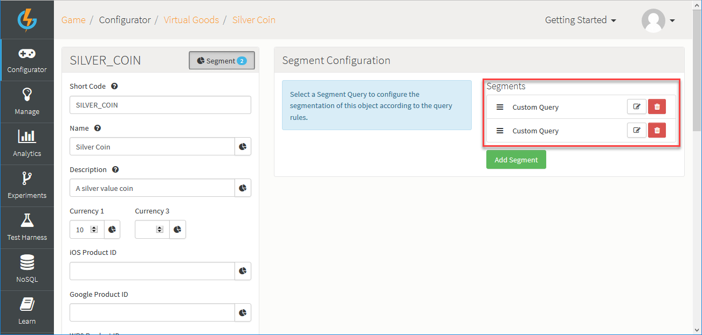
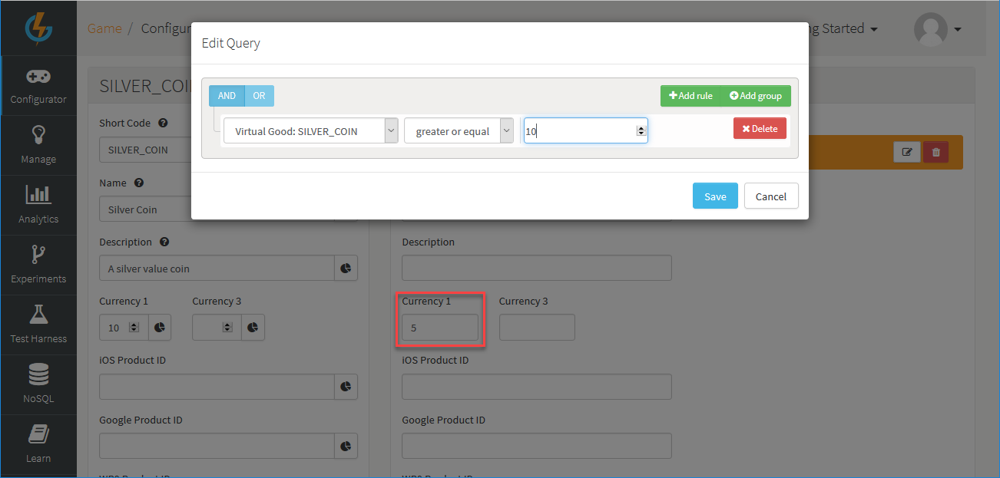
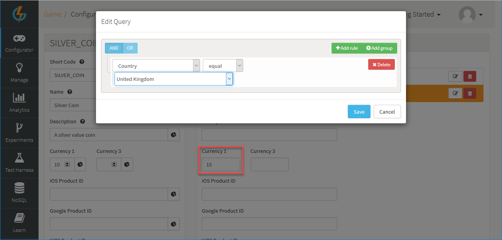

# Direct Segmentation for Configurables

GameSparks allows you to segment your configurable objects in your game directly without having to first create Segments and Segment Queries under *Configurator>Segments*. You can do this by creating a *Custom Query* when you segment the configurable to control which players experience the segmented values.

This feature is especially useful if you want to customize a single configuration object for a very specific partition of your players without having to track the Segment Query you use to do this everywhere across the portal and thereby cluttering up your Segment Query drop-down list.

When you impose differentiated player experience through direct segmentation in this way, the *scope* of the segmentation is restricted to that particular configurable because the *Custom Query* you use will not be available to segment other configurable objects.

<q>**Mixed Segmentation?** You can segment a configurable object in your game by using both a *Custom Query* and a pre-configured *Segment Query* or use multiple queries of either kind. This affords you maximum flexibility when you segment - if you add multiple segments, the order of segments determines which values any particular player will experience for the configurable. For an example where multiple segment queries are added in this way, see [Example 4](#Example 4) below. </q>

## Creating a Direct Segmentation

Configurable objects, integration pages, and message configurations can be customized using the direct segmentation method. Here are the general steps you must follow to configure direct segmentation on a configurable:

*1.* Open the configurable to edit it.

*2.* Click the *Segment* button on the top of the configurable edit page. The *Segment Configuration* panel appears.

*3.* Click *Add Segment*. The *Segment Configuration* panel adjusts.

*4.* From the *Segment Query* drop-down select *Custom Query*.

*5.* Click the edit  icon button next to *Custom Query*. An *Edit Query* dialog appears.

*6.* Create a query for segmenting the configurable.

*7.* Enter the alternative values for the segmentable fields on the configurable - those with the segment  icon - that you want to apply to players put into the segment.

*8.* Click to *Save* the segmentation for the configurable.

## Direct Segmentation Examples

Here's a few examples of direct segmentation on configurables:

### Example 1

For this *Virtual Good* we're going to create a niche segment that caters for players between the skill levels of 2 and 3 and who have been online in the last 7 days:

### Example 2

For our *Facebook Integration* we're going to offer our players from the United Kingdom a different *App ID* to connect to which is more catered for them:

### Example 3

For our *Challenge Won* message we're going to segment the message and cater it depending on the player's chosen faction. For this example, we're going to give any player belonging to the Viking faction their own customized message.

### Example 4

In this example, we'll use multiple *Custom Queries* on a *Silver Coin* Virtual Good to achieve staged discounting as players accumulate the Virtual Good:

* The first segment applies only to players that have acquired at least ten of the Virtual Good - the cost of the Virtual Good is then reduced as a discounted currency 1 cost:

* The second segment applies to players in the UK - they will be charged an increased currency 1 cost for the Virtual Good until they acquire 10 of them:

By using additional Custom Queries in the correct order for segmenting the Virtual Good, you can easily extend this example for staged discounting to apply as players accumulate more and more of them - at 20, 30, 40, and so on.
