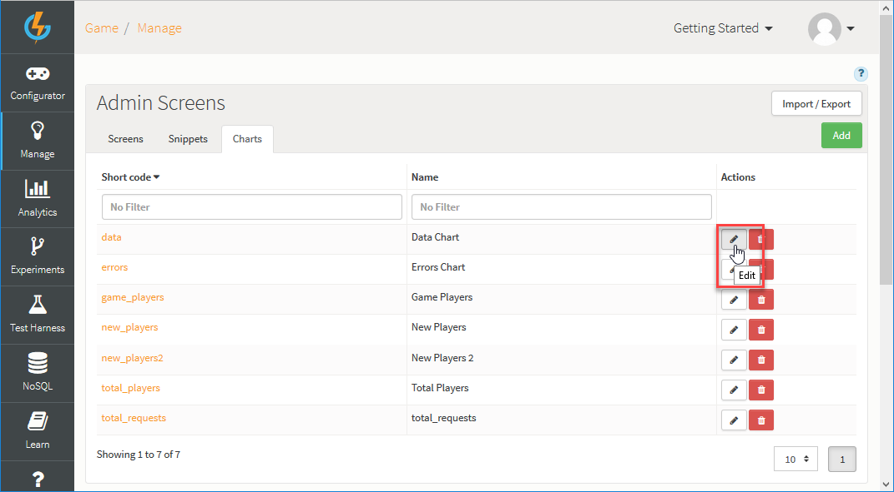

# Filtering Custom Analytics Event Keys

On a Dynamic Form, you might want to have a Chart that shows the extra data attached to the analytics event keys. Specifically, this would be a Custom Chart driven by data which is not directly accessible through the *NoSQL Explorer*.

Here's how you do this:

*1.* In the portal, go to *Manage > Admin Screens*.

*2.* Under *Screen Builder*, select the *Charts* tab.

In this example, we'll edit an existing Chart called *data*.

*3.* Click to edit  the Chart. The *Chart Builder* appears.

*4.* When you edit the Chart, you can build a query for the data the Chart will display. If you select *@type* in the first drop-down, you'll see your available analytics keys to the right:

*5.* Then click the *Filter* button and you should see your data options available for the selected analytics event key:

*6.* You can customize settings for your Chart and hit *Test* to see the data for that key:

In this example, we've only got one element with a count of 1 returned for the filter we configured for the custom Chart. But this illustrates the steps you need to follow to drive your custom Chart with data attached to analytics event keys!
