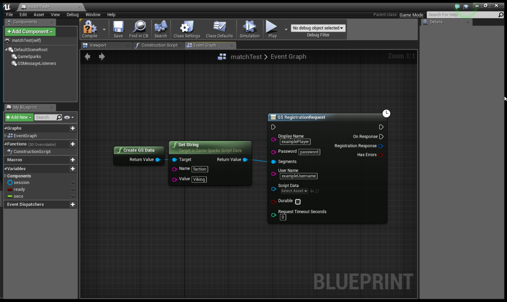

# Segmenting Players at Registration

The [RegistrationRequest](/API Documentation/Request API/Authentication/RegistrationRequest.md) includes the option to pass in Segment/Value pairs for new players.

## Using the Segment Input

To pass in a Segment or multiple Segments you'll need to input key/value pairs in the *segment* object when calling the *RegistrationRequest*. For this example we're going to be setting the Segment value for a player's faction at registration. Similar to UbiSoft's For Honor, when our player first registers, they're going to have to pick between Vikings, Samurai, or Knights as a faction.

To set our player's faction we're going to pass the following through the *segment* object:

```
{"faction":"Viking"}

```

You can input multiple segments this way:

```
{"faction":"Viking", "class":"Raider"}

```

The full request:

```
{
  "@class": ".RegistrationRequest",
  "displayName": "segPlayer23",
  "password": "pass",
  "segments": {"faction":"Viking"},
  "userName": "segPlayer23"
}

```


## SDK Examples

### Lua

```
--Set values
registerRequest:setDisplayName("examplePlayer")
registerRequest:setUserName("exampleUsername")
registerRequest:setPassword("password")
registerRequest::setSegments("faction","Viking")

```

### Unity

```
new GameSparks.Api.Requests.RegistrationRequest()
  .SetDisplayName("examplePlayer")
  .SetPassword("password")
  .SetUserName("exampleUsername")
  .SetSegments("faction","Viking")

```

### Unreal Blueprint


