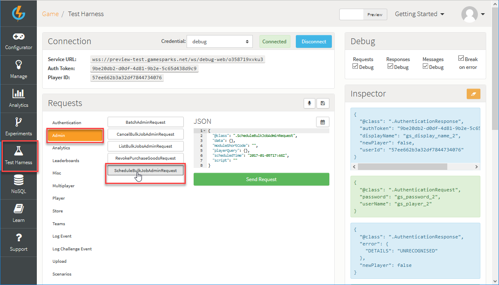

# Using Bulk Jobs

You can use Bulk Jobs in the GameSparks platform to collectively update all Player details in one action, which removes the need:
* For Players to action their own updates.
* To have an administrator individually update each Player record.

Bulk Jobs are a very useful tool for your game management operations.

In this tutorial we'll learn about the two ways you can work with Bulk Jobs:
* Through requests.
* Through Cloud Code.

<q>**Use Bulk Jobs for Global Messages!** An example of using Bulk Jobs for messaging to players can be found in [this tutorial](/Tutorials/Social Authentication and Player Profile/Using Bulk Operations for Global Messages.md).</q>

## How to Create and Execute a Bulk Job Request

*1.* Before you can use Bulk Operations you'll need to ensure that your credentials have the Admin BulkJob requests enabled. For a refresher, see [Credentials](/Documentation/Configurator/Credentials.md).

*2.* In the Portal go to the Test Harness.

*3.* Under *Requests* select *Admin* then select [ScheduleBulkJobAdminRequest](/API Documentation/Request API/Admin/ScheduleBulkJobAdminRequest.md):



*4.* Notice that the request is broken down into two different methods - *moduleShortCode* and *script*:

```
{
"@class": ".ScheduleBulkJobAdminRequest",
"data": {},
"moduleShortCode": "",
"playerQuery": {},
"scheduledTime": "2016-02-16T12:17Z",
"script": ""
}

```

Here we'll use the script method - we'll schedule a Bulk Job using a *playerQuery* and a *script*.

*5.* To create the Job you'll need to enter a *playerQuery* and a *script* into the request.

In this example:
* We want to find all Player usernames beginning "player1".  Currently, our Player collection has 20 player usernames, from player1 to player20.  So, our query will find Player usernames such as player1, player10, player11, player12, and so on.
* When we have queried all the affected Players, we'll give those Players the value of 2 for Currency type 1.
* We must also enter a date and time to submit this request. This is the scheduledTime which is in the format of “YYYY-MM-DDTHH:MMZ“.

Here it is:

```
{
"@class": ".ScheduleBulkJobAdminRequest",
"data": {},
"moduleShortCode": "",
"playerQuery": {"displayName":{"$regex":"^player1"}},
"scheduledTime": "2016-02-16T13:45Z",
"script": "var myplayer = Spark.getPlayer(); myplayer.credit1(2);"
}

```

When you've submitted the job you'll get a response with the unique jobId number similar to this:

```
{
 "@class": ".ScheduleBulkJobAdminResponse",
 "estimatedCount": 11,
 "jobId": "56c32531e4b0009f3122e73c"
}

```

The response also tells us how many estimated records will be affected based on the information available at the time of the request being submitted - "estimatedCount". For example, if a new player joined our collection with the displayName beginning with "player1" between the request being submitted and the scheduled time of the bulk job to occur, this would affect the total amount of records.

*6.* To see any jobs which have been executed you will need the unique jobId. You can find the job by doing a [ListBulkJobsAdminRequest](/API Documentation/Request API/Admin/ListBulkJobsAdminRequest.md).

Your request should be like this:

```
{
"@class": ".ListBulkJobsAdminRequest",
"bulkJobIds": [
"56c32531e4b0009f3122e73c"
]
}

```

Response:

```
{
 "@class": ".ListBulkJobsAdminResponse",
 "bulkJobs": [
  {
   "errorCount": 0,
   "actualCount": 11,
   "doneCount": 11,
   "playerQuery": {
    "displayName": {
     "$regex": "^player1"
    }
   },
   "scheduledTime": 1455630300000,
   "estimatedCount": 11,
   "created": 1455629617770,
   "started": 1455630311028,
   "completed": 1455630314912,
   "data": {},
   "id": "56c32531e4b0009f3122e73c",
   "script": "var myplayer = Spark.getPlayer(); myplayer.credit1(2);"
  }
 ]
}

```

If you want to see all of the pending jobs, you can run the request without any jobId

```
{
"@class": ".ListBulkJobsAdminRequest",
"bulkJobIds": [
]
}

```

Response:

```
{
 "@class": ".ListBulkJobsAdminResponse",
 "bulkJobs": [
  {
   "errorCount": 0,
   "actualCount": 0,
   "doneCount": 0,
   "playerQuery": {
    "displayName": {
     "$regex": "^player1"
    }
   },
   "scheduledTime": 1455630300000,
   "estimatedCount": 11,
   "created": 1455629503639,
   "data": {},
   "id": "56c324bfe4b0009f3122e3d7",
   "script": "var myplayer = Spark.getPlayer(); myplayer.credit1(2);"
  },
  {
   "errorCount": 0,
   "actualCount": 0,
   "doneCount": 0,
   "playerQuery": {
    "displayName": {
     "$regex": "^player1"
    }
   },
   "scheduledTime": 1455630300000,
   "estimatedCount": 11,
   "created": 1455629617770,
   "data": {},
   "id": "56c32531e4b0009f3122e73c",
   "script": "var myplayer = Spark.getPlayer(); myplayer.credit1(2);"
  }
 ]
}

```

*7.* When a job has been run, the results are available to be seen in NoSQL. If we want to see the results of the bulk operation, we can do this in two locations:

* The *Player* collection, which will show you how much currency each player has. We can use our player query used earlier - the one we used in the Bulk Job - in NoSQL Explorer to verify just the players affected by this job.
* The second way to see this is in the *playerTransactionAudit* collection.  This collection shows all transactions around currency and virtual goods.

## How to Create a Bulk Job with Cloud Code

We'll now look at creating the same outcome but using an Event to trigger the scheduled job.

*1.* Before you can use Bulk Operations you will need to ensure that your credentials have the Admin BulkJob requests enabled. For a refresher, see [Credentials](/Documentation/Configurator/Credentials.md).

*2.* In the portal, go to *Configurator > Events* and create a new Event.  The Event will need an Attribute which has:
* A *Data Type* of *String*.
* A *Default Aggregation Type* of *Used In Script*.
* For this example, we'll give the Attribute a Short Code of *VALUE_ATTRIB*.

*3.* In the portal, go to *Configurator > Cloud Code* and select Modules.

*4.* Add new Module.

*5.* In the Module, create some Cloud Code to credit a Player and use the Attribute to set the value credited.

```
var myVal = Spark.getData().VALUE_ATTRIB;
Spark.getPlayer().credit1(myVal);

```

*6.* Now that the Module is configured, go to the Event you created earlier with the Attribute Short Code of *VALUE_ATTRIB*.

*7.* To run the bulk operation, use Spark.getBulkScheduler.

```
Spark.getBulkScheduler().submitJobModule({"userName":{"$regex":"^player1"}}, "CreditMod", Spark.getData(), 30);

```

This above method and its attributes can be broken down into the following:

* *Spark.getBulkScheduler().submitJobModule* - The method to call on *getBulkScheduler*, which submits the bulk operation.

* *{"userName":{"$regex":"^player1"}}* - The Player query to use to find all Player usernames beginning with "player1"

* *"CreditMod"* - The module to call, which contains the Cloud Code to submit.

* *Spark.getData()* - This is the data to be passed into the Cloud Code module, which will be used to pass in the entered value of VALUE_ATTRIB.

* *30*  - The number of seconds delay before the bulk operation is executed.


*8.* Go to the Test Harness.

*9.* In the Test Harness, authenticate as a Player and select the Event you have created.

*10.* Set the amount of credit you want to add to the *VALUE_ATTRIB* and submit the request.

Your request should be similar to this:

```
{
"@class": ".LogEventRequest",
"eventKey": "BulkJob",
"VALUE_ATTRIB": "2"
}

```

Response:

```
{
 "@class": ".LogEventResponse"
}

```

*11.*  Once a job has been run, the results are available in NoSQL Explorer:

* The *Player collection* will show how much currency each player has, using the player query created earlier.  You will see that the credit values have increased since the bulk operation.

* The *playerTransactionAudit* collection shows all transactions around currency and Virtual Goods in individual records.  This will show the bulk operation transactions made to credit each affected Player.
