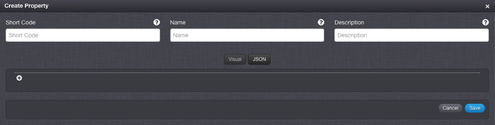
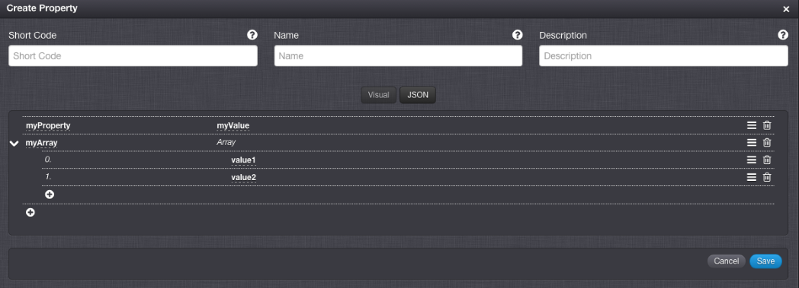
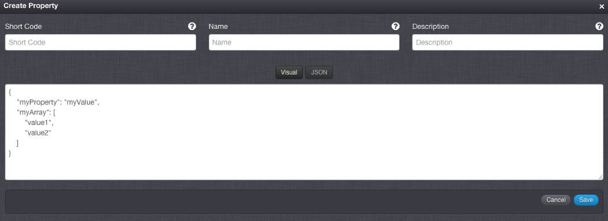
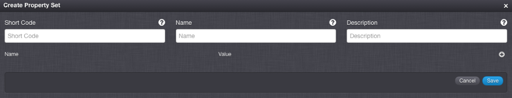
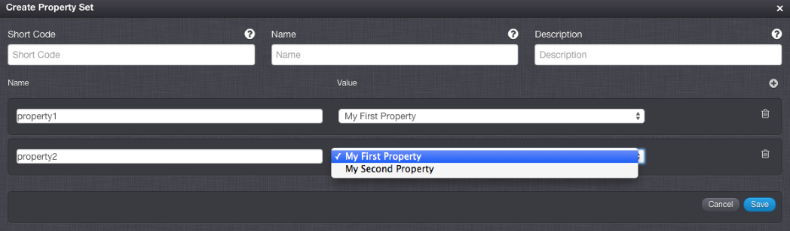
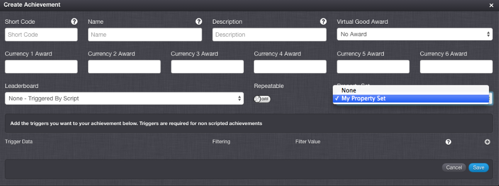
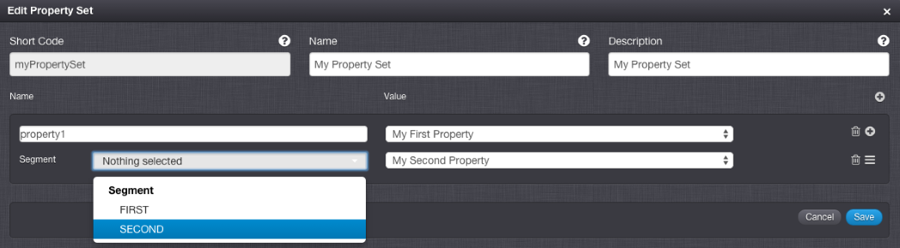

# Segmented Properties

The GameSparks platform exposes various configurable objects to drive further customization on the platform. Until now, configuration has been driven by platform capabilities and there hasn't been a first-class feature allowing you to provide your own custom configuration and which drives your own custom behavior for these objects. That's why we've introduced *Properties*. In short, you can use GameSparks Properties to store your own JSON configuration in the Portal and attach them to GameSparks objects to be surfaced when you are using these objects. You can also access Properties directly, either in Cloud Code or via the web socket API, enabling you to deliver your custom configuration wherever you need it.

Let's take a look at how to set up Properties and then how to access those values later on when we want to read them.

## Properties

*1.* Go to the *GameSparks Developer Portal* and under *Configurator*, click *Properties*.

From here you can manage your *Properties* and *Property Sets* \- more on these later. First, let's add a Property.

*2.* Click the icon on the Properties Panel.



In the *Create Property* form, there are two styles of editor you can use to build your object.  They can be any valid JSON object, including nested objects and arrays as well.
* The *JSON* editor allows you to manually type in your JSON structure whilst offering real-time validation on your input, only allowing you to save if your JSON configuration is correct.
* The *Visual* editor provides an error-free method of adding your JSON configuration by entering it in fields and choosing the data types from a select range.
* Switching back and forth between the two views will update them accordingly, allowing you to use both views when writing either simpler or more complex parts of your JSON configuration.

*3.* Give your property a *Short Code*, *Name* and *Description*. As usual, you refer to the Property by its ShortCode when you access it programmatically.





*4.* Once you're ready, click 'Save'.

You can now access this Property using Cloud Code:

```
var property = Spark.getProperties().getProperty("propertyShortCode")

```

Or you can deliver it to your clients through the web socket API using:

```

{ "@class": ".GetPropertyRequest", "propertyShortCode": "propertyShortCode" }

```


```

{ "@class": ".GetPropertyResponse", "property": { "myProperty": "myValue" }, "scriptData": null }

```

## Property Sets

Now that you've seen how to set up and use a single Property, it's time to start looking at some more powerful ways to use them. A Property Set is a configuration object that lets you pull together different, but related, properties.

Let's create a Property Set.

*1.* Click the  icon on the Property Set Panel.



*2.* Give your Property Set a *Short Code*, *Name* and *Description*. Now let's add some Properties.

*3.* Click the  icon at the bottom right.



*4.* Give the Property a name. This is how you will access the value of this property from the Property Set. Now select one of your Properties.

*5.* If you haven't already, create some more Properties and come back and add them to this Property Set.

Now that you have a Property Set you can access it in a similar way to a single Property:

```

var propertySet = Spark.getProperties().getPropertySet("propertySetShortCode")

```

Or through the web socket API using:

```

{ "@class": ".GetPropertySetRequest", "propertySetShortCode": "propertySetShortCode" }

```

```

{ "@class": ".GetPropertySetResponse", "propertySet": { "property1": { "myProperty": "myValue" }, }, "scriptData": null }

```

## Linking Property Sets

When you've created a Property Set, you can attach it to [Leaderboards](/Documentation/Configurator/Leaderboards/README.md), [Achievements](/Documentation/Configurator/Achievements.md), and [Virtual Goods](/Documentation/Configurator/Virtual Goods.md). It will be available wherever you use those objects.

Let's create an Achievement and add our Property Set to it.

*1.* Navigate to 'Achievements' and create a new one. On the Achievements edit page, you'll see a new field: 'Property Set'. From this drop-down you can see all the Property Sets you have available.



*2.* Select the one we just created, and click 'Save'. You can now access this Property Set whenever you have access to this Achievement. Within Cloud Code you can access this Achievement using:

```

var achievement = Spark.getConfig().getAchievement("achievementShortCode");


```

*3.* Also, you can now access your Property Set:

```

var propertySet = achievement.getPropertySet();


```

*4.* Similarly, a [ListAchievementsRequest](/API Documentation/Request API/Player/ListAchievementsRequest.md) will now also return the PropertySet associated with each Achievement in the response:

```

{ "@class": ".ListAchievementsRequest" }


```

```

{ "@class": ".ListAchievementsResponse", "achievements": [ { "earned": false, "shortCode": "achievementShortCode", "propertySet": { "property1": { "myProperty": "myValue" }, }, "description": "desc", "name": "name" } ], "scriptData": null }

```

## Segmentation

The last thing to mention, and the thing that we think makes Property Sets really powerful, is segmentation. When you have some [Segments](/Documentation/Configurator/Segments.md) configured within the Portal, whenever you add a Property to a Property Set you also have the option to add segmented values for that property. This makes it trivial for you to deliver different property values to different groups of players.

Make sure you have some Segments configured, and let's go back to the Properties page.



Now when you edit our Property Set, by each Property is a  icon. Clicking this lets you override the value that will be surfaced under each 'Name', depending on the segments of the current player. Now, wherever you access that Property Set, if the Player belongs to a segment whose value you've overridden, they will see that overridden value. The obvious example here is delivering language-specific properties to a Player, but the possibilities really are boundless!
