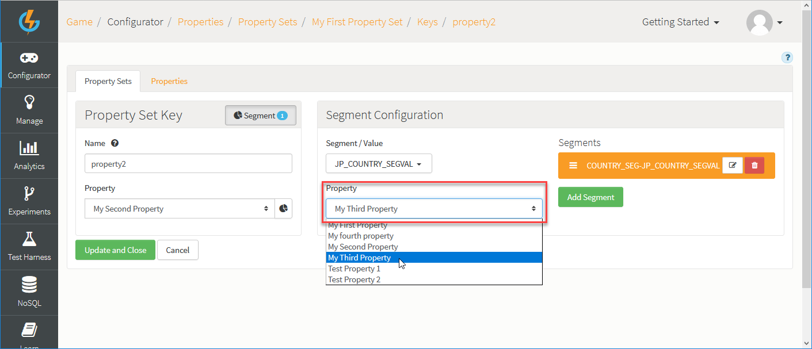

# Segmented Properties

The GameSparks platform exposes various configurable objects to drive further customization on the platform. Until now, configuration has been driven by platform capabilities and there hasn't been a first-class feature allowing you to provide your own custom configuration and which drives your own custom behavior for these objects. That's why we've introduced *Properties*. In short, you can:
* Use GameSparks Properties to store your own JSON configuration in the Portal and attach them to GameSparks objects to be surfaced when you are using these objects.
* Access Properties directly, either in Cloud Code or via the web socket API, enabling you to deliver your custom configuration wherever you need it.

Let's take a look at how to set up Properties and then how to access those values later on when we want to read them.

## Adding Properties

*1.* In the portal, navigate to *Configurator>Properties*.

From here you can use the two tabs on the page to create and manage your *Property Sets* and *Properties*.

*2.* To add a Property, select the *Properties* tab and click to *Add* a new Property. The page adjusts:


*3.* Give your Property a *Short Code*, *Name* and *Description*. As usual, you refer to the Property by its Short Code when you access it programmatically.

*4.* Add JSON in the editor for the *Value* and to build your Property object. This can be any valid JSON object, including nested objects and arrays.

You can use the editor in either of two modes to build your object:
* *Code* - Allows you to manually type in your JSON structure whilst offering real-time validation on your input, only allowing you to save if your JSON configuration is correct.
* *Tree* - Provides an error-free method of adding your JSON configuration by entering it in fields and choosing the data types from a select range.
* Switching back and forth between the two modes of JSON entry will update them accordingly, allowing you to use both modes when writing simpler or more complex parts of your JSON configuration:


*4.* When you've entered the JSON you require for your Property object, click to *Save and Close*.

### Accessing Properties

You can now access this Property using Cloud Code:

```
var property = Spark.getProperties().getProperty("propertyShortCode")

```

Or you can deliver it to your clients through the web socket API using:

```

{ "@class": ".GetPropertyRequest", "propertyShortCode": "propertyShortCode" }

```


```

{ "@class": ".GetPropertyResponse", "property": { "myProperty": "myValue" }, "scriptData": null }

```

## Adding Property Sets

Now that you've seen how to set up and use a single Property, it's time to start looking at some more powerful ways to use them. A *Property Set* is a configuration object that lets you pull together different, but related, Properties.

Let's create a Property Set:

*1.* On the *Configurator>Properties* page, select the *Property Sets* tab and click to *Add* a Property Set. The page adjusts:


*2.* Give your Property Set a *Short Code*, *Name* and *Description*.

You can now add *Property Set Keys* to your Property Set and map these to Properties.

*3.* On the *Property Set Keys* panel, click *Add*:


*4.* Give the new Property Set Key a *Name*. Now select one of your Properties to map it to the new Property Set Key.

*5.* If you haven't already, create some more Properties, add further Property Set Keys and map Properties to the Keys:


In this example, we've added two Property Set Keys to our Property Set and mapped separate Properties to them.

*6.* Click to *Save and Close* the new Property Set.


### Accessing Property Sets

Now that you have a Property Set you can access it in a similar way to a single Property using Cloud Code:

```

var propertySet = Spark.getProperties().getPropertySet("propertySetShortCode")

```

Or through the web socket API using:

```

{ "@class": ".GetPropertySetRequest", "propertySetShortCode": "propertySetShortCode" }

```

```

{ "@class": ".GetPropertySetResponse", "propertySet": { "property1": { "myProperty": "myValue" }, }, "scriptData": null }

```

## Linking Property Sets

When you've created a Property Set, you can attach it to [Leaderboards](/Documentation/Configurator/Leaderboards/README.md), [Achievements](/Documentation/Configurator/Achievements.md), and [Virtual Goods](/Documentation/Configurator/Virtual Goods.md). It will be available wherever you use those objects.

Let's create an Achievement and add our Property Set to it.

*1.* Navigate to *Configurator>Achievements* and create a new one. Click an Achievement to edit it. Use the drop-down on the *Property Set* configuration option to select a Property Set.


*2.* Select the one we just created, and click to *Save and Close*. You can now access this Property Set whenever you have access to this Achievement. Within Cloud Code you can access this Achievement using:

```

var achievement = Spark.getConfig().getAchievement("achievementShortCode");


```

*3.* Also, you can now access your Property Set:

```

var propertySet = achievement.getPropertySet();


```

*4.* Similarly, a [ListAchievementsRequest](/API Documentation/Request API/Player/ListAchievementsRequest.md) will now also return the PropertySet associated with each Achievement in the response:

```

{ "@class": ".ListAchievementsRequest" }


```

```

{ "@class": ".ListAchievementsResponse", "achievements": [ { "earned": false, "shortCode": "achievementShortCode", "propertySet": { "property1": { "myProperty": "myValue" }, }, "description": "desc", "name": "name" } ], "scriptData": null }

```

## Segmentation

The last thing to mention, and the thing that we think makes Property Sets really powerful, is segmentation. When you have some [Segments](/Documentation/Configurator/Segments.md) configured within the Portal, whenever you add a Property Set Key to a Property Set you also have the option to add segmented values for the Property you have linked to that Property Set Key. This makes it very easy for you to deliver different Property values to different groups of players.

Make sure you have some Segments configured, and let's go back to the *Property Set* tab.

*1.* Open to edit the *Property Set* we created above, and click the segment  icon next to one of the Property Set Keys you've added to a Property Set and for which you want to configure segmented values:


The page adjusts allowing you to select a segment for the Property Set Key.

*2.* On the *Segment Configuration* panel, click *Add Segment*


The *Segment Configuration* panel adjusts.

*3.* Select the *Segment* you want to apply to the Property Set Key:


*4.* Now, to select a specific value for the Property linked to the Property Set Key, click the segment icon on the Property field:



The *Segment Property* panel is shown.

*5.* In the *Segment Property* panel, select the Property *Value* you want to apply for players that will fall under the Segment you've selected:


*6.* Click to *Update and Close* the segment configuration for the selected Property on the Property Set.

Segmenting Properties in this way lets you override the Property value that will be surfaced under each Property Set Key *Name*, depending on the segments of the current player. Now, wherever you access that Property Set, if the Player belongs to a segment, they will see the specific Property value you used to override the normal Property value mapped to the Property Set Key. The obvious example here is delivering language-specific properties to a Player, but the possibilities really are boundless!
