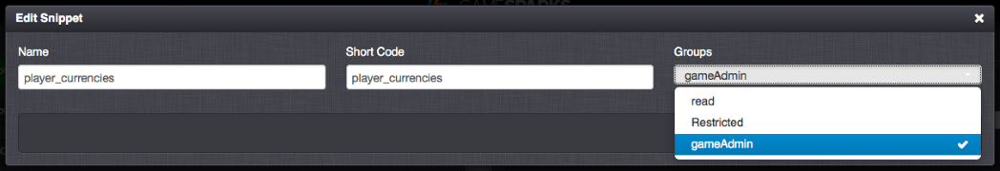

# Capabilities and User Permissions

A game Owner or Admin may wish to set specific read/write permissions for particular user for different areas of the Portal. You might want a user of your game:
* To be able to edit and make changes to Events and Leaderboards configurations.
* To able to view the configuration of Virtual Goods and Achievements but not be able to edit them.
* To be prevented from either editing or viewing the Integrations and Downloadables sections.

You can quickly set up this sort of mixed permissions for users as a specific set of capabilities and, additionally, refine the permissions in the Manage section for Screens and Snippets.

## Collaborators and Group Permissions

Previously, when adding Collaborators to a game, we had just 2 types of permissions available - an Administrator and a Read-Only user, which are referred to as *gameAdmin* and *readOnly* permissions respectively. These were not configurable to the finer granularity that we allow today.

<q>**Don't Modify!** We recommend that *you don't modify* the permissions on these default Groups (which can now be found in *Groups*), because their visibility should serve only as an intuitive template on how to configure your own Group permissions.</q>

You can now set up the read/write permissions for Collaborators on your game with a high degree of precision:
* Create a Collaborator Group.
* Edit the Group to define the read/write permissions for the Group.
* Assign Collaborators to that permissions Group.
* Finally, you can go to the *Manage > Admin Screens* section and refine the overall permissions conferred by a Group for specific screens and snippets.

## Creating Group Permissions and Assigning to Collaborators

By default on any game, the *gameAdmin* and *readOnly* Groups are displayed. The game author and owner will always have full read/write access to everything in the Portal, regardless of how the settings are changed for other game Admins. You can modify the *gameAdmin* and *readOnly* permissions Groups, but we strongly recommend that *you do not change* these default Groups. Instead, create your own custom Groups to impose the required access permissions on your Collaborators.

*1.* To create a new Group, navigate to the *Overview* page and click the  icon in the *Groups* tab under *Collaborators*:

*2.* Provide a name and description for the Group and enable *Read* and *Write* permissions for each capability in the portal, as required:

*3.* Save the new *Group*. It is added in the list on the *Groups* tab:

*4.* Select the *Collaborators* tab and add a new *Collaborator*:

*5.* To assign the *Collaborator* to the new *Group*, select the newly-created *Group* in the drop-down menu and save your changes:

In this example, the new *Collaborator* is assigned the newly-configured *Restricted* Group permissions.

*6.* Login as the *Collaborator* and navigate to the game. Immediately, you will see that not all the options available to a game Admin are available on the screen for you as a Collaborator assigned to a specific permissions Group:

Based on the Capabilities set which is defined by the *Restricted* Group permissions, they may be able to view certain things but not edit them. For example, in my configuration of Capabilities, the *Messages* Capability only has read permissions. This means I can navigate to and view the *Messages* section, but when I try to edit any Message, I will see the following:

Based on my configuration, this is the same for Teams, Virtual Goods, Achievements and Challenges. For those Capabilities that have neither read or write permissions, they won't be visible.

## Refining Permissions for Screens and Snippets

You can exploit a finer degree of access permission control to what users can see and do with Screens and Snippets. For example, access can be given to the Screen and the corresponding Snippets with the exception of the *player_virtual_good* and *player_currencies* Snippets for the newly created Group. Therefore, when a user is logged in with only that Group, they can see the Players Screen as normal, except the information displayed for Virtual Goods and Currencies.

<q>**Note:** By default, all Screens and Snippets have Nothing Selected for Groups. Unless specific Groups are selected for Screens and Snippets, everyone will be able to view them.</q>

*7.* As the game Admin, go to the *Manage* section and Edit the *Players* Screen. Select the newly-created Group in the *Groups* dropdown as well as for the *gameAdmin* Group so that Admins can also view it.

*8.* Do the same for each corresponding Snippet. Add both the newly-created Group and the default *gameAdmin* group.

*9.* For Snippets *player_virtual_goods* and *player_currencies*, select only the *gameAdmin* Group.

*10.* Login as the user belonging to the newly-created Group.

*11.* Load the *Players* Screen - you can see that the *player_virtual_goods* and *player_currencies* Snippets cannot be viewed.

