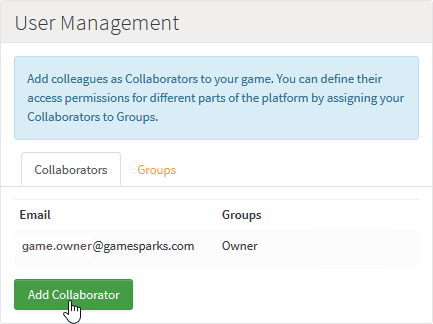

# Capabilities and User Permissions

As a game Owner or Admin, you may wish to set specific read/write permissions for a particular user for different areas of the Portal. You might want a user of your game:
* To be able to edit and make changes to Events and Leaderboards configurations.
* To able to view the configuration of Virtual Goods and Achievements but not be able to edit them.
* To be prevented from either editing or viewing the Integrations and Downloadables sections.

You can quickly set up this sort of mixed permissions for users as a specific set of capabilities and, additionally, refine the permissions in the Manage section for Screens and Snippets.

## Collaborators and Group Permissions

You can set up the read/write permissions for Collaborators on your game with a high degree of precision:
* Create a Collaborator Group.
* Edit the Group to define the read/write permissions for the Group.
* Assign Collaborators to that permissions Group.

## Creating Group Permissions and Assigning to Collaborators

A game author and owner always has full read/write access to everything in the Portal, regardless of how the settings are changed for other game Admins. You can create your own custom Groups to impose the required access permissions on your Collaborators.

*1.* To create a new Group, go to your *Game Overview* page.

*2.* Under *User Management* select the *Groups* tab and click *Add Group*:

The *Add Group* page appears.

*3.* Enter a *Name* and *Description* for the new Group and enable *Read* and *Write* permissions for each capability in the portal, as required:

You can expand headings in the *Permission* list to achieve precisely the granularity of *Read/Write* access you want for *Collaborators* that are assigned to this new *Group*:
* Here, for example, although users will have *Read* access for all functions under *Configurator*, they are restricted to only five areas where they will have *Write* access: *Events*, *Leaderboards*, *Running Totals*, *Cloud Code*, and *Teams*.

*4.* Click to *Save* the new *Group*. It is added in the list on the *Groups* tab:

<q>**Editing Groups?** You can edit or delete a Group. However, when you edit a Group - most likely to change the permissions for the Group - you will NOT be able to rename the Group.</q>

*5.* Select the *Collaborators* tab and click to *Add Collaborator*:

The *Add Collaborator* page appears.

*6.* Enter an *Email* for the new Collaborator.

<q>**Email is Unique Identifier!** Note that this will be used in the platform as the unique identifier for the Collaborator. This means that if you want to add a Collaborator who will acquire the permissions you have configured under more than one *Group*, you must add them once and assign them to those multiple *Groups*. You can't add them more than once using the same Email and each time add them to a different Group.</q>

*7.* To assign the new Collaborator to one or more permission Groups, select these from the *Groups* drop-down and click to *Save* the new Collaborator:

In this example, the new *Collaborator* is assigned the newly-configured *Restricted* Group permissions.

*8.* Click to *Save* the new Collaborator. The new Collaborator is added under *User Management* on the *Game Overview* page:

<q>**Editing a Collaborator?** If you click to edit the details of a Collaborator after you have added them to your game, you'll be able to change the permission Groups to which they are assigned but you won't be able to edit their Email. This is because the Email is used as the *unique identifier* for the Collaborator and therefore the field is protected and is read-only. To change a Collaborator's Email, you must delete the Collaborator and add them again.</q>

*9.* Log in as the *Collaborator* and navigate to the game. Based on the Capabilities set which is defined by the *Restricted* Group permissions, a Collaborator will be able to view certain things but not edit them. Given the Read/Write permissions configured for this Group, the Collaborator will be able to both view and edit game *Team Types*:

But the Collaborator will only be able to view and not edit the game's *Virtual Goods*:
* Fields will be grayed-out.
* If a *Save* is attempted, it will be blocked.

## Refining Permissions for Screens and Snippets

You can exploit a finer degree of access permission to control what users can see and do with *Screens* and *Snippets*. For example, access can be given to the Screen and the corresponding Snippets with the exception of the *player_virtual_good* and *player_currencies* Snippets for the newly created Group. Therefore, when a user is logged in with only that Group, they can see the *Players* Screen as normal, except that the information displayed for Virtual Goods and Currencies will not be displayed.

<q>**Note:** By default, all Screens and Snippets have no Groups selected. Unless specific Groups are selected for Screens and Snippets, users in any Group will be able to view them.</q>

*7.* As the game Admin, go to the *Manage* section and Edit the *Players* Screen. Select the newly-created Group in the *Groups* dropdown as well as for the *gameAdmin* Group so that Admins can also view it:

*8.* Do the same for each corresponding Snippet. Add both the newly-created Group and the default *gameAdmin* group.

*9.* For Snippets *player_virtual_goods* and *player_currencies*, select only the *gameAdmin* Group.

*10.* Login as the user belonging to the newly-created *Restricted* Group.

*11.* Load the *Players* Screen - you can see that the *player_virtual_goods* and *player_currencies* Snippets cannot be viewed.

