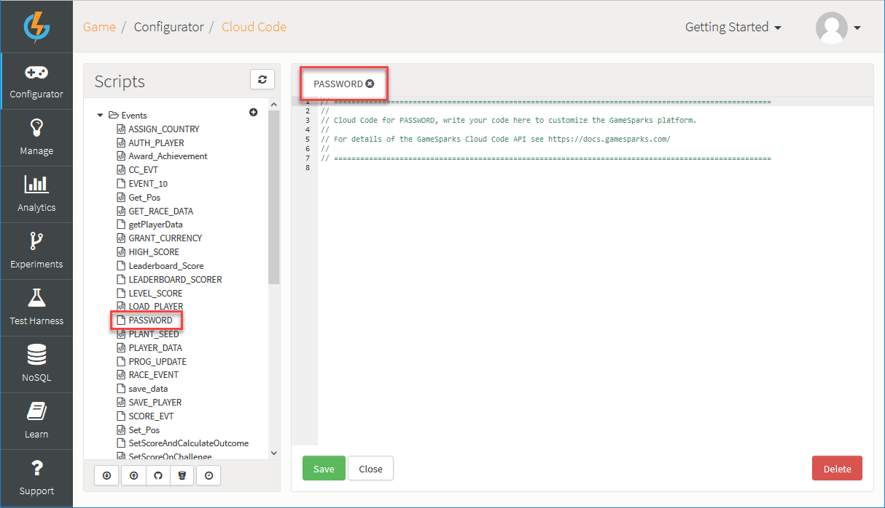

# How to Change Player Passwords

If your game uses the [RegistrationRequest](/API Documentation/Request API/Authentication/RegistrationRequest.md) GameSparks API method for signing up players to your game, you might want to enable them to change their password in the future.

This tutorial describes two possible ways to achieve this:
* Using the [ChangeUserDetailsRequest](/API Documentation/Request API/Player/ChangeUserDetailsRequest.md) API method.
* Using the [SparkPlayer](/API Documentation/Cloud Code API/Player/SparkPlayer.md) Cloud Code object.

## Changing Passwords with ChangeUserDetailsRequest API call

The [ChangeUserDetailsRequest](/API Documentation/Request API/Player/ChangeUserDetailsRequest.md) call contains a 'newPassword' field, which you can use to alter the currently authenticated player's details.

Let's try this out using the GameSparks developer portal Test Harness.

*1.* In the GameSparks portal, navigate to the *Test Harness*, under *Requests* click *Authentication*, and click *RegistrationRequest*.

*2.* Copy the JSON request below into the JSON field and click to *Send Request*:

```    
    {
     "@class": ".RegistrationRequest",
     "userName": "nick",
     "password": "password1",
     "displayName": "Nick"
    }

```

The GameSparks platform will return a response similar to this.

```    
    {
  "@class": ".RegistrationResponse",
   "authToken": "7c83262b-42ef-4400-b1bb-1de128c2f65e",
   "displayName": "Nick",
   "newPlayer": true,
   "userId": "581a1c0e3a32df5fa6f1dff9"
    }

```  

This player is now registered and could sign into later sessions using these credentials with an [AuthenticationRequest](/API Documentation/Request API/Authentication/AuthenticationRequest.md).

If you want to change this player's password to a new one, you make a [ChangeUserDetailsRequest](/API Documentation/Request API/Player/ChangeUserDetailsRequest.md) call that provides the new password in the 'newPassword' field.

*3.* In the Test Harness, under *Requests* click *Player*, and select *ChangeUserDetailsRequest*. Then the copy the JSON request below into the JSON field and click to *Send Request*:

```

    {
     "@class": ".ChangeUserDetailsRequest",
     "newPassword": "password2"
    }

```

The GameSparks platform will return a response similar to this:

```

    {
     "@class": ".ChangeUserDetailsResponse"
    }

```

For greater security, you might require that the player enters their existing password along with the new one - the *ChangeUserDetailsRequest* call allows you to provide the old password which the GameSparks platform will verify before changing it to the new value.

*4.* In the Test Harness and still with the *ChangeUserDetailsRequest* selected, copy the JSON request below into the JSON field and click to *Send Request*:

```    
    {
     "@class": ".ChangeUserDetailsRequest",
     "oldPassword": "password2",
     "newPassword": "password3"
    }

```
The GameSparks platform will return a response similar to this:

```

    {
     "@class": ".ChangeUserDetailsResponse"
    }

```

## Changing Passwords via Cloud Code

First of all, we need to create an Event which the game client code will use to post a password change request into the GameSparks platform. We'll be attaching a Cloud Code script to this Event later on.

*1.* In the GameSparks developer portal navigate to *Configurator > Events*.

*2.* Click to *Add* a new Event. Enter the following details:


*3.* *Save and Close* the new Event and navigate to *Configurator > Cloud Code > Scripts > Events*.

*4.* Select the *PASSWORD* Event to open up the editor for the Cloud Code associated with this Event:



*5.* Copy the following script to the editor and click the *Save* button:

```    
    var oldPassword = Spark.getData().OLD_PASS;
    var result = Spark.getPlayer().validatePassword(oldPassword);

    if (result) {
     var newPassword = Spark.getData().NEW_PASS;
     Spark.getPlayer().setPassword(newPassword);
    } else {
     Spark.setScriptData("result", "Incorrect existing password");
    }

```

This script reads the old password from the incoming Event, validates it against the password currently stored for this player, and, if they match, changes the password to the value specified in the incoming Event.

Let's test out this configuration in the *Test Harness*.

*1.* First authenticate with the previously created player.

*2.* Copy the JSON request below into the JSON field and click to *Send Request*:

```  

    {
     "@class": ".AuthenticationRequest",
     "userName": "Nick",
     "password": "password"
    }

  ```  

The GameSparks platform will return a response similar to this:

```

    {
     "@class": ".AuthenticationResponse",
     "authToken": "1c53797a-6e3f-4db7-b529-b70820c35303",
     "displayName": "displayName",
     "userId": "53808a96e4b02eeeac89e23a"
    }

```

*3.* Now send the [LogEventRequest](/API Documentation/Request API/Player/LogEventRequest.md) containing the current password and the new one. The GameSparks platform will intercept this request and execute the Cloud Code script that we provided to validate and change the player's password.

```   

    {
     "@class": ".LogEventRequest",
     "eventKey": "PASSWORD",
     "OLD_PASS": "password",
     "NEW_PASS": "mynewpassword"
    }

```

The GameSparks platform will return a response similar to this:

```

    {
     "@class": ".LogEventResponse",
    }

```
