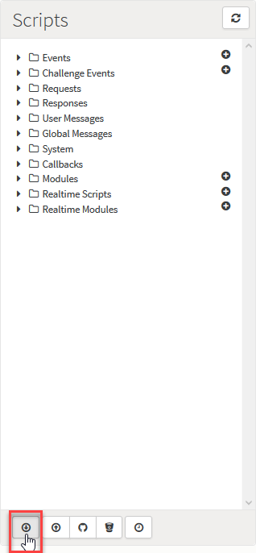
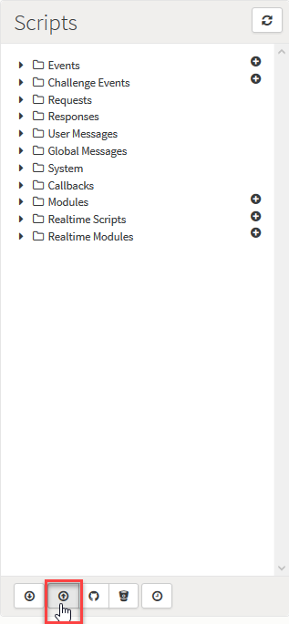
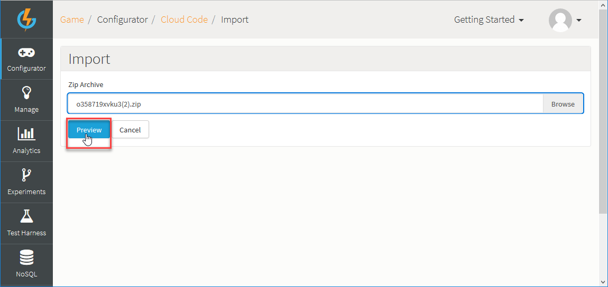
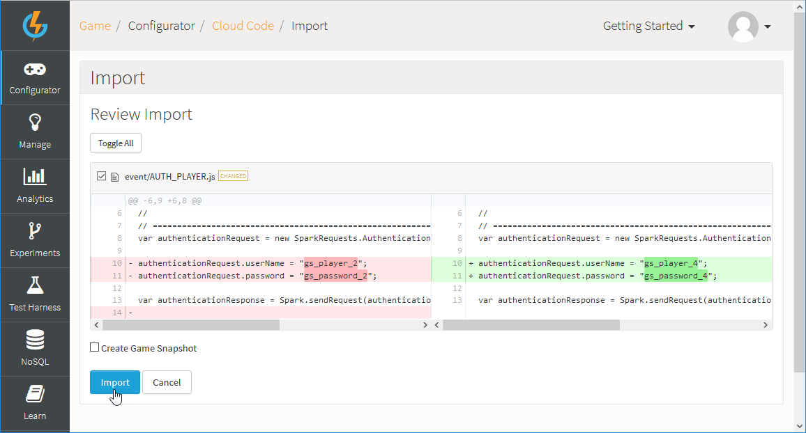
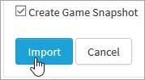
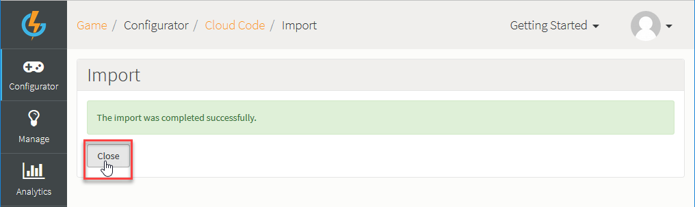

# Exporting and Importing Cloud Code

You can export and import your game configuration Cloud Code scripts:
* [Export Cloud Code](#Exporting Cloud Code)
* [Import Cloud Code](#Importing Cloud Code)

## Exporting Cloud Code

At any point in your game's development in the GameSparks portal, you can export your Cloud Code scripts.

*1.* Go to *Configurator>Cloud Code*.

*2.* On the *Scripts* panel, click *Export*:

* Your game's Cloud Code scripts are exported into a compressed archive and an *Open/Save* dialog appears.

*3.* Select to save or open the exported archive.
* When you save and decompress the export archive, the folder structure reproduces the *Scripts* panel. You can drill down to open and edit specific files and then import the Cloud Code back in - see below.

## Importing Cloud Code

If you've exported your game's Cloud Code and edited files or if you've written some scripts you want to use for your game's Cloud Code, you can import these scripts as a compressed archive:
* At import, the content can be reviewed for differences with your game's existing Cloud Code and you can select or reject those changes for import.

*1.*  Go to *Configurator>Cloud Code*.

*2.* On the *Scripts* panel, click *Import*:

The Import page opens where you can browse to select a *Zip Archive*.

*3.* Select the compressed archive folder for the Cloud Code you want to import:

*4.* Click *Preview*. A *Review Import* list opens:

Where differences with your game's existing Cloud Code scripts are identified, these are shown and you can quickly review these to decide whether or not you want to accept the changes:
* In this example, we can see that only one difference has been identified - the Cloud Code for the *AUTH_PLAYER* Event has been changed.

*5.* Scroll down the review list and use the checkboxes to accept or reject the scripts for import:
* By default all scripts are checked and will be imported.
* You can use the *Toggle All* button to select/unselect all scripts.

*6.* If you want to create a Snapshot of your game before you import the Cloud Code changes, select the *Create Game Snapshot* at the bottom of the page:

* Creating a Snapshot before importing Cloud Code changes will allow you to revert to the current game configuration, should anything go wrong after you import the changes.

*7.* Click *Import* to import the selected Cloud Code scripts.
* When the import process has successfully completed, you'll see a message:

*8.* Click *Close* to return to the Cloud Code page.
