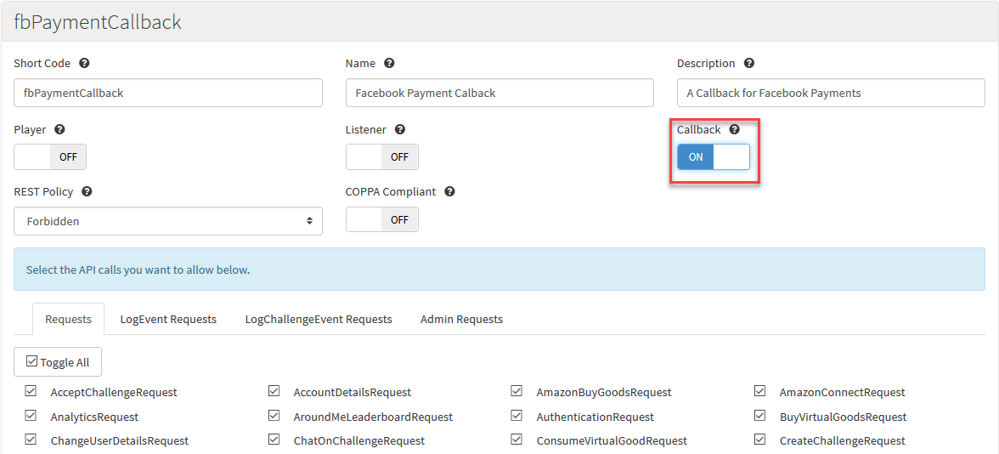
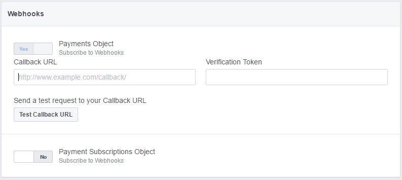

# Facebook Webhooks and GameSparks Integration

## Introduction

You can make HTTP calls from external servers or your own processes into the GameSparks platform. This is very helpful for use with Facebook Webhooks:
* You can use Callbacks to run separate, customized Cloud Code scripts against different Callback URLs.
* Each of the different Callback URLs are linked to a single custom Credential and you can create the Credentials you need for this purpose in the portal's *Integrations* section.

This tutorial explains how to use custom Callbacks for this purpose:
* [Creating a Custom Callback](#Create a Custom Callback)
* [Handling the Facebook Callback challenge](#Facebook Callback Challenge)
* [Configuring the Callback for Facebook](#Facebook Configuration)
* [Handling Payment Transaction Objects](#Handling Payment Transaction Objects)
* [Requesting Transaction Details](#Requesting Transaction Details)

## Create a Custom Callback

In order to interface with Facebook Webhooks we must first Create a Custom Callback URL. For details on how to do this, you can follow the tutorial [here](/Tutorials/Cloud Code and the Test Harness/Using Custom Callback Urls.md)

The two main points to note for this tutorial when you create your custom Callback Credential are:
1.	Make sure you enable the Callback *CB* box
2.	Each custom Credential has a unique callback.



## Facebook Callback Challenge

First we'll need to handle the Facebook Callback challenge. The main thing to note here is the *if statement*. Facebook will attempt to validate the specified Callback with a challenge. Simply put, your Callback will be required to return a token sent to it from Facebook.


```
// Used to make sure FB recognises this callback URL as a valid endpoint //
if(Spark.getData()['hub.challenge'] != null && Spark.getData()['hub.challenge'] != "" && Spark.getData()['hub.challenge'] != 'undefined'){
  Spark.setScriptData("RESPONSE_RAW", Spark.getData()['hub.challenge']); // just return the code FB sent here
}
else {}

```

<q>**Text-Based Output?** If you don't want to write JSON but want to use your own text-based output, setting a value with the key "RESPONSE_RAW" in script data will override the JSON output and return this value directly.</q>

## Facebook Configuration

Now that our Callback can meet the Facebook challenge, we can go ahead and configure our Callback with Facebook:
* We can configure our webhook from within the Facebook developer portal [here](https://developers.facebook.com/).
* For the purpose of this tutorial, we're going to configure the web hook for Canvas Payments:



1.	Insert the callback URL. This will follow the format:
  * (https ://{stage}.gamesparks.net/callback/{apiKey}/{credential}/{credentialSecret})
  * This is discussed further in the [Creating a Custom Callback Tutorial](/Tutorials/Cloud Code and the Test Harness/Using Custom Callback Urls.md).
2.	Provide a token for the Webhook to test with.
3.	Test:
  * When Facebook can confirm the challenge your Callback will be fully configured.

## Handling Payment Transaction Objects

At this stage, we've set up a Custom Callback and configured the Callback for use within the Facebook Canvas Payment system.

<q>**Implementing HTTP Callbacks?** This [tutorial](/Tutorials/Cloud Code and the Test Harness/Implementing External HTTP Callbacks.md) explains in more detail how to implement external HTTP Callbacks, such as adding parameters and the output formats.</q>


Next, we'll need handle what happens when a payment report comes in from Facebook, which is the *else* side of the original [challenge test](#Facebook Callback Challenge). This involves:
1. Going through all the transactions that were returned.
2. Then, using the individual transaction Ids, we'll request the full details of the transaction.
3. But, before we can request the full details of a transaction, we'll need an access token and we can use the Facebook Application Id and Facebook Secret to get an access token.

The following Cloud Code is a sample of how we can go about this. We add this code in the *else* of the challenge test:

```
// Used to make sure FB recognises this callback URL as a valid endpoint //
if(Spark.getData()['hub.challenge'] != null && Spark.getData()['hub.challenge'] != "" && Spark.getData()['hub.challenge'] != 'undefined'){
  Spark.setScriptData("RESPONSE_RAW", Spark.getData()['hub.challenge']); // just return the code FB sent here
}

else {
Spark.runtimeCollection('FBPaymentMessage_RAW').insert(Spark.getData());
// we want to go through all transactions that were returned //
for(var i = 0; i < JSON.parse(Spark.getData()["REQUEST_BODY"]).entry.length; i++){
    var transactionID = JSON.parse(Spark.getData()["REQUEST_BODY"]).entry[i].id;
    // Using the Facebook appId and secret to get an access token //
    var tokenResp = Spark.getHttp("https://graph.facebook.com/oauth/access_token?grant_type=client_credentials&client_id=/*Client Id*/&client_secret=/*Client Secret*/").get();
    var accessToken = tokenResp.getResponseString().split('|');
}

```

## Requesting Transaction Details

Now that we have both the access token and the transaction id we can now request the full details of the transaction. This is done via the call below and this code can follow on straight after we retrieve the access token.

```

// now that we have access token we request the details of the transaction //
var URL = "https://graph.facebook.com/v2.6/"+transactionID+"?fields=id%2Cuser%2Citems&"+accessToken[0]+"%7C"+accessToken[1];
var resp = Spark.getHttp(URL).get();
var items = resp.getResponseJson().items;
Spark.runtimeCollection('FBResponse_RAW').insert(resp.getResponseJson());

```
