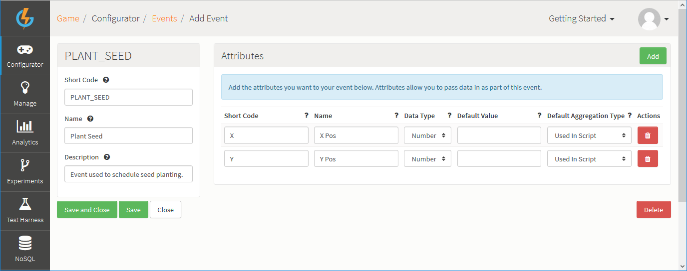
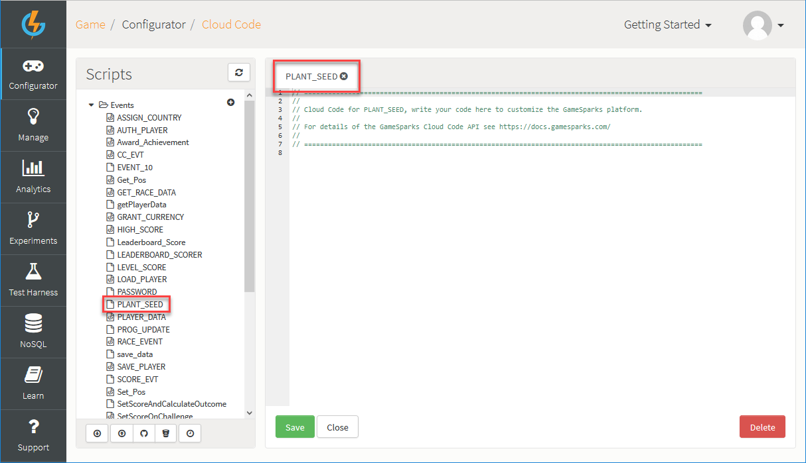
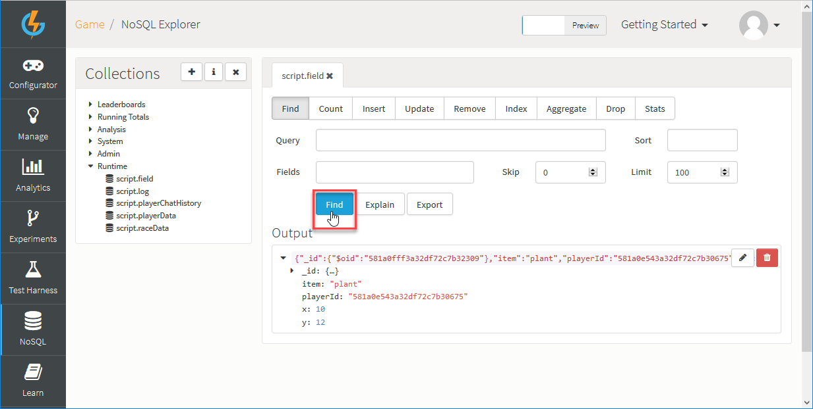
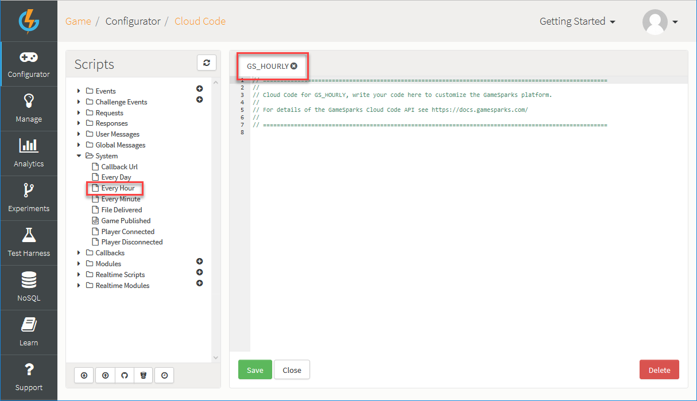

# How to Schedule Cloud Code Scripts

You can schedule Cloud Code scripts on the GameSparks platform in two ways:
* Schedule a Module script via the [SparkScheduler](/API Documentation/Cloud Code API/Utilities/SparkScheduler.md) Cloud Code object.
* Use one of the predefined system schedulers.

## Scheduling a Script via the SparkScheduler Object

Suppose you want to allow your players to plant virtual seeds within the game world and for the seed to grow into a plant after a given amount of time has passed.

To do this, let's first create an Event that the game code can trigger to indicate that the player has planted the seed.

*1.* Log in to the GameSparks Portal and navigate to *Configurator > Events*.

*2.* Click to *Add* a new Event and set up the Event as follows:



*3.* Save the Event and navigate to *Configurator > Cloud Code > Scripts > Events* and select *PLANT_SEED* to open up the Cloud Code editor for this Event.



*4.* Copy the following script to the editor and click the *Save* button.

```

// Get the Event's coord data
var x = Spark.getData().X;
var y = Spark.getData().Y;

// Schedule the GROW_SEED module to run in 60s time,
// passing in the x,y coords where the seed was planted
var theScheduler = Spark.getScheduler();
theScheduler.inSeconds("GROW_SEED", 60, {"x" : x, "y" : y});

```

This script schedules the GROW_SEED module script to run after 60 seconds.

*5.* Click to *Save* the Cloud Code script you've added to the Event and navigate to *Configurator > Cloud Code > Modules > Create New Module*.

*6.* Enter *GROW_SEED* as the Module name and click *Save*. GROW_SEED will now be listed under your *Cloud Code > Modules*.

*7.* Click to open the Cloud Code editor for the *GROW_SEED* Module.

*8.* Copy the following script to the editor and click the *Save* button.

```

// Get the x,y coords of the seed
var x = Spark.getData().x;
var y = Spark.getData().y;

// Store a 'plant' item in the 'field' runtime collection
var playerId = Spark.getPlayer().getPlayerId();
var fieldCollection = Spark.runtimeCollection('field');
fieldCollection.insert({"item":"plant", "playerId" : playerId, "x": x, "y" : y});

```

This script uses the [SparkMongoCollectionReadWrite](/API Documentation/Cloud Code API/Cloud Data/SparkMongoCollectionReadWrite.md) object to write the data to a runtime collection.

### Testing the Configuration

Let’s test out this configuration in the *Test Harness*.

*1.* Navigate to the GameSparks developer portal Test Harness.

*2.* Copy the JSON request below into the JSON field and click to *Send Request*.

```

{
 "@class": ".RegistrationRequest",
 "displayName": "displayName",
 "password": "password",
 "userName": "gardener"
}

```

The GameSparks platform will return a response similar to this.

```

{
  "@class": ".RegistrationResponse",
  "authToken": "59035171-bc9d-46bc-8dca-1d8598df1553",
  "displayName": "displayName",
  "newPlayer": true,
  "userId": "581a0e543a32df72c7b30675"
}

```

This player is now authenticated and could sign into later sessions using these credentials with an [AuthenticationRequest](/API Documentation/Request API/Authentication/AuthenticationRequest.md).

*3.* Now make the PLANT_SEED Event call. Copy the JSON request below into the JSON field and press the *Send*  icon.

```

 {

 "@class": ".LogEventRequest",
 "eventKey": "PLANT_SEED",
 "X": 10,
 "Y": 12

}

```
The GameSparks platform will return a response similar to this:

```

{

 "@class": ".LogEventResponse"

}

```
Execution of the scripts:
* The 'Plant a Seed' Cloud Code script will execute when GameSparks receives this Event. The script schedules the GROW_SEED script to run after 60 seconds, passing in the X and Y coordinates from the Event.
* 60 seconds later, the GROW_SEED script will execute, which will result in a document being created in the *script.field* collection.

*4.* Lastly, to see the results navigate to the *NoSQL Explorer*, expand *Runtime* and select the *script.field* collection.

*5.* Under the *Find* Mongo database operation, click the *Find* button and expand the results returned into the *Output* panel:



## Scheduling a Script via a System Scheduler

The *Cloud Code > System* section contains three time-based triggers:

* Every Day.
* Every Hour.
* Every Minute.

These scripts execute at the top of every day, every hour, and every minute respectively. Continuing our "plant a seed" example from above, let's schedule a script that clears all the plants from the virtual field every hour.

*1.* Navigate to *Configurator > Cloud Code*, under *Scripts* expand *System*, and select *Every Hour*.



*2.* Copy the following script into the Cloud Code editor and click the *Save* button:

```

var fieldCollection = Spark.runtimeCollection('field');
fieldCollection.remove({"item":"plant"});

```

This script removes all the documents from the 'field' collection that match the given query. In this case, all the items that are plants are removed every hour.
