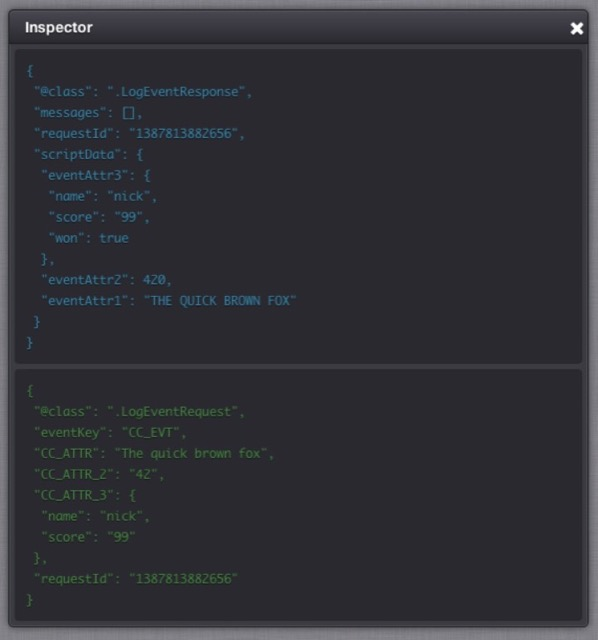

# How to Create and Use Cloud Code

In this tutorial, you can follow an example and learn how to create and work with Cloud Code:
* We'll use the Configurator to create an Event that will then trigger a simple piece of Cloud Code.
* The Event will contain three attributes - a String, a Number, and a JSON field.
* The Cloud Code (a piece of JavaScript) will manipulate these values and echo them back in the Event response.
* We'll then use the Test Harness to try out the Cloud Code script and the Event.

## Create an Event

*1.* Go to *Configurator > Events* and click the  icon:


The *Create Event* dialog appears.

*2.* Enter the Event details and click the *Save* button:


The *Create Event* dialog closes and the Event is listed on the Events page.

*3.* Click *Edit*  icon. The *Edit Event* dialog appears.

*4.* Next, click the  icon to add an Event Attribute.


*5.* Now fill in the Event Attribute details:
* Enter a *Name* for the Attribute.
* The *Short Code* will be used as the key for the value that you post into the GameSparks platform from your game code.
* Set the *Data Type* to *String*.
* For *Default Calc* select *Used in Script*.


*6.* Click *Save*.

*7.* Repeat this step and create another two Attributes for this Event, one with *Number* for its *Data Type*, the other with *JSON* for its *Data Type*.


*8.* Click *Save*. Your *Events* page should now look something like this.


## Create a Cloud Code Script

In this section, we'll create a Cloud Code script linked to the Event that we've just created.

<q>**Cloud Code Editor Shortcuts?** For a list of the keyboard shortcuts you can use in the Cloud Code Editor, go [here](/Documentation/Configurator/Cloud Code.md).</q>

*9.* Go to *Configurator > Cloud Code*.

*10.* Select *Events* in the *Bindings* section.

*11.* Select the Event we have just created - *Cloud Code Event*. We'll now bind Cloud Code to it.


*12.* Copy and paste the following JavaScript code into the editor section.

```  
    var eventAttr1 = Spark.getData().CC_ATTR
    var eventAttr2 = Spark.getData().CC_ATTR_2
    var eventAttr3 = Spark.getData().CC_ATTR_3
    Spark.setScriptData("eventAttr1", eventAttr1.toUpperCase());
    Spark.setScriptData("eventAttr2", eventAttr2 * 10);
    eventAttr3.won = true
    Spark.setScriptData("eventAttr3", eventAttr3);

```

*13.* Click *Save* at the bottom right-hand corner. Your page should now look like this.


Let's review this Cloud Code script:
* The first three lines of the script use the *Spark.getData* function to access the attribute values of the incoming Event. Notice how these attributes match the values we entered for the 3 Event Attribute Short Codes in the previous section.
* The remaining lines use the *Spark.setScriptData* function to add three new fields to the response that is delivered to the calling client:
  * The first line takes the first attribute and converts it to uppercase.
  * The second line multiplies the second attribute value by 10.
  * The final two lines add a new property to an incoming JSON object and assign that to the response.

We're now ready to test the code via the Test Harness.

## Testing the Cloud Code Script and Event

In this section, we'll:
* Use the Test Harness to register a test player with the preview version of the game.
* Authorize this player.
* Post an Event that will trigger our Cloud Code script.
* We'll then see the JSON requests and responses containing the data inserted by the script.

### Register Test players

*1.* Go to *Test Harness > Authentication* and select [RegistrationRequest](/API Documentation/Request API/Authentication/RegistrationRequest.md).

*2.* Then change the *userName* and *displayName* as shown here:


*3.* To send this JSON request to the GameSparks platform, click *Play*. In this example for *Player Six*:


The *Inspector* shows the request (in green text) that was sent to the GameSparks platform via the WebSocket and shows the response (in blue text).


### Log Event

*4.* Go to *Test Harness > LogEvent* section and select the *CC_EVT* Event that we created above.

*5.* Set each of the Attribute values in the JSON request as below. Note that:
  * The key names are the Short Codes of the Event Attributes that we created at the start of the exercise.
  * Attribute data types:
    * The first must be a String.
    * The second must be a Number.
    * The third must be a JSON object.


*6.* Click the *Play* icon to send the request to the GameSparks platform. The response is displayed in the *Inspector* in blue text:
* The scriptData property contains the fields that we added from within our Cloud Code script.
* The keys are *eventAttr1*, *eventAttr2*, and *eventAttr3*.


