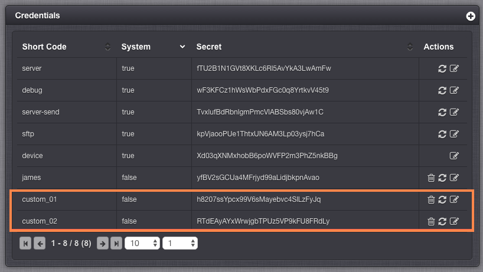
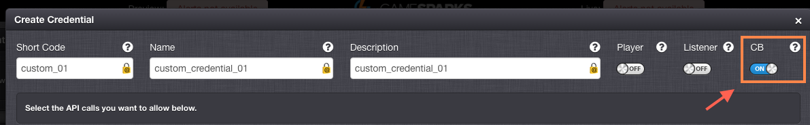
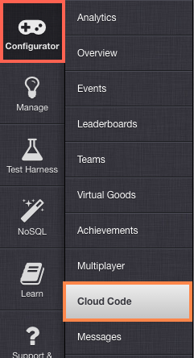
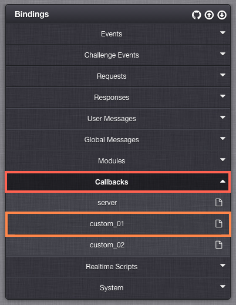

# How to Use Custom Callback Urls

You can use Callbacks to run separate, customized Cloud Code scripts against different Callback URLs. Each of the different Callback URLs are linked to a single custom Credential and you can create the Credentials you need for this purpose in the portal's Integrations section.

<q>**Multiple Callback URLs!** Previously, only one Callback URL could be created per game.  You can now create as many custom Callback URLs as there are custom Credentials.</q>

*1.* Before we can create a Callback URL script, we'll first need to create a customized Credential. In the portal, go to *Configurator > Integrations*.

*2* To add two new custom Credentials, click the Plus  icon on *Credentials*:

<q>**Creating Credentials!** For a refresher, see [Security Credentials](/Documentation/Configurator/Integrations/Security Credentials.md).</q>



*2.*  When you create each Credential, ensure to switch on the *CB* checkbox.  This tells the platform that this credential is going to be exclusively used for Callback scripts:



*3.* In the portal, select *Configurator > Cloud Code*.



*4.* Select *Callbacks* from the *Bindings* list, and edit one of the custom credentials that you created in *Step 1* or *2*.



*5.* Enter the Cloud Code you want to be executed for the Callback. For the purposes of our tutorial, we'll just write a Script to return a message:

```
Spark.setScriptData("RESPONSE_RAW", "Hello World!");
```

*6.* Now that the Callback script is created, we can see this working by using an API Post Request in the following format:

https ://{stage}.gamesparks.net/callback/{apiKey}/{credential}/{credentialSecret}

Response:

```
Hello World!

```
