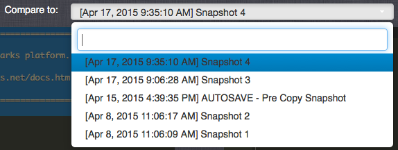

# How to View Cloud Code History

You can manage your Cloud Code revisions between Snapshots. This allows you to review and revert to previous versions of the Cloud Code that appears on Events and provides a visual comparison showing the differences in the Cloud Code.

## Accessing Cloud Code History

*1.* To access Cloud Code History, navigate to the *Cloud Code* section in the *Configurator* and select the *History* button:

This opens the Cloud Code History tool:

The Cloud Code History tool is designed to allow you to select one Snapshot - from the *Base* column - then select a second Snapshot - from the *Compare to* column - and compare the Cloud Code contained in the two Snapshots.

## Comparing Snapshots

The Cloud Code History tool is designed to be read right-to-left:
* The left column - *Base* - shows the current Workspace Configuration and latest saved Snapshot of the game.
* The right column - *Compare to* - shows all other Snapshots that pre-date the one that is selected in the *Base* and that are not Cloud Code equivalent to the selected *Base* Snapshot.

**Left Column**  | **Right Column**
-----  | -----------
    | 
   Selecting Snapshot *8* in *Base*... | ...shows all Snapshots older than Snapshot *8* in *Compare to*

 
<q>**Green is LIVE!** Any Snapshot highlighted in green is the one published to LIVE.</q>

## Identifying Differences

### Using the Differences Drop-Down

In the far-right of the screen, there is a drop-down labeled *Differences.* Depending on the comparison of Snapshots, it will show the items (and their location) that differ between those Snapshots. For example, new events added, edited events, and ones that have been removed:

**Differences Icon**  | **Indicates**
-----  | -----------
  | Newly added item since *Compare to* Snapshot version.
 | Edited item since *Compare to* Snapshot version.
 | Removed item since *Compare to* Snapshot version.

### Checking Lines of Cloud Code

Lines of Cloud Code highlighted in blue depict the difference for that module or event where the Cloud Code differs:

### Trying to Compare Cloud Code Equivalent Snapshots

When you select a Snapshot in the *Base* column, the *Compare to* column will only show Snapshots with Cloud Code differences from one selected in *Base*.

**Left Column**  | **Right Column**
-----  | -----------
    | 
   Selecting Workspace Configuration in *Base*... | ...shows all Snapshots older than Snapshot *11* in *Compare to*

However, if Snapshots *5* and *6* are Cloud Code equivalent and we select Snapshot *6* in Base:

**Left Column**  | **Right Column**
-----  | -----------
    | 
   Selecting Snapshot *6* in *Base*... | ...shows Snapshot *4* and older in *Compare to*

We can see that selecting Snapshot *6* in *Base* let's us compare only to Snapshot *4* and earlier - Snapshot *5* is omitted from the list. This makes sense, because *5* and *6* are Cloud Code equivalent, which would make trying to compare them pointless!

Let's review this example more closely. In terms of Cloud Code:
* Snapshots *1*, *2*, *3*, and *4* (including the AUTOSAVE Snapshot) are the same as each other.
* Snapshots *5* and *6* are the same as each other (we saw that we can't therefore compare them.)

In terms of comparing Snapshots, we would find:
* If we select Snapshot *5* in *Base*, *we can* compare it to Snapshots *1*, *2*, *3*, or *4*.
* If we select Snapshot *4* in *Base*, *we can't* compare it to Snapshots *1*, *2*, or *3*.
* If we select Snapshot *6* in *Base*, *we can* compare it to Snapshots *1*, *2*, *3*, or *4*.
* If we select Snapshot *6* in *Base*, *we can't* compare it to Snapshot *5*.
