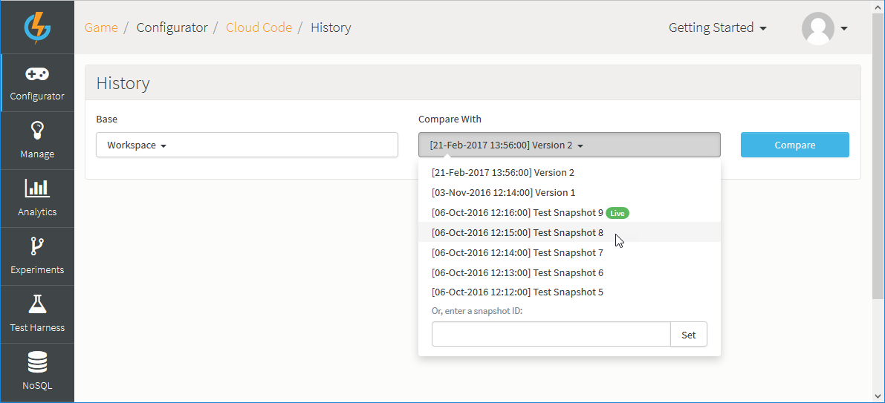
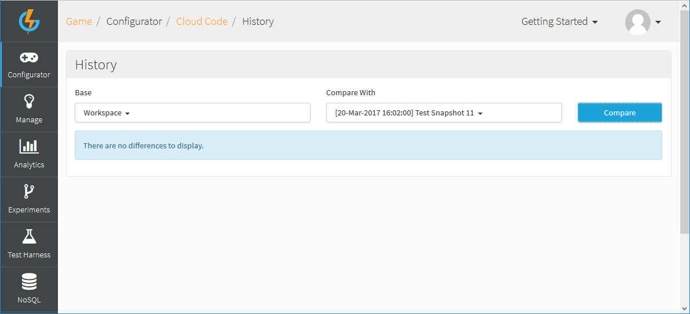

# How to View Cloud Code History

You can manage your Cloud Code revisions between Snapshots. This allows you to review and revert to previous versions of the Cloud Code that appears on Events and provides a visual comparison showing the differences in the Cloud Code.

## Accessing Cloud Code History

*1.* To access Cloud Code History, navigate to *Configurator > Cloud Code* and at the bottom of the *Scripts* panel, click *History*:

This opens the Cloud Code History tool.

*2.* The Cloud Code History tool is designed to allow you to quickly compare the Cloud Code contained in two Snapshots - one you've selected from the *Base* drop-down and one you've selected from the *Compare With* drop-down - and, if there are Cloud Code differences allow you to quickly review the differences:

In this example, we've selected *Workspace* for the *Base*, which is the current game configuration, and an earlier Snapshot, *Test Snapshot 10*, for the *Compare With* selection.

## Selecting and Comparing Snapshots

*1.* Use the *Base* and *Compare With* drop-downs to select the two Snapshots which you want to compare for Cloud Code differences.

The Cloud Code History tool is designed to compare the right-hand Snapshot to the left-hand Snapshot:
* The left column - *Base* - shows the current Workspace Configuration - *Workspace* - as the default selection and all your other saved game Snapshots for selection.
* The right column - *Compare With* - does not show *Workspace* but all your other saved game Snapshots for selection.

**Left Drop-Down**  | **Right Drop-Down**
-----  | -----------
    | 
   Default *Workspace* selection in *Base*... | ...shows all other saved Snapshots in *Compare With*

*2.* Click *Compare*.
* If there are no Cloud Code differences between the two Snapshots, then you'll see a message telling you this:

* If there are Cloud Code differences between the two Snapshots, then the differences are listed:

In this example, we see that if we take the right-hand selection - *Test Snapshot 5* (an earlier Snapshot) - and compare its Cloud Code with the left-hand selection - *Test Snapshot 10* (the most recent Snapshot) - Cloud Code has been added for 4 Events since *Test Snapshot 5* was taken.

*3.* On the other hand, if we switch the selections, we see that comparing *Test Snapshot 10* - in right-hand - with *Test Snapshot 5* - in left-hand - and click *Compare*, the differences show as deletions:

## Reviewing Differences

Once you have run a compare of two Snapshots and differences are returned, you can use several features built into the Cloud Code History Tool to help you quickly find and review specific differences in Cloud Code.

### Types of Difference

Differences are listed as one of three kinds:

**Differences Icon**  | **Indicates**
-----  | -----------
  | Newly added item.
 | Edited item.
 | Removed item.

### Finding Differences

You can scroll down to inspect the Cloud Code differences or you can click the hotlink text for the identified change to jump straight to that Cloud Code. This is particularly useful if the compare returns many differences:

### Reviewing Edit Differences

The example in the [earlier section](#Selecting and Comparing Snapshots) showed Cloud Code differences for the addition or deletion of entire items between Snapshots. More typically, the differences will be the result of you having edited a few lines of Cloud Code across saved Snapshots.

Editing differences are presented in the Cloud Code History Tool in a way that is designed to help you quickly recognize and understand the changes made:

Compare in this example shows that there are editing differences between the selected Snapshots for *RACE_EVENT*. When we click to inspect the differences:

... we see that the editing differences are clearly pinpointed:
* Each line where a difference is identified is highlighted.
* Several lines above and below the difference are shown to help you find just where the difference exists.
* Specific difference for values and terms within a highlighted difference line are strongly highlighted.
* The values for the currently selected *Base* Snapshot are shown in green on the right and the corresponding values in the currently selected *Compare With* Snapshot are shown in red on the left.
