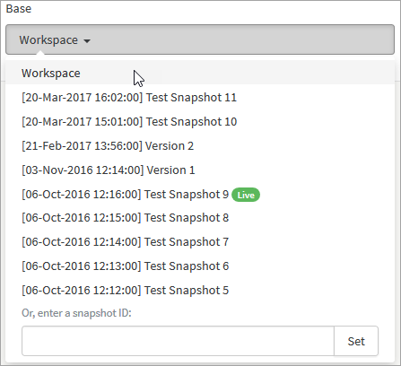
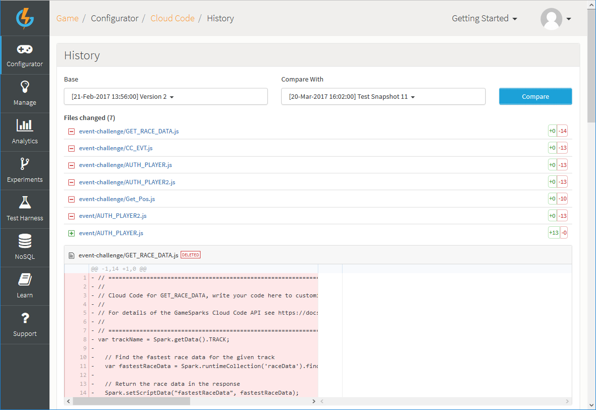

# How to View Cloud Code History

You can manage your Cloud Code revisions between Snapshots. This allows you to review and revert to previous versions of your Cloud Code and provides a visual comparison showing the differences in the Cloud Code.

## Accessing Cloud Code History

*1.* To access Cloud Code History, navigate to *Configurator > Cloud Code* and at the bottom of the *Scripts* panel, click *History*:

This opens the Cloud Code History tool.

*2.* The Cloud Code History tool is designed to allow you to quickly compare the Cloud Code contained in two Snapshots - one you've selected from the *Base* drop-down and one you've selected from the *Compare With* drop-down.

Note that, when you select a Snapshot in the *Base* drop-down, only those Snapshots where Cloud Code differences exist will be available for selection in the *Compare With* drop-down:

* In this example, we've selected *Workspace* for the *Base*, which is the current game configuration, and an earlier Snapshot, *Test Snapshot 8*, for the *Compare With* selection.

## Selecting and Comparing Snapshots

*1.* Use the *Base* and *Compare With* drop-downs to select the two Snapshots which you want to compare for Cloud Code differences.

The Cloud Code History tool is designed to compare the right-hand Snapshot to the left-hand Snapshot:
* Left drop-down - *Base* - shows the current Workspace Configuration - *Workspace* - as the default selection and all your other saved game Snapshots for selection.
* Right drop-down - *Compare With* - does not show *Workspace* but any other saved game Snapshots as available for selection where differences exist between *Workspace* and the Snapshot.
* Left/Right drop-down dependency - when you select another saved Snapshot in the left drop-down, the right drop-down is filtered to show only those Snapshots where differences with the selected left drop-down Snapshot exist.

**Left Drop-Down**  | **Right Drop-Down**
--------  | --------
    | 
Default *Workspace* selection in the *Base*... | ...shows Snapshots in *Compare With* with Cloud Code differences.

<q>**Green is LIVE!** The currently published Snapshot is flagged in both drop-down lists.</q>

*2.* If you have a large number of Snapshots, you can search and select either of the drop-down lists by entering the Snapshot ID in the drop-down search field and clicking *Set*:

*3.* Click *Compare*. The Cloud Code differences between the Snapshots are listed.

In the following example, we see that if we take the right-hand selection - *Version 2* (an earlier Snapshot) - and compare its Cloud Code with the left-hand selection - *Test Snapshot 11* (the most recent Snapshot) - Cloud Code has been added for 6 Events and deleted for 1 since *Version 2* was created:

*4.* On the other hand, if we switch the selections, we see that comparing *Test Snapshot 11* - in right-hand - with *Version 2* - in left-hand - and click *Compare*, the differences show as 6 deletions and 1 addition:

## Reviewing Differences

Once you have run a compare of two Snapshots and differences are returned, you can use several features built into the Cloud Code History Tool to help you quickly find and review specific differences in Cloud Code.

### Types of Difference

Differences are listed as one of three kinds:

**Differences Icon**  | **Indicates**
-----  | -----------
  | Newly added item.
 | Edited item.
 | Removed item.

### Finding Differences

You can scroll down to inspect the Cloud Code differences or you can click the hotlink text for the identified change to jump straight to that Cloud Code. This is particularly useful if the compare returns many differences:

### Reviewing Edit Differences

The example in the [earlier section](#Selecting and Comparing Snapshots) showed Cloud Code differences for the addition or deletion of entire items between Snapshots. More typically, the differences will be the result of you having edited a few lines of Cloud Code across saved Snapshots.

Editing differences are presented in the Cloud Code History Tool in a way that is designed to help you quickly recognize and understand the changes made:

In the following example, performing a Compare shows that there are editing differences between the selected Snapshots for the *CC_EVT*:

The editing differences are clearly pinpointed:
* Each line where a difference is identified is highlighted.
* Several lines above and below the difference are shown to help you find just where the difference exists.
* Specific difference for values and terms within a highlighted difference line are strongly highlighted.
