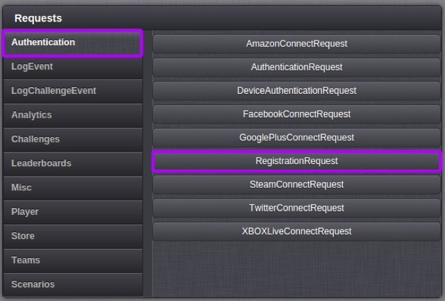
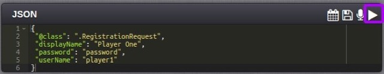
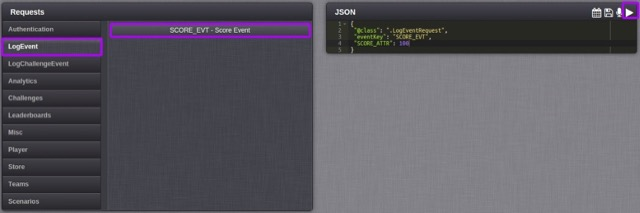

# How to create and award Achievements via a Leaderboard?

In this exercise we'll create an [Achievement](/Documentation/Configurator/Achievements.md) that is awarded to a player when they beat their current high score in a game:
* First, we'll need to create an [Event](/Documentation/Configurator/Events.md) and a [Leaderboard](/Documentation/Configurator/Leaderboards/README.md).
* When we've completed the configuration, we'll test it via the [Test Harness](/Documentation/Test Harness/README.md).

## Creating an Event

To start, we'll use the Configurator to create an event that will allow your game code to log a score for the player with the GameSparks platform.

Click the  icon in the Events section on the Event page to bring up the Create Event dialog.

Now fill in the Event details, and add an attribute row.

Configure the Event attribute:
* *Name* - Enter a name for the attribute.
* *Short Code* - You'll use this as the key for the score that you post into the platform from your game code.
* *Data Type* - Set the Data Type to Number in the case of a high score table, because the incoming scores are integers and we want to be able to sort them into numerical order.
* *Default Value* - This field can be ignored for our example.
* *Default Calc* - In the case of a high score table, we want to track the highest score posted by each of the game's players. Therefore, select *Maximum*. This will result in  GameSparks platform storing one record per player and that record will contain the player's highest score.

## Creating a Leaderboard

Next, we'll create a Leaderboard that will arrange the players' scores in order from highest to lowest.

Create a Leaderboard to represent the game's high score table. Click the  icon on the Leaderboards page to bring up the *Create Leaderboard* dialog:

Now fill in the Leaderboard's details and click the *Save* button.

<q>**Note:** You'll use the short code when your game code posts scores into the GameSparks platform.</q>

* The *Running Total* field should be set to the 'Score Event' that we created in the previous section. A Running Total was automatically created when you created the event in the section above.
* In the *Summary* field select the event attribute 'Score Attribute'.
* The *FilterType* field is set to * (wildcard) so that all values are included.
* The *Filter Value* field is not relevant in this exercise.
* Finally, the *Sort* field is set to DESC (descending) to order the Leaderboard from highest player score to lowest.

<q>**Note:** [Running Totals](/Documentation/Configurator/Leaderboards/Running Totals.md) are an advanced topic that we don't need to worry about for this exercise.</q>

## Creating an Achievement

Now, we can create an Achievement that is triggered when a new high score is posted to the Leaderboard.

Click the  icon in the Achievements section:

The *Create Achievement* dialog appears:

Configure the Achievement and click the *Save* button:
* *Leaderboard* - Set the Leaderboard field to 'High Score Table' for this exercise to link to the Leaderboard we set up in the previous section.
* *Virtual Good Award* - We set the Virtual Good Award to 'No Award' for this exercise. If we had Virtual Goods in our game configuration, it would be possible to link the Achievement to them via this field.
* *Currency Awards* - We set Currency awards to 100. This awards 100 of each currency when a player gets this Achievement.
* *Trigger Filtering* - Finally, we add a trigger filtering by >=100. This awards the Achievement when the player scores 100 or more on that Leaderboard.

## Testing Achievement, Leaderboard, and Event with Test Harness

In this section we'll use the Test Harness to register a test player with the preview version of the game, authorize this player and post a new high score to the GameSparks platform. We'll see the JSON requests and responses and then request the player's details to see that they have been gifted with some in-game currency.

### Register a Test Player

Select [RegistrationRequest](/API Documentation/Request API/Authentication/RegistrationRequest.md) from the *Test Harness Authentication* menu.

Now change the *userName* and *displayName* as shown below and send this JSON request to the GameSparks platform by clicking the *Play* icon.

The Inspector shows the request (in green text) that was sent to the GameSparks platform via the WebSocket and the response (in blue text).

### Check the Player's Current Details

Select [AccountDetailsRequest](/API Documentation/Request API/Player/AccountDetailsRequest.md) from the *Test Harness Player* menu. Examine the currency values for this player in the response, notice that they are all zero.

### Log Event

Select the [LogEventRequest](/API Documentation/Request API/Player/LogEventRequest.md) option on the *LogEvent* tab. Now select the 'Score Event' menu option from the submenu:

* Notice that the eventKey field is set to *SCORE_EVT*, which is the short code of the Event that we created at the start of the exercise.
* Set the *SCORE_ATTR* value to 100.
* Click the Play icon to send the request to the GameSparks platform.

In the Inspector you can see the request you sent in green text and the response in blue text.

There will also be two Messages: an *AchievementEarnedMessage* and a *NewHighScoreMessage*. Both are asynchronous messages that the GameSparks platform has sent to this player:

### Check the Player's Updated Details

Finally repeat the [AccountDetailsRequest](/API Documentation/Request API/Player/AccountDetailsRequest.md) you performed earlier and notice that the player now has the new Achievement and 100 of each currency.

